---
## Front matter
lang: ru-RU
title: Лабораторная работа №1
subtitle: Операционные системы
author:
  - Пономарева Т.А.
institute:
  - Российский университет дружбы народов, Москва, Россия
date: 06 марта 2025

## i18n babel
babel-lang: russian
babel-otherlangs: english

## Formatting pdf
toc: false
toc-title: Содержание
slide_level: 2
aspectratio: 169
section-titles: true
theme: metropolis
header-includes:
 - \metroset{progressbar=frametitle,sectionpage=progressbar,numbering=fraction}
---

# Информация

## Докладчик

:::::::::::::: {.columns align=center}
::: {.column width="70%"}

  * Пономарева Татьяна Александровна
  * Студент группы НКАбд-04-24
  * Российский университет дружбы народов
  * [1132246742@pfur.ru](mailto:1132246742@pfur.ru)
  * <https://github.com/taponomareva>

:::
::: {.column width="30%"}

:::
::::::::::::::

# Вводная часть
 
## Цель работы

Целью данной работы является приобретение практических навыков установки операционной системы на виртуальную машину, настройки минимально необходимых для дальнейшей работы сервисов.

# Задание

1. Установка дистрибутива Fedora-Sway-Spin на VirtualBox
2. Установка расширений для стабильной работы с системой

# Теоретическое введение

В данной лабораторной работе рассматривается процесс установки и настройки дистрибутива Fedora Sway Spin в виртуальной среде с использованием VirtualBox. Fedora Sway Spin представляет собой вариант дистрибутива Fedora, использующий оконный менеджер Sway, который является Wayland-совместимой альтернативой i3. Использование данного дистрибутива ориентировано на пользователей, предпочитающих управлять оконным пространством через сочетания клавиш, обеспечивая эффективный рабочий процесс. Основные особенности Fedora Sway: использование Wayland вместо  X11, что обеспечивает повышенную безопасность и производительность. 

# Основная часть выполнения лабораторной работы №1 

## Выполнение лабораторной работы

Сначала запускаю виртуальную среду VirtualBox (рис. 1).

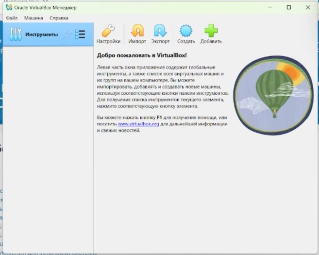{#fig:001 width=70%}

# Создание виртуальной машины

Затем создаю виртуальную машину, нажав на кнопку "Создать", и задаю следующие параметры (рис. 2).

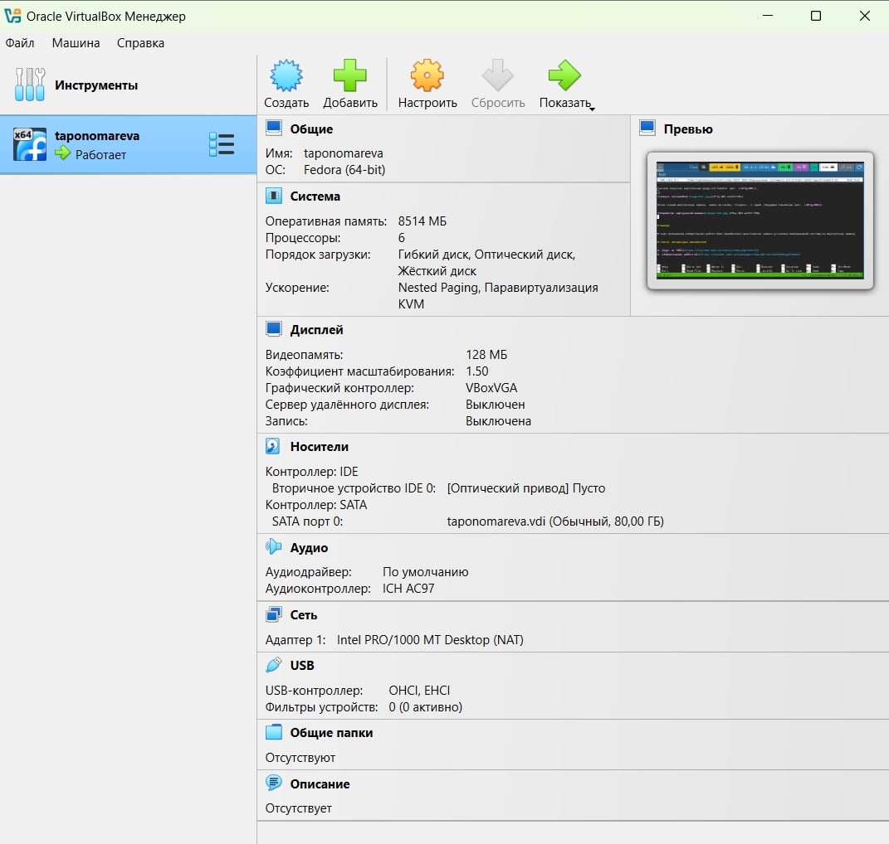{#fig:002 width=70%}

## Запуск виртуальной машины 

Запускаю саму виртуальную машину через кнопку "Запустить" (рис. 3).

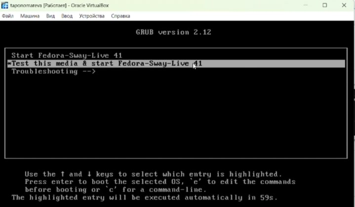{#fig:003 width=70%}

# Установка системы

Начинаю устанавливать систему через  Win + d (появляется соответствующее окно, где нужно выбрать Install to Hard Drive) (рис. 4).

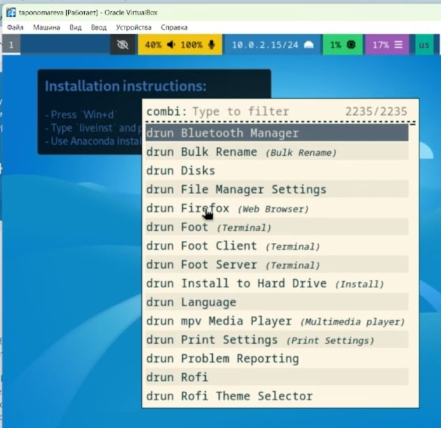{#fig:004 width=70%}

## Установка системы

Появляется окно установки. Выбираю соответствующий язык, задаю общий диск на 80 ГБ и указываю имя пользователя, используя имя моей учетной записи (рис. 5).

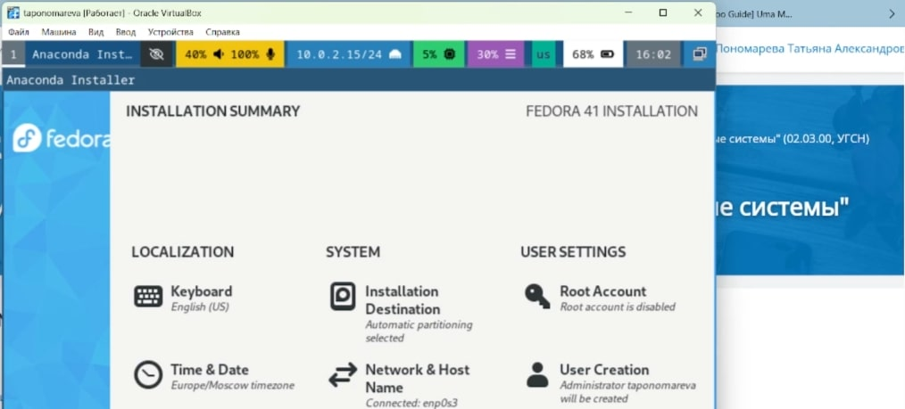{#fig:005 width=70%}

# Запуск системы

Затем идет запуск машины после установки системы на диск 80 ГБ и изъятия изначального .iso (рис. 6).

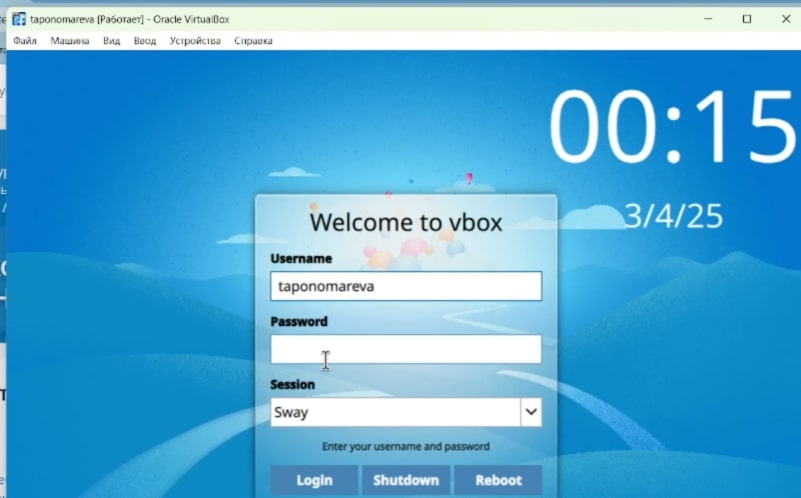{#fig:006 width=70%}

# Начало работы с машиной

Система была успешно установлена. Вхожу в ОС под заданной при установке учетной записью (рис. 7).

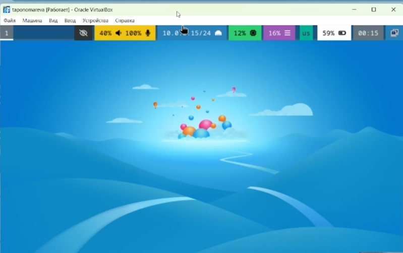{#fig:007 width=70%}

# Запуск терминала

Нажимаю комбинацию Win + Enter для запуска терминала (рис. 8).

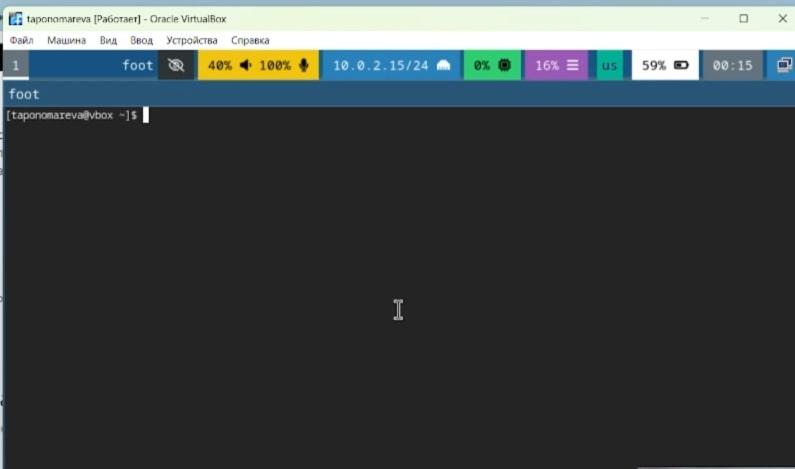{#fig:008 width=70%}

## Переключение на роль супер-пользователя

Переключаюсь на роль супер-пользователя при помощи sudo -i (рис. 9).

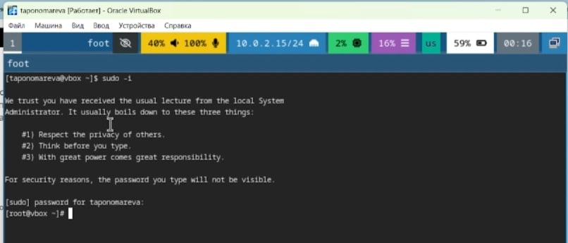{#fig:009 width=70%}

# Установка средств разработки

Устанавливаю средства разработки и обновляю все пакеты (рис. 10).

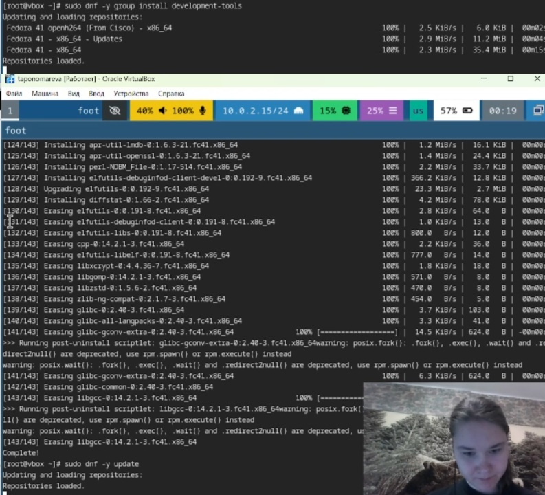{#fig:010 width=70%}

## Установка дополнительных программ

Устанавливаю программы для удобства работы в консоли (рис. 11).

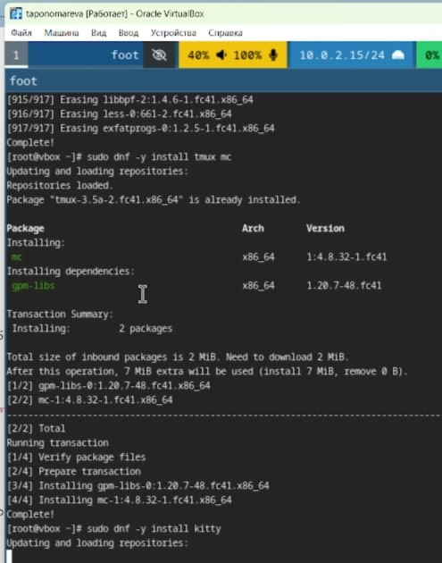{#fig:011 width=70%}

# Отключение системы безопасности SELinux

Так как в данном курсе не идет рассмотрение работы с системой безопасности SELinux, то можно ее отключить. В файле /etc/selinux/config заменяю значение SELINUX=enforcing на SELINUX=permissive (рис. 12).

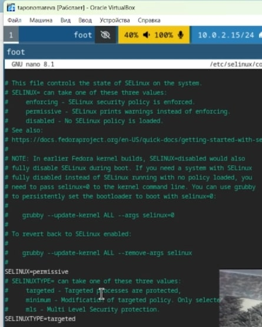{#fig:012 width=70%}

После перезагружаю машину командой sudo systemctl reboot.

# Настройка раскладки клавиатуры

Далее настраиваю раскладку клавиатуры.

Вхожу в ОС под заданной мной при установке учетной записью. Запускаю терминал, используя комбинацию Win + Enter. Захожу в терминальный мультиплексор tmux.

Создаю конфигурационный файл 95-system-keyboard-config.conf (рис. 13).

{#fig:013 width=70%}

Переключаюсь на роль супер-пользователя.

# Настройка раскладки клавиатуры

Редактирую конфигурационный файл(рис. 14).

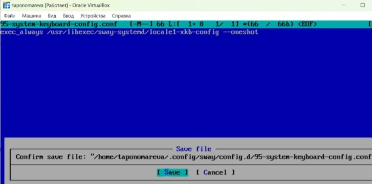{#fig:014 width=70%}

# Настройка раскладки клавиатуры

Затем я редактирую /etc/X11/xorg.conf.d/00-keyboard.conf (рис. 15).

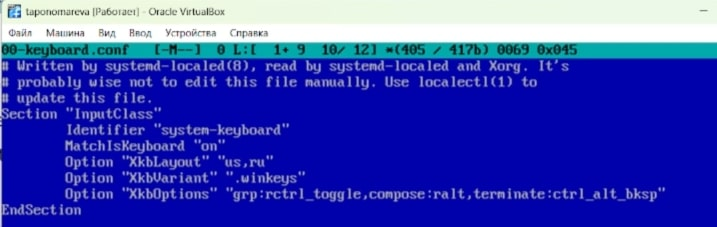{#fig:015 width=70%}

Перезагружаю виртуальную машину при помощи sudo systemctl reboot.

# Установка имени хоста

Устанавливаю имя хоста, используя hostnamectl set-hostname taponomareva (рис. 16)

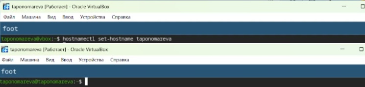{#fig:016 width=70%}

# Установка pandoc

Устанавливаю pandoc (рис. 17).

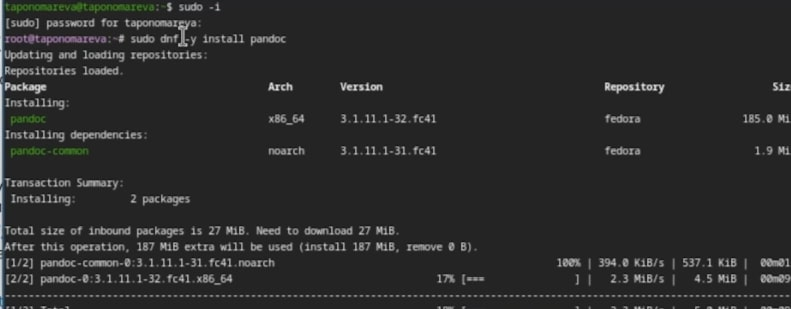{#fig:017 width=70%}

## Установка pandoc

Для работы с перекрестными ссылками скачиваю с сайта https://github.com/lierdakil/pandoc-crossref нужную версию pandoc-crossref (он скомпилен для версии pandoc 3.1.11.1)

Распаковываю архив через tar -xvJf pandoc-crossref-Linux.tar.xz (рис. 18).

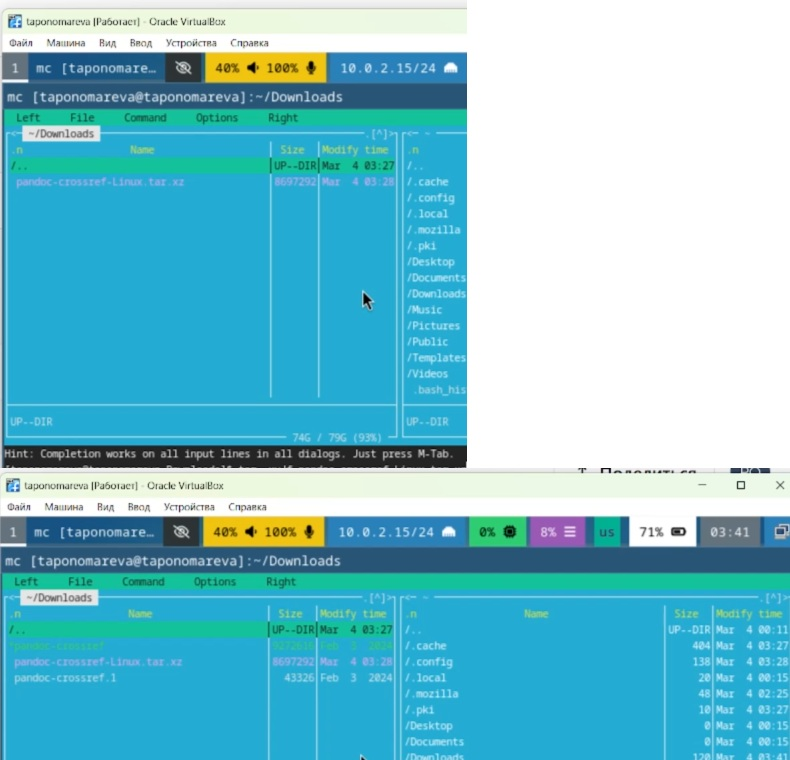{#fig:018 width=70%}

## Установка pandoc

Копирую файл pandoc-crossref в /usr/local/bin (рис. 19).

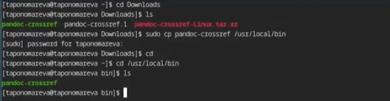{#fig:019 width=70%}

# Дистрибутив TeXlive

Устанавливаю дистрибутив TeXlive (рис. 20).

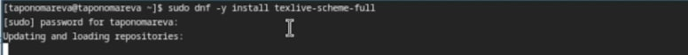{#fig:020 width=70%}

# Выводы

В ходе проведения лабораторной работы были приобретены практические навыки установки операционной системы на виртуальную машину.

# Список литературы{.unnumbered}

1. [Курс на ТУИС](https://esystem.rudn.ru/course/view.php?id=113)
2. [Лабораторная работа №1](https://esystem.rudn.ru/mod/page/view.php?id=1224368#org27a8a61)
