---
## Front matter
title: "Отчёт по лабораторной работе №1"
subtitle: "Операционные системы"
author: "Пономарева Татьяна Александровна"

## Generic otions
lang: ru-RU
toc-title: "Содержание"

## Bibliography
bibliography: bib/cite.bib
csl: pandoc/csl/gost-r-7-0-5-2008-numeric.csl

## Pdf output format
toc: true # Table of contents
toc-depth: 2
lof: true # List of figures
lot: true # List of tables
fontsize: 12pt
linestretch: 1.5
papersize: a4
documentclass: scrreprt
## I18n polyglossia
polyglossia-lang:
  name: russian
  options:
	- spelling=modern
	- babelshorthands=true
polyglossia-otherlangs:
  name: english
## I18n babel
babel-lang: russian
babel-otherlangs: english
## Fonts
mainfont: IBM Plex Serif
romanfont: IBM Plex Serif
sansfont: IBM Plex Sans
monofont: IBM Plex Mono
mathfont: STIX Two Math
mainfontoptions: Ligatures=Common,Ligatures=TeX,Scale=0.94
romanfontoptions: Ligatures=Common,Ligatures=TeX,Scale=0.94
sansfontoptions: Ligatures=Common,Ligatures=TeX,Scale=MatchLowercase,Scale=0.94
monofontoptions: Scale=MatchLowercase,Scale=0.94,FakeStretch=0.9
mathfontoptions:
## Biblatex
biblatex: true
biblio-style: "gost-numeric"
biblatexoptions:
  - parentracker=true
  - backend=biber
  - hyperref=auto
  - language=auto
  - autolang=other*
  - citestyle=gost-numeric
## Pandoc-crossref LaTeX customization
figureTitle: "Рис."
tableTitle: "Таблица"
listingTitle: "Листинг"
lofTitle: "Список иллюстраций"
lotTitle: "Список таблиц"
lolTitle: "Листинги"
## Misc options
indent: true
header-includes:
  - \usepackage{indentfirst}
  - \usepackage{float} # keep figures where there are in the text
  - \floatplacement{figure}{H} # keep figures where there are in the text
---

# Цель работы

Целью данной работы является приобретение практических навыков установки операционной системы на виртуальную машину, настройки минимально необходимых для дальнейшей работы сервисов.
# Задание

1)Установка дистрибутива Fedora-Sway-Spin на VirtualBox
2)Установка расширений для стабильной работы с системой
# Теоретическое введение

В данной лабораторной работе рассматривается процесс установки и настройки дистрибутива Fedora Sway Spin в виртуальной среде с использованием VirtualBox. Fedora Sway Spin представляет собой вариант дистрибутива Fedora, использующий оконный менеджер Sway, который является Wayland-совместимой альтернативой i3. Использование данного дистрибутива ориентировано на пользователей, предпочитающих управлять оконным пространством через сочетания клавиш, обеспечивая эффективный рабочий процесс. Основные особенности Fedora Sway: использование Wayland вместо  X11, что обеспечивает повышенную безопасность и производительность. 

# Выполнение лабораторной работы

Сначала запускаю виртуальную среду VirtualBox (рис. [-@fig:001]).

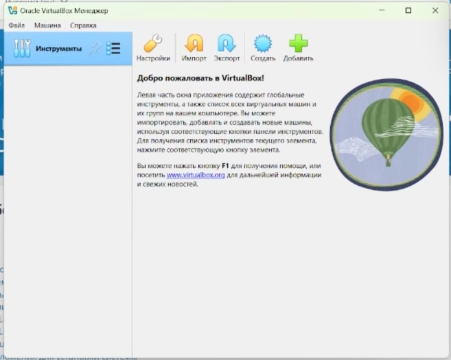{#fig:001 width=70%}

Затем создаю виртуальную машину, нажав на кнопку "Создать", и задаю следующие параметры (рис. [-@fig:002]).

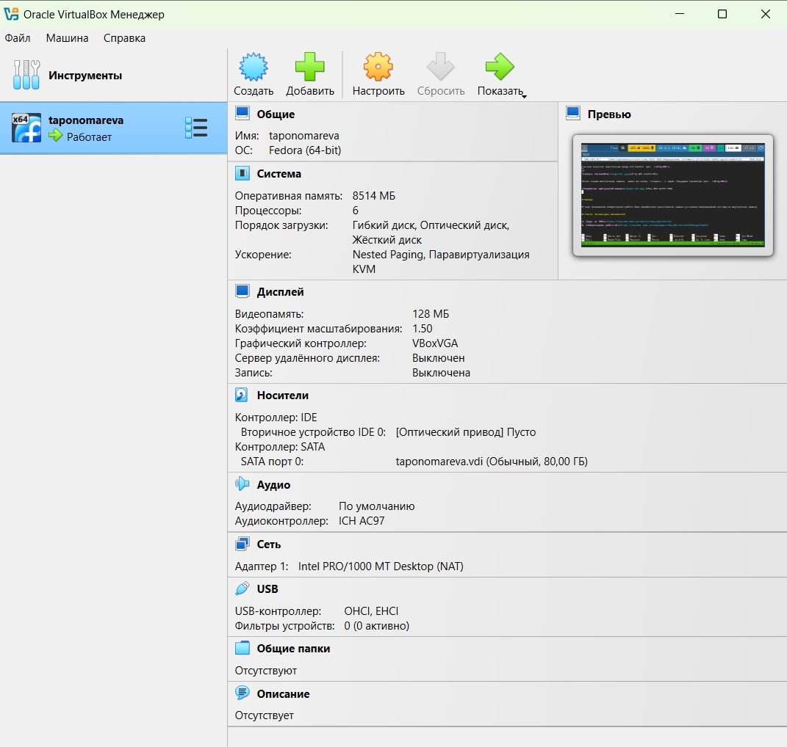{#fig:002 width=70%}

Запускаю саму виртуальную машину через кнопку "Запустить" (рис. [-@fig:003]).

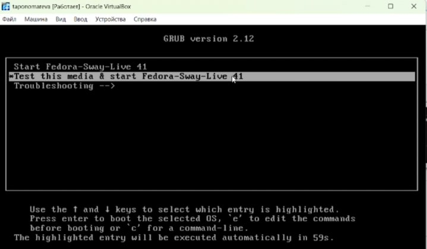{#fig:003 width=70%}

Начинаю устанавливать систему через  Win + d (появляется соответствующее окно, где нужно выбрать Install to Hard Drive) (рис. [-@fig:004]).

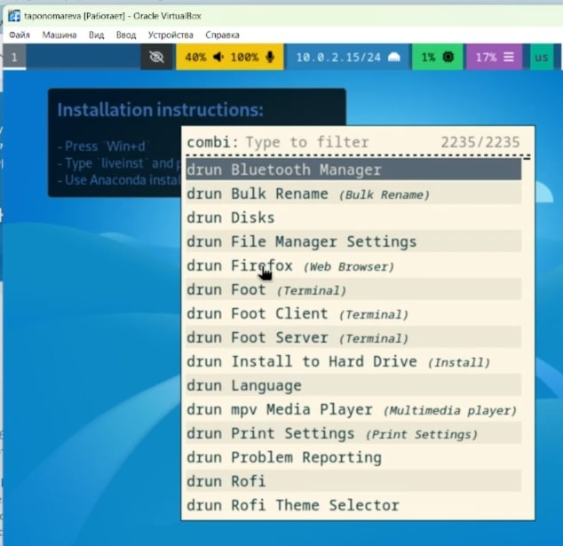{#fig:004 width=70%}

Появляется окно установки. Выбираю соответствующий язык, задаю общий диск на 80 ГБ и указываю имя пользователя, используя имя моей учетной записи (рис. [-@fig:005]).

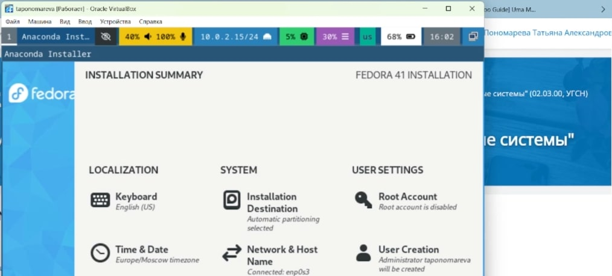{#fig:005 width=70%}

Затем идет запуск машины после установки системы на диск 80 ГБ и изъятия изначального .iso (рис. [-@fig:006]).

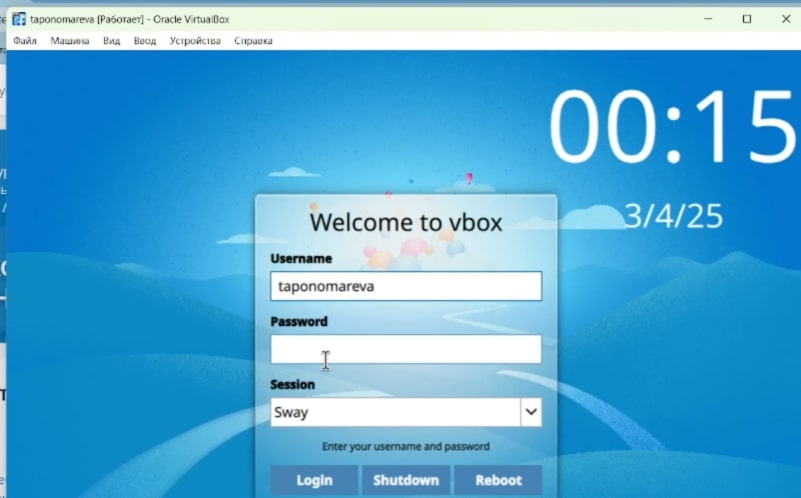{#fig:006 width=70%}

Система была успешно установлена. Вхожу в ОС под заданной при установке учетной записью (рис. [-@fig:007]).

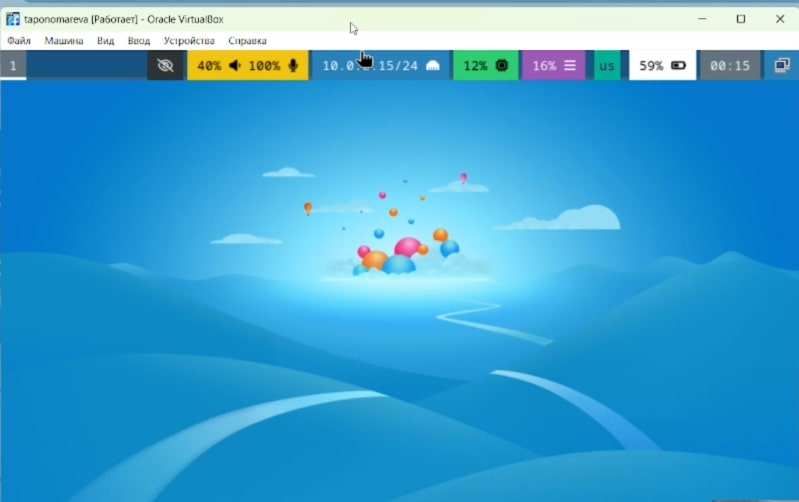{#fig:007 width=70%}

Нажимаю комбинацию Win + Enter для запуска терминала (рис. [-@fig:008]).

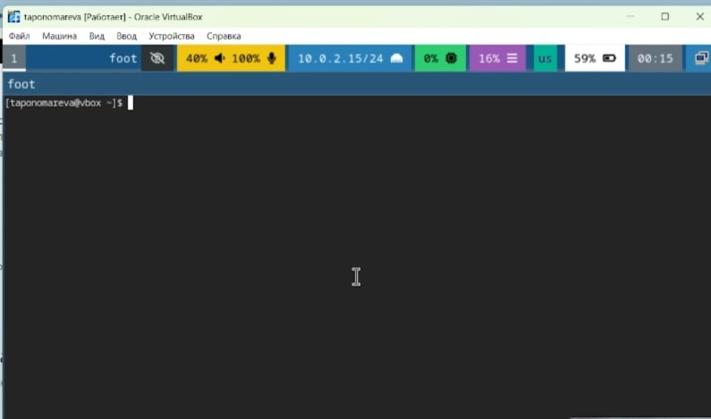{#fig:008 width=70%}

Переключаюсь на роль супер-пользователя при помощи sudo -i (рис. [-@fig:009]).

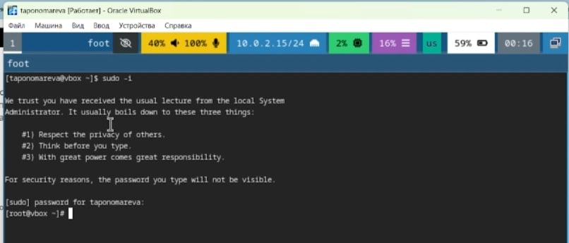{#fig:009 width=70%}

Устанавливаю средства разработки и обновляю все пакеты (рис. [-@fig:010]).

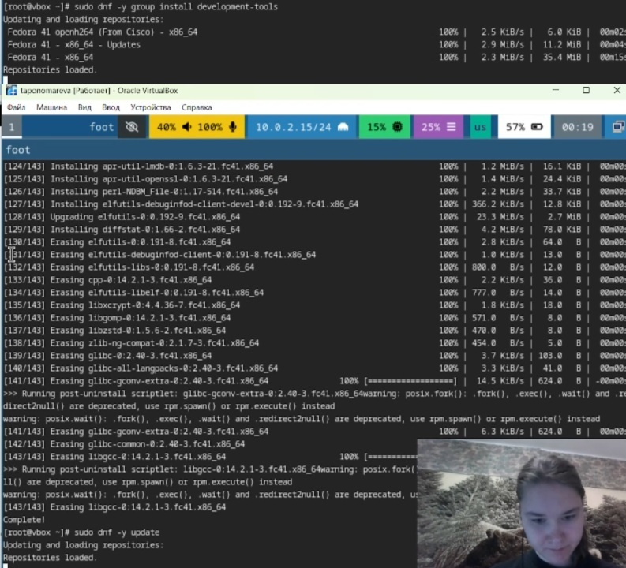{#fig:010 width=70%}

Устанавливаю программы для удобства работы в консоли (рис. [-@fig:011]).

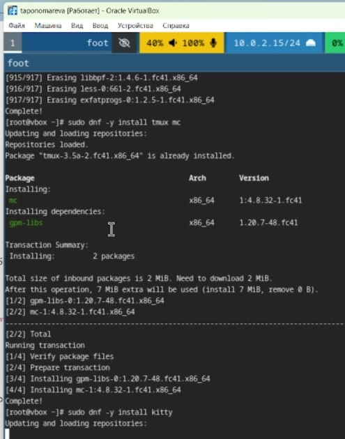{#fig:011 width=70%}

Так как в данном курсе не идет рассмотрение работы с системой безопасности SELinux, то можно ее отключить. В файле /etc/selinux/config заменяю значение SELINUX=enforcing на SELINUX=permissive (рис. [-@fig:012]).

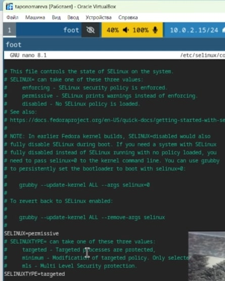{#fig:012 width=70%}

После перезагружаю машину командой sudo systemctl reboot.

Далее настраиваю раскладку клавиатуры.

Вхожу в ОС под заданной мной при установке учетной записью. Запускаю терминал, используя комбинацию Win + Enter. Захожу в терминальный мультиплексор tmux.

Создаю конфигурационный файл 95-system-keyboard-config.conf (рис. [-@fig:013]).

{#fig:013 width=70%}

Переключаюсь на роль супер-пользователя.

Редактирую конфигурационный файл(рис. [-@fig:014]).

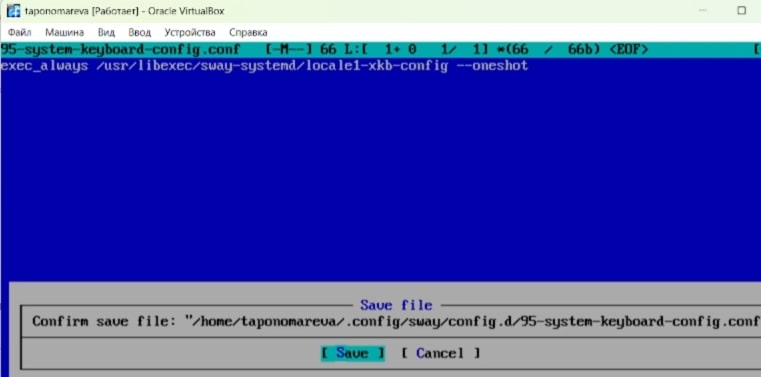{#fig:014 width=70%}

Затем я редактирую /etc/X11/xorg.conf.d/00-keyboard.conf (рис. [-@fig:015]).

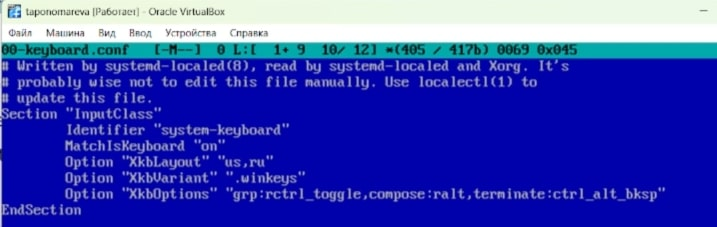{#fig:015 width=70%}

Перезагружаю виртуальную машину при помощи sudo systemctl reboot.

Устанавливаю имя хоста, используя hostnamectl set-hostname taponomareva (рис. [-@fig:016])

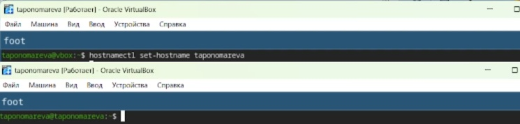{#fig:016 width=70%}

Устанавливаю pandoc (рис. [-@fig:017]).

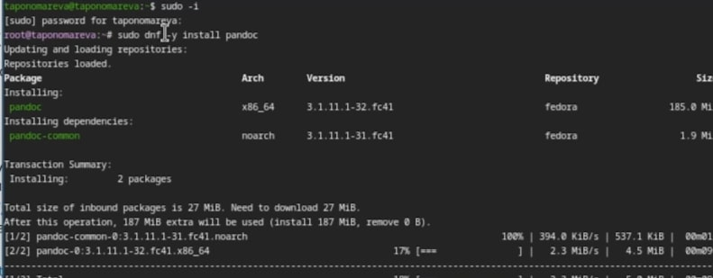{#fig:017 width=70%}

Для работы с перекрестными ссылками скачиваю с сайта https://github.com/lierdakil/pandoc-crossref нужную версию pandoc-crossref (он скомпилен для версии pandoc 3.1.11.1)

Распаковываю архив через tar -xvJf pandoc-crossref-Linux.tar.xz (рис. [-@fig:018]).

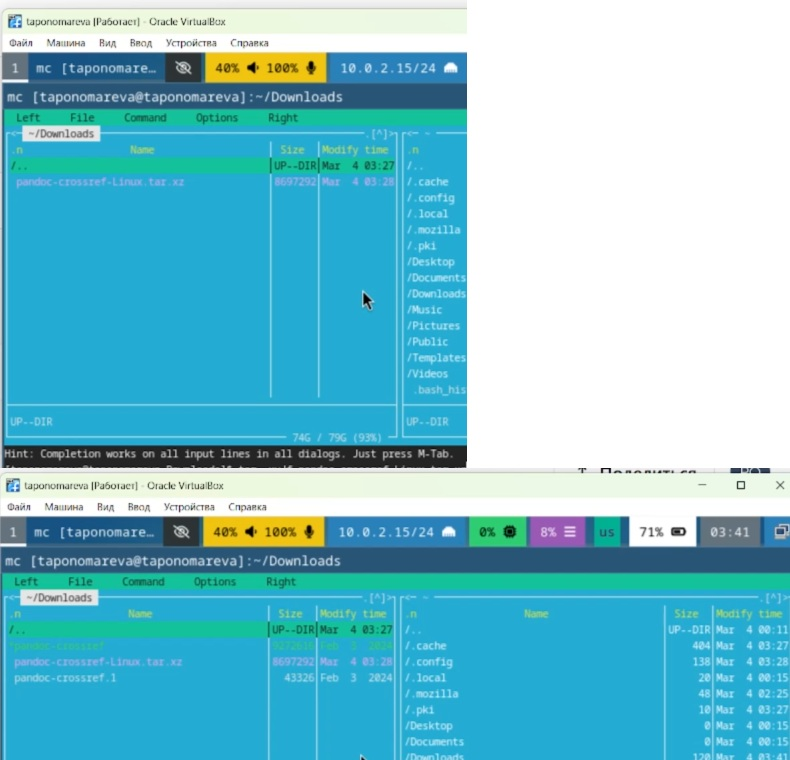{#fig:018 width=70%}

Копирую файл pandoc-crossref в /usr/local/bin (рис. [-@fig:019]).

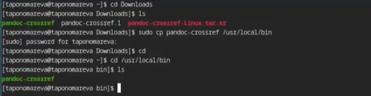{#fig:019 width=70%}

Устанавливаю дистрибутив TeXlive (рис. [-@fig:020]).

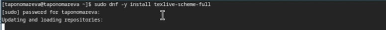{#fig:020 width=70%}

# Выполнение домашнего задания

Использую поиск с помощью grep (рис. [-@fig:021])

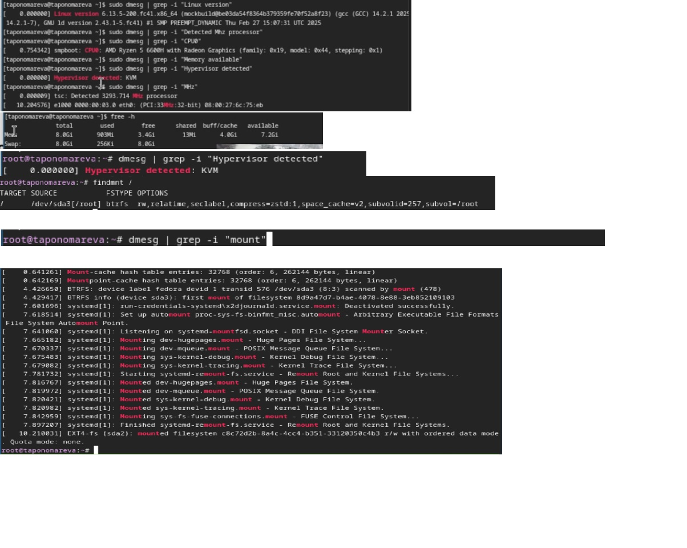{#fig:021 width=70%}

# Ответы на контрольные вопросы

1.Учетная запись пользователя содержит имя пользователя (username), UID (User ID) - числовой идентификатор пользователя, GID (Group ID) - идентификатор основной группы пользователя, home directory, login shell, комменторий (например, полное имя как дополнительные сведения), пароль в зашифрованном виде находится в файле /etc/shadow (в /etc/passwd вместо него символ "x")

2.Команды терминала и примеры

a) Справка по команде (пример): man (man ls), --help (ls --help), info (info ls) 
b) Перемещение по файловой системе: cd (cd /home/taponomareva/work) переход в каталог /home/taponomareva/work, cd .. переход в родительский каталог, cd ~ переход в домашний каталог
с) Просмотр содержимого каталога: ls список файлов и папок, ls -l подробный список с правами доступа, датой и размером, ls -a подробный  список со скрытыми файлами
d) Определение объема каталога: du -sh /path/to/dir суммарный объем каталога в удобочитаемом формате
e) Создание/удаление каталогов/файлов: mkdir newdir, touch newfile.txt (создание каталога, файла), rm newfile.txt, rm -r newdir (удаление файла, удаление каталога и его содержимого), rmdir emptydir (удаление пустого каталога)
f) Задание определенных прав на файл/каталог: chmod u+x file.txt (добавление права на выполнение для владельца файла), chmod 755 script.sh (права: владелец - полный доступ, группа и остальные - чтение)
g) Просмотр истории команд: history

3.Файловая система - способ организации и хранения файлов на носителях информации, обеспечивающий доступ, управление и защиту данных. Например, NTFS - файловая система по умолчанию в Windows, FAT32 - старый формат, совместимый со многими операционными системами, ограничен максимальным размером файла (около 4 ГБ) и менее надежен по сравнению с современными файловыми системами

4.Просмотр подмонтированных файловых систем в ОС: mount (mount | less) выводит список всех смонтированных файловых систем, df (df -h) показывает использование дискового пространства для каждого монтированного раздела

5.Удаление зависшего процесса: ps aux | grep process_name (или top, htop), потом kill PID стандартное завершение или kill -9 PID принудительное завершение процесса

# Выводы

В ходе проведения лабораторной работы были приобретены практические навыки установки операционной системы на виртуальную машину.

# Список литературы{.unnumbered}

1. [Курс на ТУИС](https://esystem.rudn.ru/course/view.php?id=113)
2. [Лабораторная работа №1](https://esystem.rudn.ru/mod/page/view.php?id=1224368#org27a8a61)
