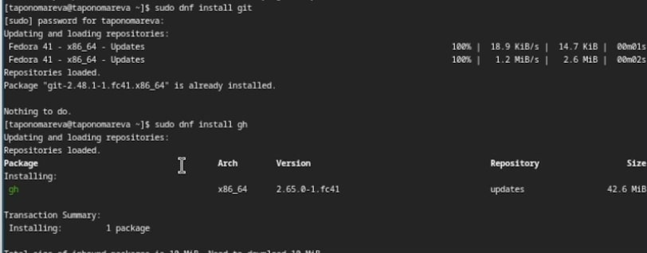
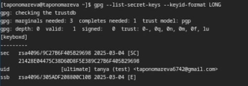
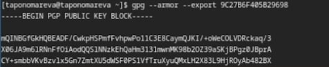
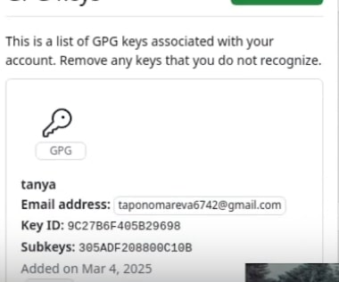
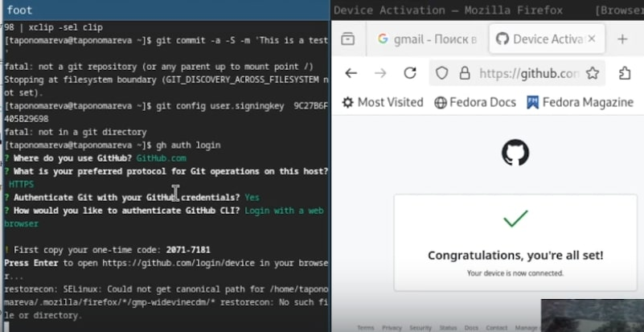
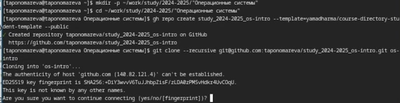
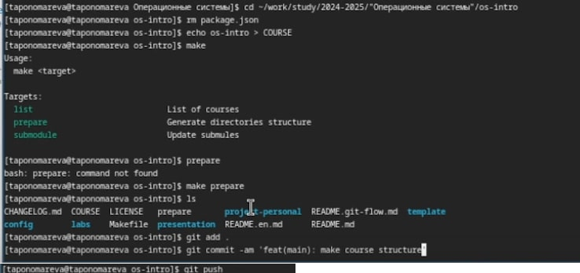

---
## Front matter
title: "Отчёт по лабораторной работе №2"
subtitle: "Операционные системы"
author: "Пономарева Татьяна Александровна"

## Generic otions
lang: ru-RU
toc-title: "Содержание"

## Bibliography
bibliography: bib/cite.bib
csl: pandoc/csl/gost-r-7-0-5-2008-numeric.csl

## Pdf output format
toc: true # Table of contents
toc-depth: 2
lof: true # List of figures
lot: true # List of tables
fontsize: 12pt
linestretch: 1.5
papersize: a4
documentclass: scrreprt
## I18n polyglossia
polyglossia-lang:
  name: russian
  options:
	- spelling=modern
	- babelshorthands=true
polyglossia-otherlangs:
  name: english
## I18n babel
babel-lang: russian
babel-otherlangs: english
## Fonts
mainfont: IBM Plex Serif
romanfont: IBM Plex Serif
sansfont: IBM Plex Sans
monofont: IBM Plex Mono
mathfont: STIX Two Math
mainfontoptions: Ligatures=Common,Ligatures=TeX,Scale=0.94
romanfontoptions: Ligatures=Common,Ligatures=TeX,Scale=0.94
sansfontoptions: Ligatures=Common,Ligatures=TeX,Scale=MatchLowercase,Scale=0.94
monofontoptions: Scale=MatchLowercase,Scale=0.94,FakeStretch=0.9
mathfontoptions:
## Biblatex
biblatex: true
biblio-style: "gost-numeric"
biblatexoptions:
  - parentracker=true
  - backend=biber
  - hyperref=auto
  - language=auto
  - autolang=other*
  - citestyle=gost-numeric
## Pandoc-crossref LaTeX customization
figureTitle: "Рис."
tableTitle: "Таблица"
listingTitle: "Листинг"
lofTitle: "Список иллюстраций"
lotTitle: "Список таблиц"
lolTitle: "Листинги"
## Misc options
indent: true
header-includes:
  - \usepackage{indentfirst}
  - \usepackage{float} # keep figures where there are in the text
  - \floatplacement{figure}{H} # keep figures where there are in the text
---

# Цель работы

Изучить идеологию и применение средств контроля версий и освоить умения по работе с git

# Задание

1. Создать базовую конфигурацию для работы с git
2. Создать ключ SSH
3. Создать ключ PGP
4. Настроить подписи git
5. Зарегистрироваться на Github
6. Создать локальный каталог для выполнения заданий по предмету

# Теоретическое введение

Системы контроля версий (Version Control System, VCS) применяются при работе нескольких человек над одним проектом. Обычно основное дерево проекта хранится в локальном или удалённом репозитории, к которому настроен доступ для участников проекта. При внесении изменений в содержание проекта система контроля версий позволяет их фиксировать, совмещать изменения, произведённые разными участниками проекта, производить откат к любой более ранней версии проекта, если это требуется.

# Выполнение лабораторной работы

## Установка програмного обеспечения

Сначала устанавливаю git, потом gh (рис. [-@fig:001]).

{#fig:001 width=70%}

## Базовая настройка git

Задаю имя и email владельца репозитория, настраиваю utf-8 в выводе сообщений git (рис. [-@fig:002]).

{#fig:002 width=70%}

## Верификация коммитов с помощью PGP
### Создание ключа

Генерирую ключ, задаю следующие параметры: RSA и RSA, размер 4096, срок действия бессрочен, имя: tanya, email: taponomareva6742@gmail.com, comment: test (рис. [-@fig:003]).

{#fig:003 width=70%}

### Экспорт ключа

Вывожу список ключей (рис. [-@fig:004]).

{#fig:004 width=70%}

Экспортирую ключ по его отпечатку (рис. [-@fig:005]).

{#fig:005 width=70%}

### Добавление PGP ключа в GitHub

Копирую ключ и добавляю его в настройках профиля на GitHub (рис. [-@fig:006]).

{#fig:006 width=70%}

## Базовая настройка git 

Задаю имя начальной ветки (master) (рис. [-@fig:007]).

{#fig:007 width=70%}

## Создание ключа ssh

Создаю ключ ssh по алгоритму rsa с ключем размером 4096 бит(рис. [-@fig:008]).

{#fig:008 width=70%}

Создаю ключ ssh по алгоритму ed25519(рис. [-@fig:009]).

{#fig:009 width=70%}

Ключ был добавлен в GitHub (рис. [-@fig:014]).

{#fig:014 width=70%}

## Настройка gh

Авторизовываюсь через команду gh auth login (рис. [-@fig:010]).

{#fig:010 width=70%}

## Настройка автоматических подписей коммитов git

Используя введенный email, указываю Git применять его при подписи коммитов (рис. [-@fig:011]).

{#fig:011 width=70%}

## Создание репозитория курса на основе шаблона

Создаю репозиторий курса на основе шаблона (рис. [-@fig:012]).

{#fig:012 width=70%}

## Настройка каталога курса

Перехожу в каталог и удаляю лишние файлы, затем создаю необходимые каталоги, далее отправляю файлы на сервер (рис. [-@fig:013]).

{#fig:013 width=70%}

# Контрольные вопросы

1. Системы контроля версий (VCS) — это инструменты, предназначенные для отслеживания изменений в файлах или наборе файлов. Они позволяют сохранять версии данных и управлять ими, что важно при разработке программного обеспечения, написании текстов или любых других длительных проектных работах, требующих отслеживания изменений. VCS помогают работать с историей изменений, сотрудничать с другими людьми и восстанавливать предыдущие версии файлов.

2. Пояснение понятий VCS:

- Хранилище (repository) — это место, где хранится вся информация о проекте, включая файлы и историю изменений.
- Commit — это операция, при которой изменения в рабочих файлах фиксируются в хранилище с добавлением сообщения, объясняющего изменения.
- История (history) — это последовательность коммитов, представляющая изменения, которые были сделаны в проекте за время его существования.
- Рабочая копия (working copy) — это локальная версия файлов проекта, с которыми пользователь работает. Изменения сначала происходят в рабочей копии и затем фиксируются в хранилище с помощью коммита.

3. Централизованные и децентрализованные VCS:

- Централизованные VCS предполагают наличие одного центрального хранилища, к которому подключаются все пользователи. Все изменения сохраняются в этом едином месте. Пример: Subversion (SVN).
- Децентрализованные VCS позволяют каждому пользователю иметь локальное хранилище, синхронизируя изменения между репозиториями. Каждый участник может работать автономно, а затем обмениваться данными с другими. Пример: Git.

4. Примеры VCS:

- Централизованные: Subversion (SVN), CVS.
- Децентрализованные: Git, Mercurial.

5. Действия с VCS при единоличной работе:

Инициализация репозитория (создание нового хранилища).
Изменение файлов в рабочей копии.
Добавление новых файлов в индекс с помощью команды git add.
Фиксация изменений в хранилище с помощью git commit.
Просмотр истории изменений с помощью git log.

6. Порядок работы с общим хранилищем VCS:

Клонирование репозитория с удалённого сервера с помощью git clone.
Синхронизация с удалённым хранилищем с помощью git fetch или git pull.
Редактирование локальных файлов и фиксация изменений через git commit.
Отправка изменений в удалённое хранилище через git push.
Разрешение конфликтов при слиянии изменений с помощью git merge.

7. Основные задачи, решаемые инструментальным средством Git:

Отслеживание изменений в проекте.
Совместная работа с другими пользователями.
Ветвление и слияние изменений (работа с ветками).
Управление удалёнными репозиториями и синхронизация изменений.
Восстановление предыдущих версий файлов и проекта.

8. Команды Git:

git init — инициализация нового репозитория.
git clone <url> — клонирование удалённого репозитория.
git add <file> — добавление изменений в индекс (подготовка файлов к коммиту).
git commit -m "message" — фиксация изменений в репозитории с сообщением.
git status — просмотр текущего состояния рабочей копии.
git log — просмотр истории коммитов.
git push — отправка изменений в удалённый репозиторий.
git pull — получение изменений с удалённого репозитория.
git branch — создание и управление ветками.

9. Примеры использования Git с локальными и удалёнными репозиториями:

Локальный репозиторий: git init — инициализация репозитория, git commit — фиксация изменений, git status — проверка состояния.
Удалённый репозиторий: git clone <url> — клонирование удалённого репозитория, git push — отправка изменений на сервер, git pull — получение обновлений с сервера.

10. Ветви в Git позволяют изолировать изменения в проекте, не влияя на основную рабочую версию. Это полезно для параллельной разработки новых функций, исправлений ошибок или экспериментов, которые затем могут быть объединены в основную ветку (например, main или master). Ветки позволяют легко работать с несколькими направлениями разработки и избежать конфликтов между различными задачами.

# Выводы

Была изучена идеология и применение средств контроля версий и освоены умения по работе с git

# Список литературы{.unnumbered}

1. [Курс на ТУИС](https://esystem.rudn.ru/course/view.php?id=113)
2. [Лабораторная работа №2](https://esystem.rudn.ru/mod/page/view.php?id=1224371)
