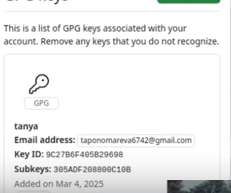

---
## Front matter
lang: ru-RU
title: Презентация по лабораторной работе №3
subtitle: Операционные системы
author:
  - Пономарева Т.А.
institute:
  - Российский университет дружбы народов, Москва, Россия
date: 07 марта 2025

## i18n babel
babel-lang: russian
babel-otherlangs: english

## Formatting pdf
toc: false
toc-title: Содержание
slide_level: 2
aspectratio: 169
section-titles: true
theme: metropolis
header-includes:
 - \metroset{progressbar=frametitle,sectionpage=progressbar,numbering=fraction}
---

# Информация

## Докладчик

:::::::::::::: {.columns align=center}
::: {.column width="70%"}

  * Пономарева Татьяна Александровна
  * Студент группы НКАбд-04-24
  * Российский университет дружбы народов
  * [1132246742@pfur.ru](mailto:1132246742@pfur.ru)
  * <https://github.com/taponomareva>

:::
::: {.column width="30%"}

:::
::::::::::::::

# Вводная часть

## Цель работы

Научиться оформлять отчеты с помощью легковесного языка разметки Markdown

# Задание

- Сделать отчет по предыдущей лабораторной работе в формате Markdown
- Предоставить отчет в 3-х форматах: pdf, docx, md

# Теоретическое введение

Для обработки файлов в формате Markdown будет использоваться Pandoc.

## Цели и задачи

- Создать шаблон презентации в Markdown
- Описать алгоритм создания выходных форматов презентаций
# Выполнение лабораторной работы

## Установка програмного обеспечения

Сначала устанавливаю git, потом gh (рис. 1).

{#fig:001 width=70%}

## Базовая настройка git

Задаю имя и email владельца репозитория, настраиваю utf-8 в выводе сообщений git (рис. 2).

{#fig:002 width=70%}

# Верификация коммитов с помощью PGP
## Создание ключа

Генерирую ключ, задаю следующие параметры: RSA и RSA, размер 4096, срок действия бессрочен, имя: tanya, email: taponomareva6742@gmail.com, comment: test (рис. 3).

{#fig:003 width=70%}

## Экспорт ключа

Вывожу список ключей (рис. 4).

{#fig:004 width=70%}

Экспортирую ключ по его отпечатку (рис. 5).

{#fig:005 width=70%}

## Добавление PGP ключа в GitHub

Копирую ключ и добавляю его в настройках профиля на GitHub (рис. 6).

{#fig:006 width=70%}

## Базовая настройка git 

Задаю имя начальной ветки (master) (рис. 7).

{#fig:007 width=70%}

## Создание ключа ssh

Создаю ключ ssh по алгоритму rsa с ключем размером 4096 бит(рис. 8).

{#fig:008 width=70%}

Создаю ключ ssh по алгоритму ed25519(рис. 9).

{#fig:009 width=70%}

Ключ был добавлен в GitHub (рис. 14).

{#fig:014 width=70%}

# Настройка gh

Авторизовываюсь через команду gh auth login (рис. 10).

{#fig:010 width=70%}

# Настройка автоматических подписей коммитов git

Используя введенный email, указываю Git применять его при подписи коммитов (рис. 11).

{#fig:011 width=70%}

# Создание репозитория курса на основе шаблона

Создаю репозиторий курса на основе шаблона (рис. 12).

{#fig:012 width=70%}

# Настройка каталога курса

Перехожу в каталог и удаляю лишние файлы, затем создаю необходимые каталоги, далее отправляю файлы на сервер (рис. 13).

{#fig:013 width=70%}

# Выводы

Были получены навыки оформления отчетов в формате Markdown.

