---
## Front matter
lang: ru-RU
title: Лабораторная работа №4
subtitle: Операционные системы
author:
  - Пономарева Татьяна Александровна
professor:
  - Кулябов Дмитрий Сергеевич
  - д.ф.-м.н., профессор
  - профессор кафедры прикладной информатики и теории вероятностей
institute:
  - Российский университет дружбы народов, Москва, Россия
date: 08 марта 2025

## i18n babel
babel-lang: russian
babel-otherlangs: english

## Formatting pdf
toc: false
toc-title: Содержание
slide_level: 2
aspectratio: 169
section-titles: true
theme: metropolis
header-includes:
 - \metroset{progressbar=frametitle,sectionpage=progressbar,numbering=fraction}
---

# Информация

## Докладчик

:::::::::::::: {.columns align=center}
::: {.column width="70%"}

  * Пономарева Татьяна Александровна
  * Студент группы НКАбд-04-24
  * Российский университет дружбы народов
  * [1132246742@pfur.ru](mailto:1132246742@pfur.ru)
  * <https://github.com/taponomareva>

:::
::: {.column width="30%"}

:::
::::::::::::::

# Вводная часть

## Цель работы

Получение навыков правильной работы с репозиториями git

## Задание

- Выполнить работу для тестового репозитория
- Преобразовать рабочий репозиторий в репозиторий с git-flow и conventional commits.

# Теоретическое введение

Рабочий процесс Gitflow Workflow используется с пакетом git-flow. Gitflow Workflow опубликована и популяризована Винсентом Дриссеном и предполагает выстраивание строгой модели ветвления с учетом выпуска проекта.

# Выполнение лабораторной работы

## Установка Node.js

Сначала устанавливаю Node.js и pnpm (рис. 1).

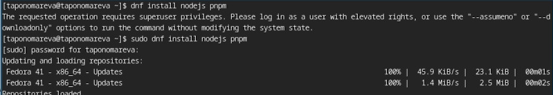

## Установка gitflow

Потом загружаю gitflow (рис. 2).

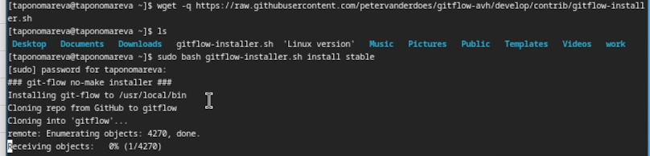 

## Настройка Node.js

Далее идет настройка Node.js. Запускаю pnpm, делаю перелогин и выполняю source ~/.bashrc (рис. 3).

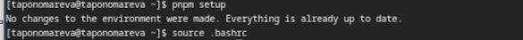 

## Общепринятые коммиты

Использую commitizen для форматирования коммитов (рис. 4).

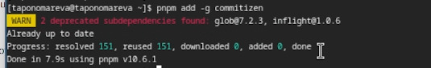

Использую standard-changelog для создания логов (рис. 5).

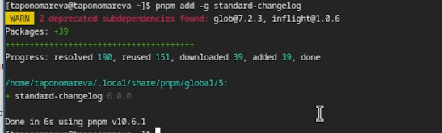

## Создание репозитория git

Создаю репозиторий git-extended и копирую его в папку home (рис. 6).

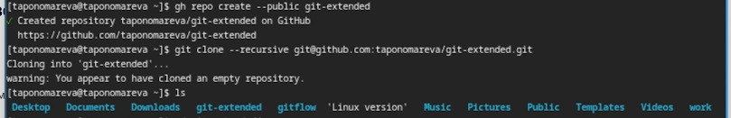

Делаю первый коммит и выкладываю его на github (рис. 7).

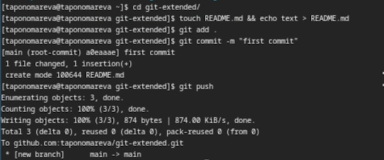

## Конфигурация общепринятых коммитов

Использую команду pnpm init, затем nano package.json (рис. 8)

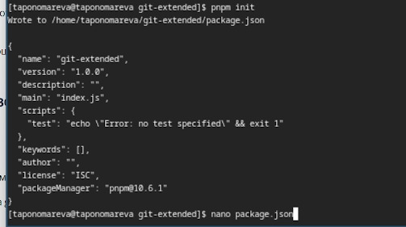

Изменяю файл package.json (рис. 9).

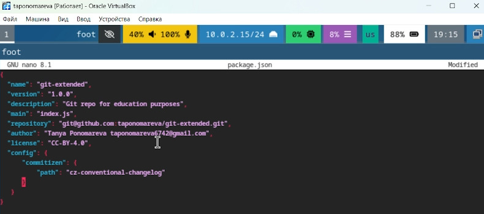

Добавляю новые файлы, выполняю коммит и отправляю на github (рис. 10).

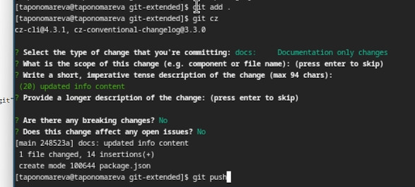

# Конфигурация git-flow

Инициализирую git-flow, устанавливаю префикс для ярлыков как v, проверяю, что нахожусь на ветке develop (рис. 11).

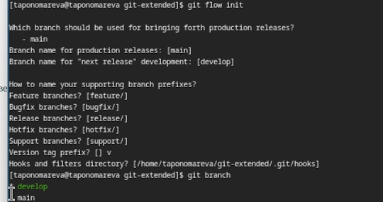

## Загрузка репозитория в хранилище

Загружаю весь репозиторий в хранилище и устанавливаю внешнюю ветку как вышестоящую для этой ветки (рис. 12).

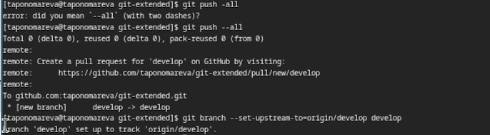

Создаю релиз с версией 1.0.0 (рис. 13).

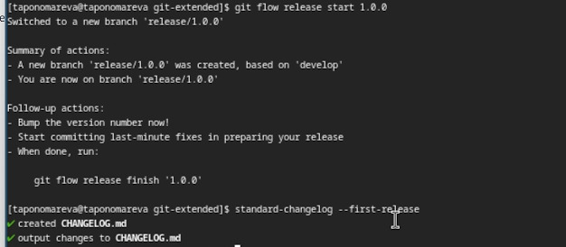

## Создание журнала
Создаю журнал изменений и добавляю его в индекс(рис. 14).

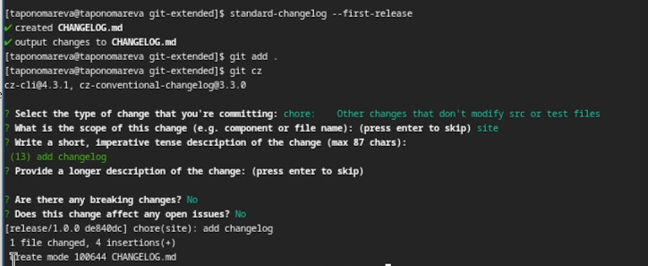

Заливаю релизную ветку в основную (рис. 15).

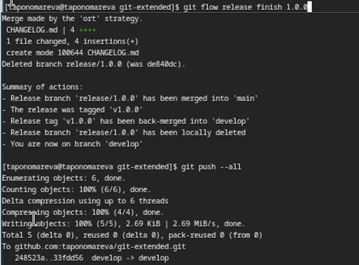

## Отправление данных на гитхаб

Отправляю данные на github (рис. 16).

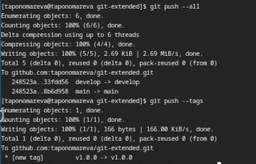

Создаю релиз на гитхаб (рис. 17).

Создаю ветку для новой функциональности, затем создаю релиз 1.2.3 (рис. 18).

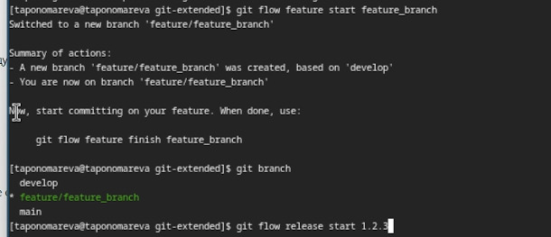

# Обновление номера версии

Обновляю номер версии в файле package.json (рис. 19).

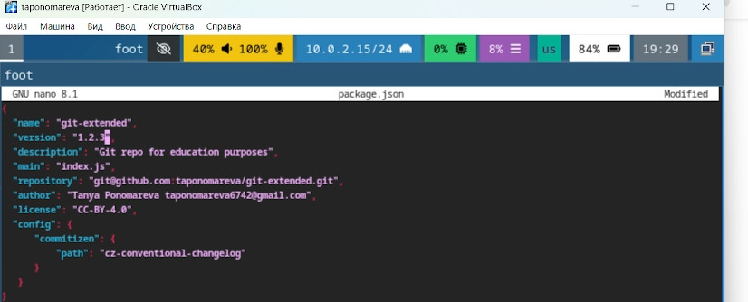

Создаю журнал изменений, добавляю его в индекс и заливаю релизную ветку в основную (рис. 20).

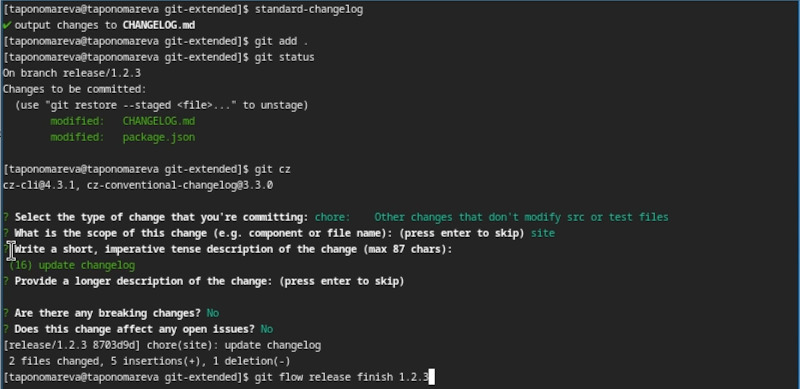

Отправляю данные на гитхаб (рис. 21).

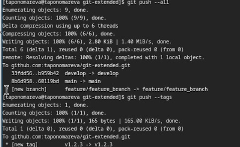

Создаю релиз на гитхаб с комментарием из журнала изменений (рис. 22).

# Выводы

Были получены навыки правильной работы с репозиториями git
