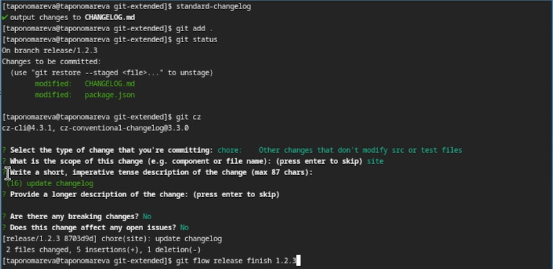

---
## Front matter
title: "Отчёт по лабораторной работе №4"
subtitle: "Операционные системы"
author: "Пономарева Татьяна Александровна"

## Generic otions
lang: ru-RU
toc-title: "Содержание"

## Bibliography
bibliography: bib/cite.bib
csl: pandoc/csl/gost-r-7-0-5-2008-numeric.csl

## Pdf output format
toc: true # Table of contents
toc-depth: 2
lof: true # List of figures
lot: true # List of tables
fontsize: 12pt
linestretch: 1.5
papersize: a4
documentclass: scrreprt
## I18n polyglossia
polyglossia-lang:
  name: russian
  options:
	- spelling=modern
	- babelshorthands=true
polyglossia-otherlangs:
  name: english
## I18n babel
babel-lang: russian
babel-otherlangs: english
## Fonts
mainfont: IBM Plex Serif
romanfont: IBM Plex Serif
sansfont: IBM Plex Sans
monofont: IBM Plex Mono
mathfont: STIX Two Math
mainfontoptions: Ligatures=Common,Ligatures=TeX,Scale=0.94
romanfontoptions: Ligatures=Common,Ligatures=TeX,Scale=0.94
sansfontoptions: Ligatures=Common,Ligatures=TeX,Scale=MatchLowercase,Scale=0.94
monofontoptions: Scale=MatchLowercase,Scale=0.94,FakeStretch=0.9
mathfontoptions:
## Biblatex
biblatex: true
biblio-style: "gost-numeric"
biblatexoptions:
  - parentracker=true
  - backend=biber
  - hyperref=auto
  - language=auto
  - autolang=other*
  - citestyle=gost-numeric
## Pandoc-crossref LaTeX customization
figureTitle: "Рис."
tableTitle: "Таблица"
listingTitle: "Листинг"
lofTitle: "Список иллюстраций"
lotTitle: "Список таблиц"
lolTitle: "Листинги"
## Misc options
indent: true
header-includes:
  - \usepackage{indentfirst}
  - \usepackage{float} # keep figures where there are in the text
  - \floatplacement{figure}{H} # keep figures where there are in the text
---

# Цель работы

Получение навыков правильной работы с репозиториями git

# Задание

- Выполнить работу для тестового репозитория
- Преобразовать рабочий репозиторий в репозиторий с git-flow и conventional commits.

# Теоретическое введение

Рабочий процесс Gitflow Workflow используется с пакетом git-flow. Gitflow Workflow опубликована и популяризована Винсентом Дриссеном и предполагает выстраивание строгой модели ветвления с учетом выпуска проекта.

# Выполнение лабораторной работы

## Установка Node.js

Сначала устанавливаю Node.js и pnpm (рис. [-@fig:001]).

{#fig:001 width=70%} 

## Установка gitflow

Потом загружаю gitflow (рис. [-@fig:002]).

{#fig:002 width=70%} 

## Настройка Node.js

Далее идет настройка Node.js. Запускаю pnpm, делаю перелогин и выполняю source ~/.bashrc (рис. [-@fig:003]).

{#fig:003 width=70%} 

## Общепринятые коммиты

Использую commitizen для форматирования коммитов (рис. [-@fig:004]).

{#fig:004 width=70%}

Использую standard-changelog для создания логов (рис. [-@fig:005]).

{#fig:005 width=70%}

## Создание репозитория git

Создаю репозиторий git-extended и копирую его в папку home (рис. [-@fig:006]).

{#fig:006 width=70%}

Делаю первый коммит и выкладываю его на github (рис. [-@fig:007]).

{#fig:007 width=70%}

## Конфигурация общепринятых коммитов

Использую команду pnpm init, затем nano package.json (рис. [-@fig:008])

{#fig:008 width=70#}

Изменяю файл package.json (рис. [-@fig:009]).

{#fig:009 width=70%}

Добавляю новые файлы, выполняю коммит и отправляю на github (рис. [-@fig:010]).

{#fig:010 width=70%}

## Конфигурация git-flow

Инициализирую git-flow, устанавливаю префикс для ярлыков как v, проверяю, что нахожусь на ветке develop (рис. [-@fig:011]).

{#fig:011 width=70%}

Загружаю весь репозиторий в хранилище и устанавливаю внешнюю ветку как вышестоящую для этой ветки (рис. [-@fig:012]).

{#fig:012 width=70%}

Создаю релиз с версией 1.0.0 (рис. [-@fig:013]).

{#fig:013 width=70%}

Создаю журнал изменений и добавляю его в индекс(рис. [-@fig:014]).

{#fig:014 width=70%}

Заливаю релизную ветку в основную (рис. [-@fig:015]).

{#fig:015 width=70%}

Отправляю данные на github (рис. [-@fig:016]).

{#fig:016 width=70%}

Создаю релиз на гитхаб (рис. [-@fig:017]).

{#fig:017 width=70%}

Создаю ветку для новой функциональности, затем создаю релиз 1.2.3 (рис. [-@fig:018]).

{#fig:018 width=70%}

Обновляю номер версии в файле package.json (рис. [-@fig:019]).

{#fig:019 width=70%}

Создаю журнал изменений, добавляю его в индекс и заливаю релизную ветку в основную (рис. [-@fig:020]).

{#fig:020 width=70%}

Отправляю данные на гитхаб (рис. [-@fig:021]).

{#fig:021 width=70%}

Создаю релиз на гитхаб с комментарием из журнала изменений (рис. [-@fig:022]).

{#fig:022 width=70%}

# Выводы

Были получены навыков правильной работы с репозиториями git

# Список литературы{.unnumbered}

1. [Курс на ТУИС](https://esystem.rudn.ru/course/view.php?id=113)
