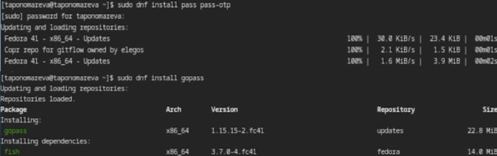
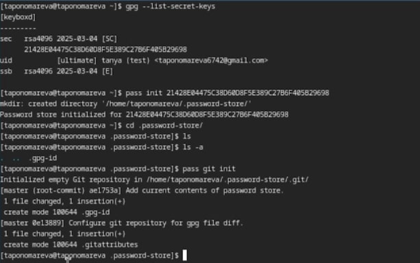
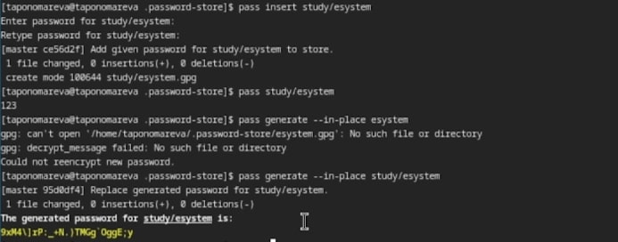
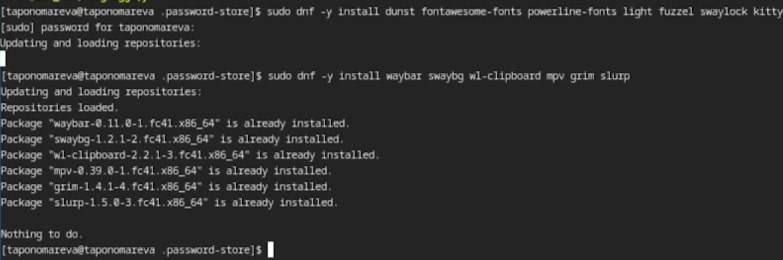
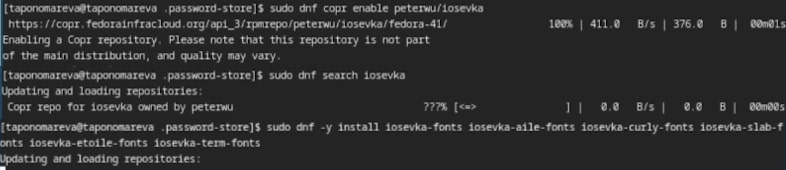
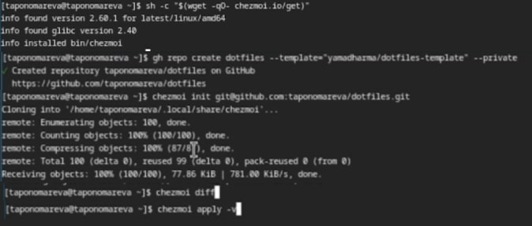
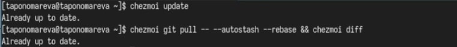
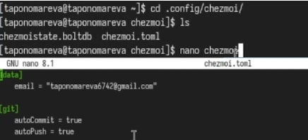

---
## Front matter
lang: ru-RU
title: Презентация по лабораторной работе №5
subtitle: Операционные системы
author:
  - Пономарева Т.А.
institute:
  - Российский университет дружбы народов, Москва, Россия
date: 15 марта 2025

## i18n babel
babel-lang: russian
babel-otherlangs: english

## Formatting pdf
toc: false
toc-title: Содержание
slide_level: 2
aspectratio: 169
section-titles: true
theme: metropolis
header-includes:
 - \metroset{progressbar=frametitle,sectionpage=progressbar,numbering=fraction}
---

# Информация

## Докладчик

:::::::::::::: {.columns align=center}
::: {.column width="70%"}

  * Пономарева Татьяна Александровна
  * Студент группы НКАбд-04-24
  * Российский университет дружбы народов
  * [1132246742@pfur.ru](mailto:1132246742@pfur.ru)
  * <https://github.com/taponomareva>

:::
::: {.column width="30%"}

:::
::::::::::::::

# Вводная часть

## Цель работы

Настроить рабочую среду

# Задание

1) Добавить новый пароль
2) Установить дополнительное программное обеспечение
3) Создать собственный репозиторий

# Теоретическое введение

Менеджер паролей pass - программа, сделанная в рамках идеологии Unix. Данные хранятся в файловой системе в виде каталогов и файлов. Файлы шифруются с помощью GPG-ключа.

# Выполнение лабораторной работы

 Установка pass и gopass (рис. 1).

## Синхронизация с git

Сначала просматриваю список ключей, инициализирую хранилище, создаю структуру git (рис. 2).

Создаю пароль (рис. 3).

# Дополнительное программное обеспечение

Устанавливаю дополнительное программное обеспечение (рис. 4).

# Шрифты

Устанавливаю шрифты (рис. 5).

# Установка бинарного файла

Устанавливаю бинарный файл. Создаю собственный репозиторий. Подключаю репозиторий к системе (рис. 6).

# Извлечение последних изменений

Извлекаю последние изменения(рис. 7).

# Автоматика изменений

Настраиваю автоматику изменений(рис. 8).

# Выводы

В ходе проведения лабораторной работы была настроена рабочая среда.

# Список литературы{.unnumbered}

1. [Курс на ТУИС](https://esystem.rudn.ru/course/view.php?id=113)

