---
## Front matter
lang: ru-RU
title: Презентация по лабораторной работе №6
subtitle: Операционные системы
author:
  - Пономарева Т.А.
institute:
  - Российский университет дружбы народов, Москва, Россия
date: 22 марта 2025

## i18n babel
babel-lang: russian
babel-otherlangs: english

## Formatting pdf
toc: false
toc-title: Содержание
slide_level: 2
aspectratio: 169
section-titles: true
theme: metropolis
header-includes:
 - \metroset{progressbar=frametitle,sectionpage=progressbar,numbering=fraction}
---

# Информация

## Докладчик

:::::::::::::: {.columns align=center}
::: {.column width="70%"}

  * Пономарева Татьяна Александровна
  * Студент группы НКАбд-04-24
  * Российский университет дружбы народов
  * [1132246742@pfur.ru](mailto:1132246742@pfur.ru)
  * <https://github.com/taponomareva>

:::
::: {.column width="30%"}

:::
::::::::::::::

# Вводная часть

## Цель работы

Приобретение практических навыков взаимодействия пользователя с системой посредством командной строки.

# Задание

1) Определить полное имя домашнего каталога
2) Работа с каталогом /tmp
3) Работа с каталогами: удаление и создание
4) Команда man, определение набора опций команды ls
5) Просмотреть описание команд при помощи man
6) Выполнить модификацию команд

# Теоретическое введение

В операционной системе типа Linux взаимодействие пользователя с системой обычно осуществляется с помощью командной строки посредством построчного ввода команд. При этом обычно используется командные интерпретаторы языка shell: /bin/sh; /bin/csh; /bin/ksh.

# Выполнение лабораторной работы

## Полное имя домашнего каталога

При помощи команды cd ~ и pwd узнаю полное имя домашнего каталога (рис. 1).

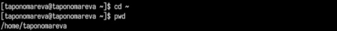

# Работа с каталогом /tmp

## Команда ls
Перехожу в каталог /tmp и выполняю команду ls для просмотра содержимого каталога (рис. 2).

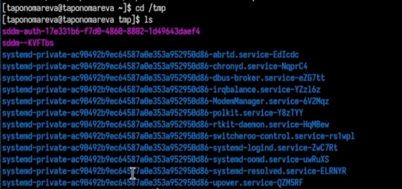

## Команда ls -a

Выполняю команду ls -a для просмотра содержимого каталога со скрытыми файлами (рис. 3).

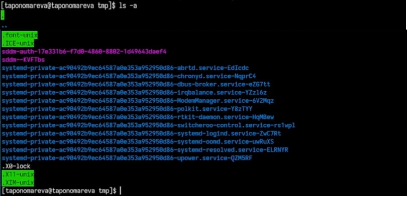

# Команда ls -alF

Выполняю команду ls -alF для детального отображения содержимого каталога (рис. 4).

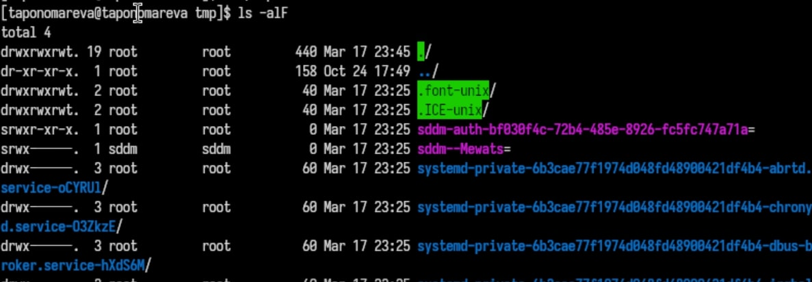

# Работа с каталогом /var/spool. Команда ls

## Каталог cron
Определяю, есть ли подкаталог с именем cron в каталоге /var/spool - он есть, проверила при помощи перехода в каталог /var/spool и команды ls (рис. 5).

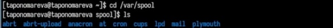

# Работа с домашним каталогом. Владелец файлов и подкаталогов

Перехожу в домашний каталог и при помощи команды ls -l вывожу на экран его содержимое и  определяю владельца файлов и подкаталогов - taponomareva (рис. 6).

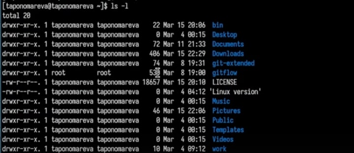

# Работа с домашним каталогом

Создаю новый каталог с именем newdir в домашнем каталоге. В каталоге ~/newdir создаю новый каталог morefun при помощи команды mkdir morefun. В домашнем каталоге создаю три новых каталога с именами letters, memos, misk, затем удаляю эти каталоги одной командой (рис. 7).

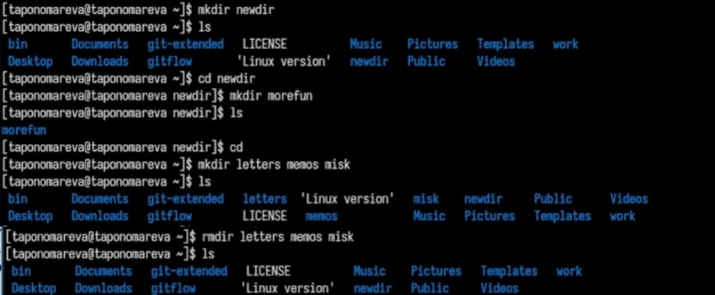

# Работа с каталогом ~/newdir

Пробую удалить каталог ~/newdir командой rm. Каталог не был удален, т.к. он содержит подкаталог morefun, т.е. каталог ~/newdir не является пустым (рис. 8).

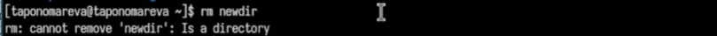

# Работа с каталогом ~/newdir/morefun

Удаляю каталог ~/newdir/morefun при помощи rm -r ~/newdir/morefun. Данный каталог был удален (рис. 9).

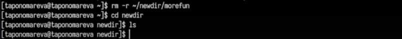

# Просмотр команды ls при помощи man ls

С помощью команды man определяю опцию команды ls, используемую для просмотра содержимого не только указанного каталога, но и подкаталогов, входящих в него (рис. 10).

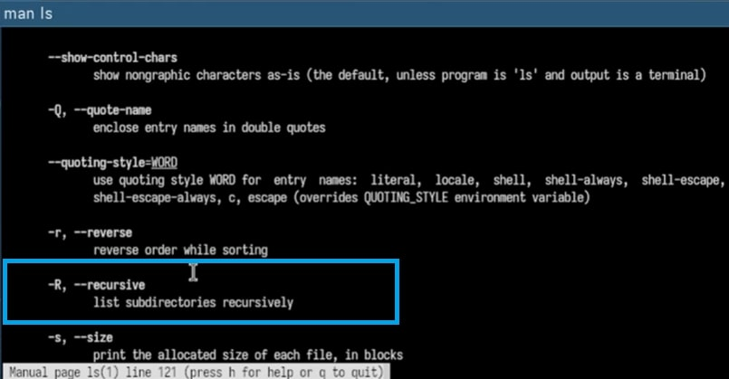

## Команда ls -R

Использую команду ls -R (рис. 11).

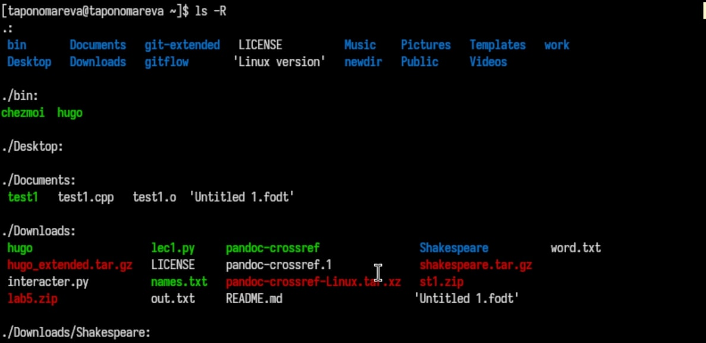

## Команда ls -lt

С помощью команды man определяю набор опций команды ls, позволяющий отсортировать по времени последнего изменения выводимый список содержимого каталога с развернутым описанием файлов - это ls -lt (рис. 12).

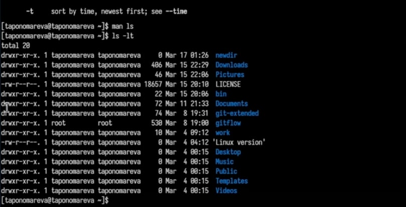

# Описание команд

Использую команду man для просмотра описания следующих команд: cd, pwd, mkdir, rmdir, rm (рис. 13).

cd dir: меняет директорию на указанную dir, pwd: выводит путь к текущей директории, mkdir dir: создает директорию dir, rmdir dir: удаляет пустую директорию dir, rm: удаляет файлы или директории.

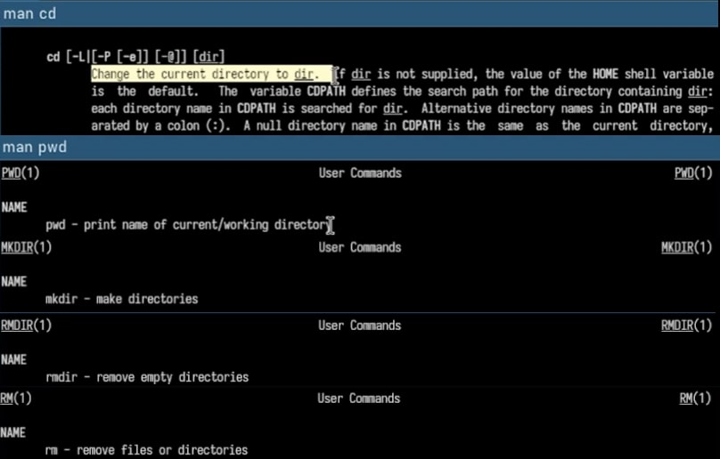

# Модификация команд

Выполняю модификацию команд из буфера команд (рис. 14).

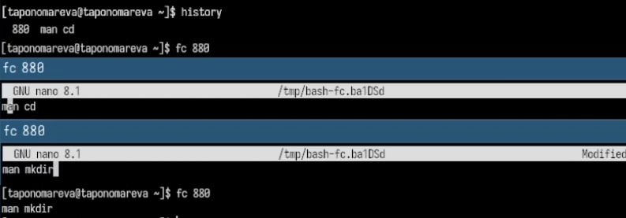

# Выводы

В ходе выполнения лабораторной работы были приобретены практические навыки взаимодействия пользователя с системой посредством командной строки.

# Список литературы{.unnumbered}

1. [Курс на ТУИС](https://esystem.rudn.ru/course/view.php?id=113)
