---
## Front matter
title: "Отчёт по лабораторной работе №6"
subtitle: "Операционные системы"
author: "Пономарева Татьяна Александровна"

## Generic otions
lang: ru-RU
toc-title: "Содержание"

## Bibliography
bibliography: bib/cite.bib
csl: pandoc/csl/gost-r-7-0-5-2008-numeric.csl

## Pdf output format
toc: true # Table of contents
toc-depth: 2
lof: true # List of figures
lot: true # List of tables
fontsize: 12pt
linestretch: 1.5
papersize: a4
documentclass: scrreprt
## I18n polyglossia
polyglossia-lang:
  name: russian
  options:
	- spelling=modern
	- babelshorthands=true
polyglossia-otherlangs:
  name: english
## I18n babel
babel-lang: russian
babel-otherlangs: english
## Fonts
mainfont: IBM Plex Serif
romanfont: IBM Plex Serif
sansfont: IBM Plex Sans
monofont: IBM Plex Mono
mathfont: STIX Two Math
mainfontoptions: Ligatures=Common,Ligatures=TeX,Scale=0.94
romanfontoptions: Ligatures=Common,Ligatures=TeX,Scale=0.94
sansfontoptions: Ligatures=Common,Ligatures=TeX,Scale=MatchLowercase,Scale=0.94
monofontoptions: Scale=MatchLowercase,Scale=0.94,FakeStretch=0.9
mathfontoptions:
## Biblatex
biblatex: true
biblio-style: "gost-numeric"
biblatexoptions:
  - parentracker=true
  - backend=biber
  - hyperref=auto
  - language=auto
  - autolang=other*
  - citestyle=gost-numeric
## Pandoc-crossref LaTeX customization
figureTitle: "Рис."
tableTitle: "Таблица"
listingTitle: "Листинг"
lofTitle: "Список иллюстраций"
lotTitle: "Список таблиц"
lolTitle: "Листинги"
## Misc options
indent: true
header-includes:
  - \usepackage{indentfirst}
  - \usepackage{float} # keep figures where there are in the text
  - \floatplacement{figure}{H} # keep figures where there are in the text
---

# Цель работы

Приобретение практических навыков взаимодействия пользователя с системой посредством командной строки.

# Задание

1) Определить полное имя домашнего каталога
2) Работа с каталогом /tmp
3) Работа с каталогами: удаление и создание
4) Команда man, определение набора опций команды ls
5) Просмотреть описание команд при помощи man
6) Выполнить модификацию команд

# Теоретическое введение

В операционной системе типа Linux взаимодействие пользователя с системой обычно осуществляется с помощью командной строки посредством построчного ввода команд. При этом обычно используется командные интерпретаторы языка shell: /bin/sh; /bin/csh; /bin/ksh.

# Выполнение лабораторной работы

При помощи команды cd ~ и pwd узнаю полное имя домашнего каталога (рис. [-@fig:001]).

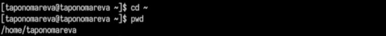{#fig:001 width=70%}

Перехожу в каталог /tmp и выполняю команду ls для просмотра содержимого каталога (рис. [-@fig:002]).

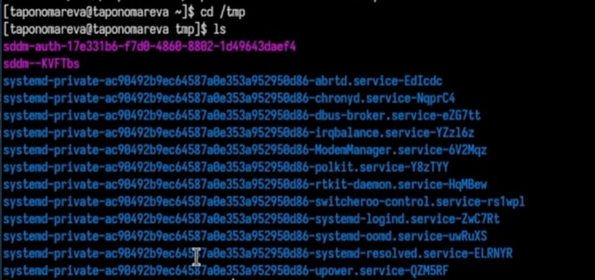{#fig:002 width=70%}

Выполняю команду ls -a для просмотра содержимого каталога со скрытыми файлами (рис. [-@fig:003]).

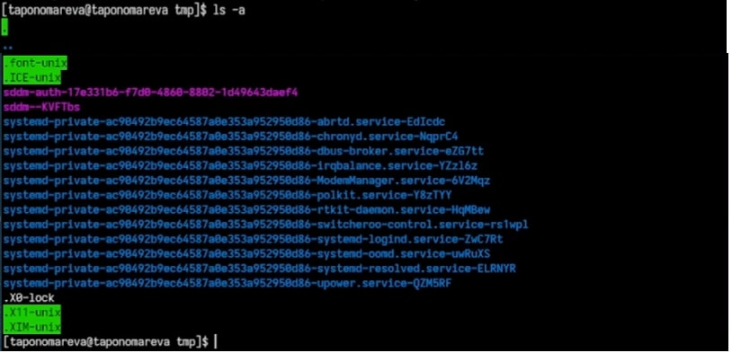{#fig:003 width=70%}

Выполняю команду ls -alF для детального отображения содержимого каталога (рис. [-@fig:004]).

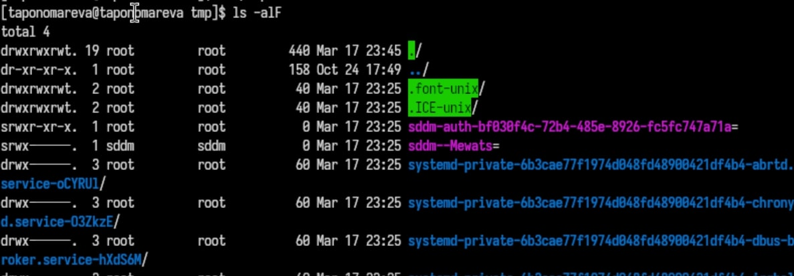{#fig:004 width=70%}

Определяю, есть ли подкаталог с именем cron в каталоге /var/spool - он есть, проверила при помощи перехода в каталог /var/spool и команды ls (рис. [-@fig:005]).

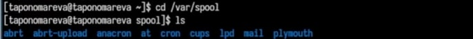{#fig:005 width=70%}

Перехожу в домашний каталог и при помощи команды ls -l вывожу на экран его содержимое и  определяю владельца файлов и подкаталогов - taponomareva (рис. [-@fig:006]).

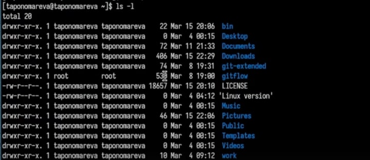{#fig:006 width=70%}

Создаю новый каталог с именем newdir в домашнем каталоге. В каталоге ~/newdir создаю новый каталог morefun при помощи команды mkdir morefun. В домашнем каталоге создаю три новых каталога с именами letters, memos, misk, затем удаляю эти каталоги одной командой (рис. [-@fig:007]).

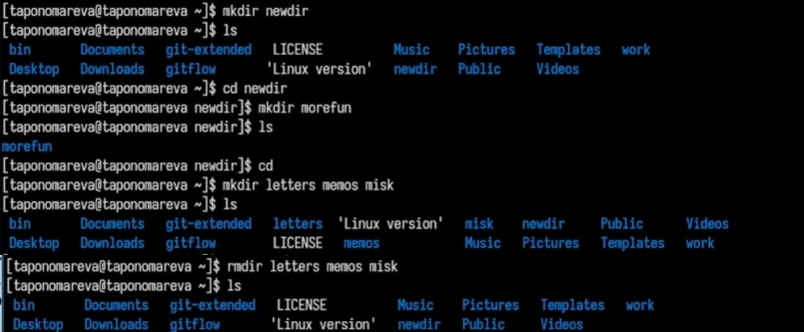{#fig:007 width=70%}

Пробую удалить каталог ~/newdir командой rm. Каталог не был удален, т.к. он содержит подкаталог morefun, т.е. каталог ~/newdir не является пустым (рис. [-@fig:008]).

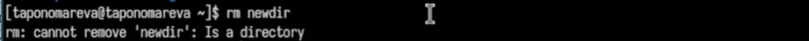{#fig:008 width=70%}

Удаляю каталог ~/newdir/morefun при помощи rm -r ~/newdir/morefun. Данный каталог был удален (рис. [-@fig:009]).

{#fig:009 width=70%}

С помощью команды man определяю опцию команды ls, используемую для просмотра содержимого не только указанного каталога, но и подкаталогов, входящих в него (рис. [-@fig:010]).

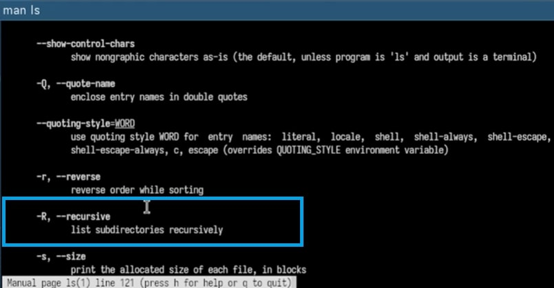{#fig:010 width=70%}

Использую команду ls -R (рис. [-@fig:011]).

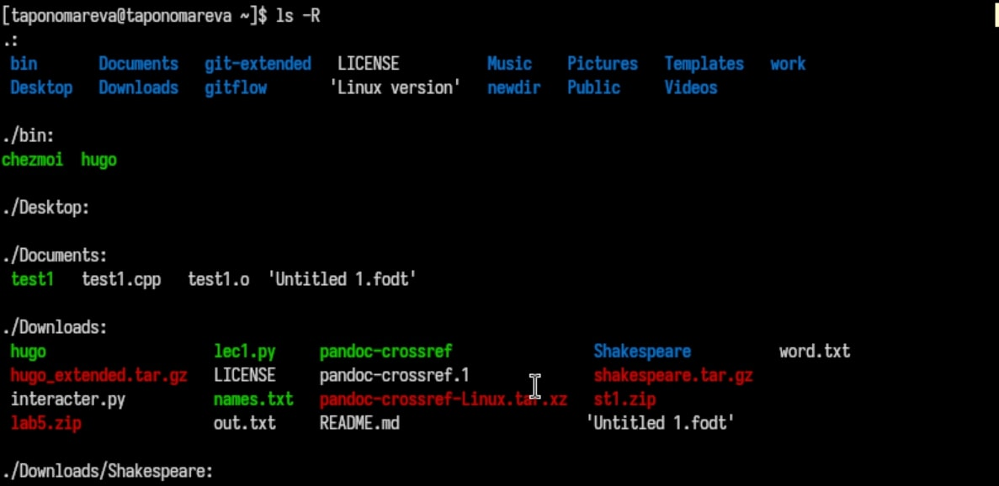{#fig:011 width=70%}

С помощью команды man определяю набор опций команды ls, позволяющий отсортировать по времени последнего изменения выводимый список содержимого каталога с развернутым описанием файлов - это ls -lt (рис. [-@fig:012]).

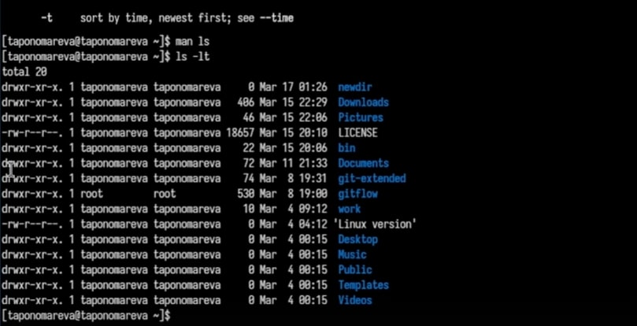{#fig:012 width=70%}

Использую команду man для просмотра описания следующих команд: cd, pwd, mkdir, rmdir, rm (рис. [-@fig:013]).

cd dir: меняет директорию на указанную dir, pwd: выводит путь к текущей директории, mkdir dir: создает директорию dir, rmdir dir: удаляет пустую директорию dir, rm: удаляет файлы или директории.

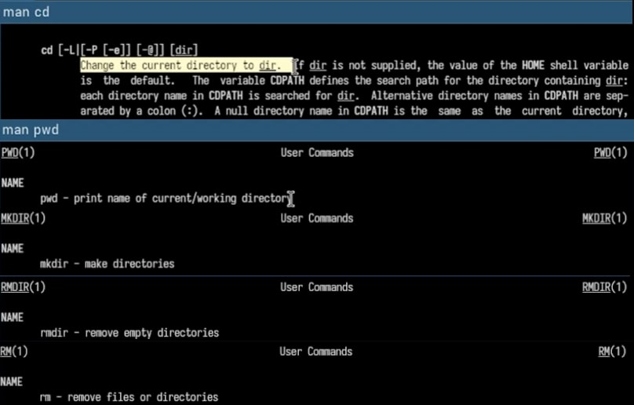{#fig:013 width=70%}

Выполняю модификацию команд из буфера команд (рис. [-@fig:014]).

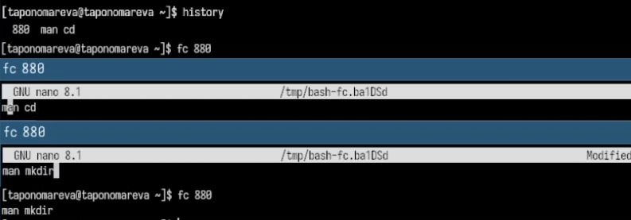{#fig:014 width=70%}

# Контрольные вопросы

1. Что такое командная строка?
Командная строка — это интерфейс, позволяющий пользователям взаимодействовать с операционной системой с помощью текстовых команд.

2. Как определить абсолютный путь текущего каталога?
Используется команда pwd.
Пример: pwd

3. Как вывести только тип файлов и их имена в текущем каталоге?
Используется команда ls -F.
Пример: ls -F

4. Как отобразить скрытые файлы?
Используется команда ls -a.
Пример: ls -a

5. Как удалить файл и каталог? Можно ли одной командой?
Файл удаляется командой rm.
Пример:

rm file.txt

Пустой каталог удаляется rmdir, а непустой rm -r.
Пример:

rmdir empty_folder

rm -r full_folder

Одной командой (rm -r) можно удалить и файлы, и каталоги.

6. Как вывести историю команд?
Используется команда history.
Пример: history

7. Как использовать историю команд для модифицированного выполнения?
!! — выполнить последнюю команду.

!n — выполнить команду с номером n.

!имя — выполнить последнюю команду, начинающуюся с имя.
Пример: !ls

8. Как запустить несколько команд в одной строке?
Используя ; (выполняются последовательно).

Используя && (следующая выполняется, если предыдущая успешна).
Пример:
pwd; ls -l && echo "Команды выполнены"

9. Что такое символы экранирования?
Символ \ используется для экранирования спецсимволов.
Пример:
echo "Файл находится в папке \"Документы\""

10. Как выглядит вывод ls -l?
Показывает подробную информацию о файлах: права доступа, владелец, группа, размер, дата изменения и имя файла.

11. Что такое относительный путь?
Относительный путь указывает путь относительно текущего каталога.
Примеры:
Относительный: cd documents
Абсолютный: cd /home/user/documents

12. Как получить информацию о команде?
Используются man, --help или info.
Пример: man ls

13. Какая клавиша дополняет команды?
Tab — автодополнение команд и имен файлов.

# Выводы

В ходе выполнения лабораторной работы были приобретены практические навыки взаимодействия пользователя с системой посредством командной строки.

# Список литературы{.unnumbered}

1. [Курс на ТУИС](https://esystem.rudn.ru/course/view.php?id=113)
