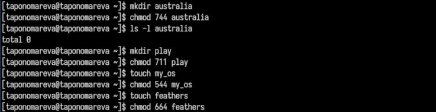

---
## Front matter
lang: ru-RU
title: Презентация по лабораторной работе №7
subtitle: Операционные системы
author:
  - Пономарева Т.А.
institute:
  - Российский университет дружбы народов, Москва, Россия
date: 29 марта 2025

## i18n babel
babel-lang: russian
babel-otherlangs: english

## Formatting pdf
toc: false
toc-title: Содержание
slide_level: 2
aspectratio: 169
section-titles: true
theme: metropolis
header-includes:
 - \metroset{progressbar=frametitle,sectionpage=progressbar,numbering=fraction}
---

# Информация

## Докладчик

:::::::::::::: {.columns align=center}
::: {.column width="70%"}

  * Пономарева Татьяна Александровна
  * Студент группы НКАбд-04-24
  * Российский университет дружбы народов
  * [1132246742@pfur.ru](mailto:1132246742@pfur.ru)
  * <https://github.com/taponomareva>

:::
::: {.column width="30%"}

:::
::::::::::::::

# Вводная часть

# Цель работы

 Ознакомление с файловой системой Linux,её структурой,именами и содержанием каталогов. Приобретение практических навыков по применению команд для работы с файламиикаталогами,по управлению процессами (и работами),по проверке исполь зования диска и обслуживанию файловой системы.

# Теоретическое введение

Файловая система в Linux представляет собой иерархическую структуру, где все данные хранятся в виде файлов и каталогов. Основным элементом является корневой каталог /, из которого разворачивается вся файловая структура. Для управления файлами и каталогами в Linux используются различные команды, позволяющие создавать, изменять, перемещать и удалять файлы, а также управлять их правами доступа.

# Выполнение лабораторной работы

Сначала создаю файл lab7.txt, ввожу в него текст стихотворения и смотрю его содержание при помощи команды cat lab7.txt, потом выполняю команду less lab7.txt. Далее вывожу 10 первых и последних строк файла lab7.txt (рис. 1).

# Копирование файлов и каталогов

Выполняю операции копирования (рис. 2).

# Перемещение и переименование файлов и каталогов

Выполняю операции копирования (рис. 3).

# Изменение прав доступа

Выполняю операции изменения прав доступа (рис. 4).

# Анализ файловой системы

Выполняю анализ файловой системы (рис. 5).

## Команда df

Команда df (рис. 6).

## Команда fsck

Команда fsck /dev/sda1 (рис. 7).

# Работа по заданию

Выполняю следующие команды: (рис. 8).

# Изменение прав доступа

Меняю права доступа (рис. 9).

# Cодержимое passwd

Смотрю содержимое passwd (рис. 10).

Изменяю права доступа к файлам и проверяю их содержимое, что вызывает ошибку, т к были отняты права на прочтение (рис. 11).

# Команда man

Команда man mount - подключение файловых систем, man fsck - проверка и восстановление файловых систем, man mkfs - создание файловых систем, man kill - завершение процессов(рис. 12).

# Выводы

Было произведено ознакомление с файловой системой Linux, её структурой, именами и содержанием каталогов. Были приобретены практические навыки по применению команд для работы с файлами и каталогами, по управлению процессами (и работами), по проверке исполь зования диска и обслуживанию файловой системы.

# Список литературы{.unnumbered}

1. [Курс на ТУИС](https://esystem.rudn.ru/course/view.php?id=113)
