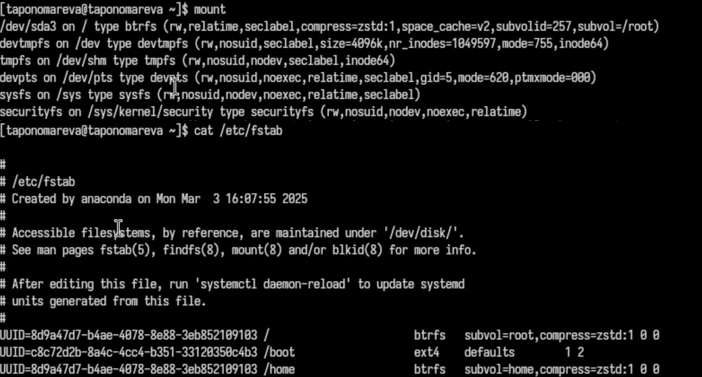

---
## Front matter
title: "Отчёт по лабораторной работе №7"
subtitle: "Операционные системы"
author: "Пономарева Татьяна Александровна"

## Generic otions
lang: ru-RU
toc-title: "Содержание"

## Bibliography
bibliography: bib/cite.bib
csl: pandoc/csl/gost-r-7-0-5-2008-numeric.csl

## Pdf output format
toc: true # Table of contents
toc-depth: 2
lof: true # List of figures
lot: true # List of tables
fontsize: 12pt
linestretch: 1.5
papersize: a4
documentclass: scrreprt
## I18n polyglossia
polyglossia-lang:
  name: russian
  options:
	- spelling=modern
	- babelshorthands=true
polyglossia-otherlangs:
  name: english
## I18n babel
babel-lang: russian
babel-otherlangs: english
## Fonts
mainfont: IBM Plex Serif
romanfont: IBM Plex Serif
sansfont: IBM Plex Sans
monofont: IBM Plex Mono
mathfont: STIX Two Math
mainfontoptions: Ligatures=Common,Ligatures=TeX,Scale=0.94
romanfontoptions: Ligatures=Common,Ligatures=TeX,Scale=0.94
sansfontoptions: Ligatures=Common,Ligatures=TeX,Scale=MatchLowercase,Scale=0.94
monofontoptions: Scale=MatchLowercase,Scale=0.94,FakeStretch=0.9
mathfontoptions:
## Biblatex
biblatex: true
biblio-style: "gost-numeric"
biblatexoptions:
  - parentracker=true
  - backend=biber
  - hyperref=auto
  - language=auto
  - autolang=other*
  - citestyle=gost-numeric
## Pandoc-crossref LaTeX customization
figureTitle: "Рис."
tableTitle: "Таблица"
listingTitle: "Листинг"
lofTitle: "Список иллюстраций"
lotTitle: "Список таблиц"
lolTitle: "Листинги"
## Misc options
indent: true
header-includes:
  - \usepackage{indentfirst}
  - \usepackage{float} # keep figures where there are in the text
  - \floatplacement{figure}{H} # keep figures where there are in the text
---

# Цель работы

 Ознакомление с файловой системой Linux,её структурой,именами и содержанием каталогов. Приобретение практических навыков по применению команд для работы с файламиикаталогами,по управлению процессами (и работами),по проверке исполь зования диска и обслуживанию файловой системы.

# Задание

Здесь приводится описание задания в соответствии с рекомендациями
методического пособия и выданным вариантом.

# Теоретическое введение

Файловая система в Linux представляет собой иерархическую структуру, где все данные хранятся в виде файлов и каталогов. Основным элементом является корневой каталог /, из которого разворачивается вся файловая структура. Для управления файлами и каталогами в Linux используются различные команды, позволяющие создавать, изменять, перемещать и удалять файлы, а также управлять их правами доступа.

# Выполнение лабораторной работы

Сначала создаю файл lab7.txt, ввожу в него текст стихотворения и смотрю его содержание при помощи команды cat lab7.txt, потом выполняю команду less lab7.txt. Далее вывожу 10 первых и последних строк файла lab7.txt (рис. [-@fig:001]).

{#fig:001 width=70%}

# Копирование файлов и каталогов

Выполняю операции копирования (рис. [-@fig:002]).

{#fig:002 width=70%}

# Перемещение и переименование файлов и каталогов

Выполняю операции копирования (рис. [-@fig:003]).

{#fig:003 width=70%}

# Изменение прав доступа

Выполняю операции изменения прав доступа (рис. [-@fig:004]).

{#fig:004 width=70%}

# Анализ файловой системы

Выполняю анализ файловой системы (рис. [-@fig:005]).

{#fig:005 width=70%}

Команда df (рис. [-@fig:006]).

{#fig:006 width=70%}

Команда fsck /dev/sda1 (рис. [-@fig:007]).

{#fig:007 width=70%}

Выполняю следующие команды: (рис. [-@fig:008]).

{#fig:008 width=70%}

Меняю права доступа (рис. [-@fig:009]).

{#fig:009 width=70%}

Смотрю содержимое passwd (рис. [-@fig:0010]).

{#fig:0010 width=70%}

Изменяю права доступа к файлам и проверяю их содержимое, что вызывает ошибку, т к были отняты права на прочтение (рис. [-@fig:0011]).

{#fig:0011 width=70%}

Команда man mount - подключение файловых систем, man fsck - проверка и восстановление файловых систем, man mkfs - создание файловых систем, man kill - завершение процессов(рис. [-@fig:0012]).

{#fig:0012 width=70%}

# Ответы на контрольные вопросы

1. Характеристика файловых систем
Файловая система – это способ организации, хранения и управления данными на диске. В Linux используются различные файловые системы:

ext4 – наиболее распространенная файловая система в современных дистрибутивах Linux, поддерживает журналирование, большие файлы и разделы.

ext3 – устаревшая версия ext4, обладает меньшей производительностью.

XFS – высокопроизводительная файловая система, хорошо работает с большими объемами данных.

Btrfs – поддерживает снапшоты, сжатие данных и самовосстановление файлов.

NTFS – файловая система Windows, поддерживаемая в Linux через драйвер ntfs-3g.

FAT32/exFAT – используются на флеш-накопителях и внешних дисках, совместимы с разными операционными системами.

2. Общая структура файловой системы и характеристика директорий первого уровня
Файловая система Linux организована в виде иерархии с корневой директорией /. Основные каталоги первого уровня:

/ – корневая директория, содержит все остальные файлы и каталоги.

/bin – содержит исполняемые файлы (команды, доступные всем пользователям).

/boot – файлы, необходимые для загрузки системы (ядро, загрузчик).

/dev – файлы устройств (например, жесткие диски, флеш-накопители).

/etc – конфигурационные файлы системы и программ.

/home – домашние каталоги пользователей.

/lib – системные библиотеки, необходимые для работы программ.

/media и /mnt – точки монтирования съемных носителей.

/opt – дополнительные программы, установленные вручную.

/proc – виртуальная файловая система, содержащая информацию о запущенных процессах.

/root – домашний каталог суперпользователя (root).

/tmp – временные файлы, которые удаляются после перезагрузки.

/usr – программы и утилиты, установленные для пользователей.

/var – файлы логов, кэша и временных данных.

3. Какая операция должна быть выполнена, чтобы содержимое некоторой файловой системы было доступно операционной системе?
Файловая система становится доступной после монтирования. Для этого используется команда:

mount /dev/sdX /mnt

Где /dev/sdX – имя устройства (например, /dev/sdb1), а /mnt – точка монтирования.

4. Основные причины нарушения целостности файловой системы и способы устранения повреждений

Причины повреждений:

Некорректное выключение компьютера.

Физические повреждения жесткого диска.

Ошибки в драйверах или файловой системе.

Вирусы и вредоносные программы.

Способы устранения:

Проверка и исправление ошибок файловой системы с помощью команды fsck:

fsck -y /dev/sdX

Восстановление данных из резервной копии.

Замена поврежденного диска.

5. Как создается файловая система?
Создание новой файловой системы выполняется командой mkfs. Например, для создания файловой системы ext4:

mkfs.ext4 /dev/sdX

6. Команды для просмотра текстовых файлов

cat file.txt – выводит весь файл в терминале.

less file.txt – позволяет пролистывать файл постранично.

more file.txt – аналогично less, но с ограниченными возможностями.

head file.txt – показывает первые десять строк файла.

tail file.txt – показывает последние десять строк файла.

7. Основные возможности команды cp в Linux

Копирование файла:

cp file.txt /destination/

Копирование каталога с его содержимым:

cp -r folder/ /destination/

Сохранение атрибутов (прав доступа, владельца, временных меток):

cp -p file.txt /destination/

8. Основные возможности команды mv в Linux

Перемещение файла или каталога:

mv file.txt /destination/

Переименование файла:

mv oldname.txt newname.txt

9. Что такое права доступа и как они могут быть изменены?
Каждый файл или каталог в Linux имеет права доступа:

Чтение (r)

Запись (w)

Исполнение (x)

Изменение прав доступа выполняется командой chmod. Например:

chmod 755 script.sh

Где 755 – это комбинация прав:

Владелец: чтение, запись, выполнение (7)

Группа: чтение и выполнение (5)

Остальные пользователи: чтение и выполнение (5)

Изменение владельца файла выполняется командой chown:

chown user:group file.txt

# Выводы

Было произведено ознакомление с файловой системой Linux, её структурой, именами и содержанием каталогов. Были приобретены практические навыки по применению команд для работы с файлами и каталогами, по управлению процессами (и работами), по проверке исполь зования диска и обслуживанию файловой системы.

# Список литературы{.unnumbered}

1. [Курс на ТУИС](https://esystem.rudn.ru/course/view.php?id=113)
