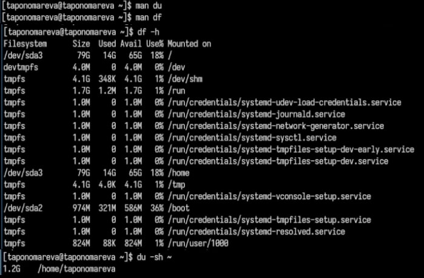

---
## Front matter
lang: ru-RU
title: Презентация по лабораторной работе №8
subtitle: Операционные системы
author:
  - Пономарева Т.А.
institute:
  - Российский университет дружбы народов, Москва, Россия
date: 31 марта 2025

## i18n babel
babel-lang: russian
babel-otherlangs: english

## Formatting pdf
toc: false
toc-title: Содержание
slide_level: 2
aspectratio: 169
section-titles: true
theme: metropolis
header-includes:
 - \metroset{progressbar=frametitle,sectionpage=progressbar,numbering=fraction}
---

# Информация

## Докладчик

:::::::::::::: {.columns align=center}
::: {.column width="70%"}

  * Пономарева Татьяна Александровна
  * Студент группы НКАбд-04-24
  * Российский университет дружбы народов
  * [1132246742@pfur.ru](mailto:1132246742@pfur.ru)
  * <https://github.com/taponomareva>

:::
::: {.column width="30%"}

:::
::::::::::::::

# Вводная часть

## Цель работы

Ознакомление с инструментами поиска файлов и фильтрации текстовых данных. Приобретение практических навыков: по управлению процессами (и заданиями), по проверке использования диска и обслуживанию файловых систем.

# Теоретическое введение

## Перенаправление ввода-вывода

В системе по умолчанию открыто три специальных потока:
- stdin — стандартный поток ввода (по умолчанию: клавиатура), файловый дескриптор 0;
- stdout — стандартный поток вывода (по умолчанию: консоль), файловый дескриптор 1;
- stderr — стандартный поток вывод сообщений об ошибках (по умолчанию: консоль), файловый дескриптор 2.
Большинство используемых в консоли команд и программ записывают результаты своей работы в стандартный поток вывода stdout.

# Выполнение лабораторной работы

## Вход в систему

Вхожу в систему при помощи команды whoami - выводит имя моей учетной записи (taponomareva) (рис. 1).

## Записывание названий файлов в file.txt

Записываю названия файлов из каталога /etc и домашнего каталога в file.txt при помощи команд ls /etc > file.txt и ls ~ >> file.txt (рис. 2).

## Записывание названий файлов в conf.txt

Вывожу файлы с расширением .conf и записываю их в conf.txt, используя grep "\.conf$" file.txt > conf.txt (рис. 3).

## Определение файлов с 'c' в домашнем каталоге

Определяю файлы, начинающиеся с 'c' в домашнем каталоге, совершая команды ls ~ | grep "^c" и find ~ -maxdepth 1 -type f -name "c*" (рис. 4).

## Вывод файлов из /etc, начинающихся с 'h', постранично

Вывожу имена файлов из /etc, начинающихся с 'h', постранично: ls /etc | grep "^h" | less (рис. 5).

## Запуск процесса в фоновом режиме и удаление ~/logfile

Запускаю процесс в фоновом режиме, записывающий файлы, начинающиеся с 'log', в ~/logfile: ls ~ | grep "^log" > ~/logfile &; затем удаляю файл ~/logfile: rm ~/logfile (рис. 6).

## Запуск gedit в фоновом режиме и определение его идентификатора

Запускаю редактор gedit в фоновом режиме при помощи команды gedit & и определяю его идентификатора процесса: ps aux | grep gedit или pgrep gedit (рис. 7).

## Завершение процесса gedit

Завершаю процесса gedit, используя kill <PID> (<PID> подставьте номер процесса) или pkill gedit (рис. 8).

## Информация о df и du, их выполнение

Получаю информации о df и du, затем их выполняю: man df - справка по команде df, информация о свободном и используемом пространстве файловых систем; man du - справка по команде du, оценка занимаего дискового пространства файлами и директориями; df -h - показывает свободное место на дисках (читаемый формат); du -sh ~ - показывает размер домашней директории в удобном формате(рис. 9).

## Вывод всех директорий в домашнем каталоге

Вывожу все директории в домашнем каталоге: find ~ -type d (рис. 10).

# Выводы

Было произведено ознакомление с инструментами поиска файлов и фильтрации текстовых данных. Были приобретены практические навыки: по управлению процессами (и заданиями), по проверке использования диска и обслуживанию файловых систем.

# Список литературы{.unnumbered}

1. [Курс на ТУИС](https://esystem.rudn.ru/course/view.php?id=113)
