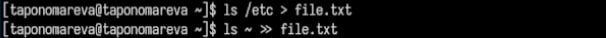
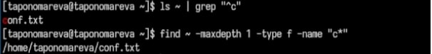
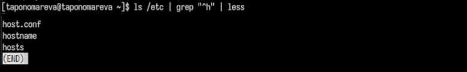
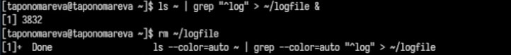
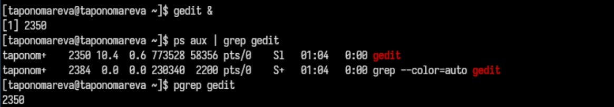
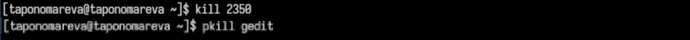
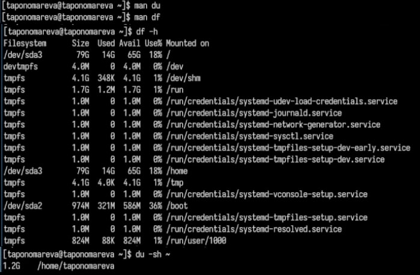
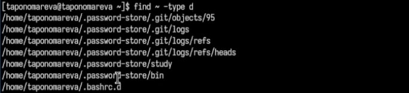

---
## Front matter
title: "Отчёт по лабораторной работе №8"
subtitle: "Операционные системы"
author: "Пономарева Татьяна Александровна"

## Generic otions
lang: ru-RU
toc-title: "Содержание"

## Bibliography
bibliography: bib/cite.bib
csl: pandoc/csl/gost-r-7-0-5-2008-numeric.csl

## Pdf output format
toc: true # Table of contents
toc-depth: 2
lof: true # List of figures
lot: true # List of tables
fontsize: 12pt
linestretch: 1.5
papersize: a4
documentclass: scrreprt
## I18n polyglossia
polyglossia-lang:
  name: russian
  options:
	- spelling=modern
	- babelshorthands=true
polyglossia-otherlangs:
  name: english
## I18n babel
babel-lang: russian
babel-otherlangs: english
## Fonts
mainfont: IBM Plex Serif
romanfont: IBM Plex Serif
sansfont: IBM Plex Sans
monofont: IBM Plex Mono
mathfont: STIX Two Math
mainfontoptions: Ligatures=Common,Ligatures=TeX,Scale=0.94
romanfontoptions: Ligatures=Common,Ligatures=TeX,Scale=0.94
sansfontoptions: Ligatures=Common,Ligatures=TeX,Scale=MatchLowercase,Scale=0.94
monofontoptions: Scale=MatchLowercase,Scale=0.94,FakeStretch=0.9
mathfontoptions:
## Biblatex
biblatex: true
biblio-style: "gost-numeric"
biblatexoptions:
  - parentracker=true
  - backend=biber
  - hyperref=auto
  - language=auto
  - autolang=other*
  - citestyle=gost-numeric
## Pandoc-crossref LaTeX customization
figureTitle: "Рис."
tableTitle: "Таблица"
listingTitle: "Листинг"
lofTitle: "Список иллюстраций"
lotTitle: "Список таблиц"
lolTitle: "Листинги"
## Misc options
indent: true
header-includes:
  - \usepackage{indentfirst}
  - \usepackage{float} # keep figures where there are in the text
  - \floatplacement{figure}{H} # keep figures where there are in the text
---

# Цель работы

Ознакомление с инструментами поиска файлов и фильтрации текстовых данных. Приобретение практических навыков: по управлению процессами (и заданиями), по проверке использования диска и обслуживанию файловых систем.

# Теоретическое введение

## Перенаправление ввода-вывода

В системе по умолчанию открыто три специальных потока:
- stdin — стандартный поток ввода (по умолчанию: клавиатура), файловый дескриптор 0;
- stdout — стандартный поток вывода (по умолчанию: консоль), файловый дескриптор 1;
- stderr — стандартный поток вывод сообщений об ошибках (по умолчанию: консоль), файловый дескриптор 2.
Большинство используемых в консоли команд и программ записывают результаты своей работы в стандартный поток вывода stdout.

# Выполнение лабораторной работы

Вхожу в систему при помощи команды whoami - выводит имя моей учетной записи (taponomareva) (рис. [-@fig:001]).

{#fig:001 width=70%}

Записываю названия файлов из каталога /etc и домашнего каталога в file.txt при помощи команд ls /etc > file.txt и ls ~ >> file.txt (рис. [-@fig:002]).

{#fig:002 width=70%}

Вывожу файлы с расширением .conf и записываю их в conf.txt, используя grep "\.conf$" file.txt > conf.txt (рис. [-@fig:003]).

{#fig:003 width=70%}

Определяю файлы, начинающиеся с 'c' в домашнем каталоге, совершая команды ls ~ | grep "^c" и find ~ -maxdepth 1 -type f -name "c*" (рис. [-@fig:004]).

{#fig:004 width=70%}

Вывожу имена файлов из /etc, начинающихся с 'h', постранично: ls /etc | grep "^h" | less (рис. [-@fig:005]).

{#fig:005 width=70%}

Запускаю процесс в фоновом режиме, записывающий файлы, начинающиеся с 'log', в ~/logfile: ls ~ | grep "^log" > ~/logfile &; затем удаляю файл ~/logfile: rm ~/logfile (рис. [-@fig:006]).

{#fig:006 width=70%}

Запускаю редактор gedit в фоновом режиме при помощи команды gedit & и определяю его идентификатора процесса: ps aux | grep gedit или pgrep gedit (рис. [-@fig:007]).

{#fig:007 width=70%}

Завершаю процесса gedit, используя kill <PID> (<PID> подставьте номер процесса) или pkill gedit (рис. [-@fig:008]).

{#fig:008 width=70%}

Получаю информации о df и du, затем их выполняю: man df - справка по команде df, информация о свободном и используемом пространстве файловых систем; man du - справка по команде du, оценка занимаего дискового пространства файлами и директориями; df -h - показывает свободное место на дисках (читаемый формат); du -sh ~ - показывает размер домашней директории в удобном формате(рис. [-@fig:009]).

{#fig:009 width=70%}

Вывожу все директории в домашнем каталоге: find ~ -type d (рис. [-@fig:0010]).

{#fig:0010 width=70%}

# Ответы на контрольные вопросы

1)Потоки ввода-вывода — это механизмы, с помощью которых происходит обмен данными между программами и устройствами. Основные потоки:

- Стандартный ввод (stdin) — поток, через который данные поступают в программу (например, с клавиатуры).
- Стандартный вывод (stdout) — поток, через который данные выводятся из программы (например, на экран).
- Стандартный вывод ошибок (stderr) — поток для вывода ошибок, который позволяет отделить сообщения об ошибках от основного вывода.

2)Разница между операцией > и >>:

- > — оператор перенаправления вывода, который создает новый файл или перезаписывает существующий, если файл уже существует.
- >> — оператор, который дописывает вывод в конец существующего файла, не перезаписывая его содержимое.

3)Конвейер — это механизм, позволяющий передавать вывод одной команды в качестве ввода для следующей команды. Он используется для последовательной обработки данных (например, ps aux | grep "python").

4) Процесс — это выполняемая программа с выделенными системными ресурсами. Процесс отличается от программы тем, что программа — это набор инструкций, а процесс — это экземпляр программы, выполняющийся в данный момент. Процесс имеет уникальный идентификатор (PID) и может быть многократным (запуск одной и той же программы).

5)PID и GID:

PID (Process ID) — уникальный идентификатор процесса.
GID (Group ID) — идентификатор группы, к которой принадлежит процесс (например, для управления правами доступа).

6)Задачи — это отдельные процессы или потоки, которые выполняются системой. Для управления задачами используется команда ps, которая показывает список процессов, и команда kill, которая позволяет завершить процесс.

7)top и htop:

top — утилита для мониторинга процессов в реальном времени, которая отображает информацию о системе, таких как использование CPU, памяти, процессы и т. д.
htop — более удобная версия top, с цветным интерфейсом и возможностью взаимодействовать с процессами, например, их завершать.

8) Команда поиска файлов — команда find позволяет искать файлы в файловой системе по различным критериям, например, по имени или времени модификации. Пример: find /home -name "*.txt" — найдет все файлы с расширением .txt в каталоге /home.

9) Для поиска файла по содержанию этого используют команду grep, которая ищет строки в файлах по заданному параметру. Пример: grep -r "search_string" /path/to/directory — ищет строки, содержащие "search_string" в файлах внутри указанного каталога.

10)Определение объема свободной памяти на жестком диске: используется команда df для получения информации о свободном и занятом пространстве на жестком диске. Пример: df -h

11)Определение объема домашнего каталога: используется команда du для подсчета использования пространства в каталоге. Пример: du -sh /home/username

12) Удаление зависшего процесса: выполняется команда kill, чтобы завершить зависший процесс. Пример: kill -9 <PID> — где <PID> — идентификатор зависшего процесса, где параметр -9 значит принудительное завершение процесса.

# Выводы

Было произведено ознакомление с инструментами поиска файлов и фильтрации текстовых данных. Были приобретены практические навыки: по управлению процессами (и заданиями), по проверке использования диска и обслуживанию файловых систем.

# Список литературы{.unnumbered}

1. [Курс на ТУИС](https://esystem.rudn.ru/course/view.php?id=113)
