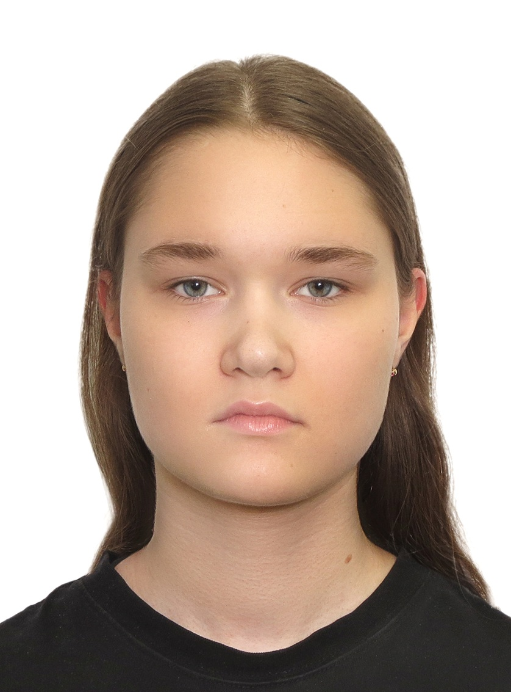
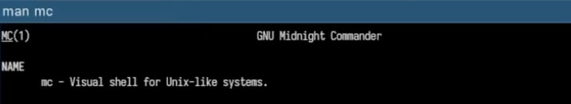
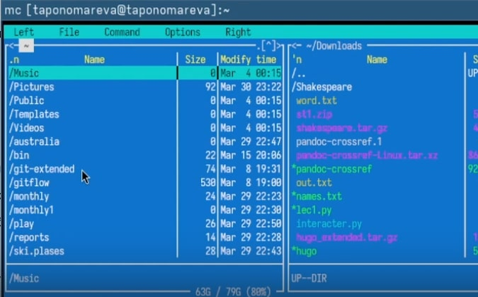
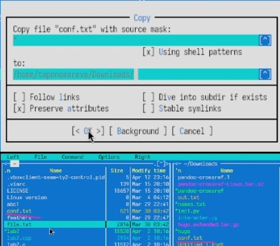
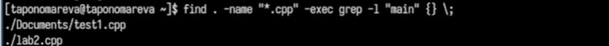
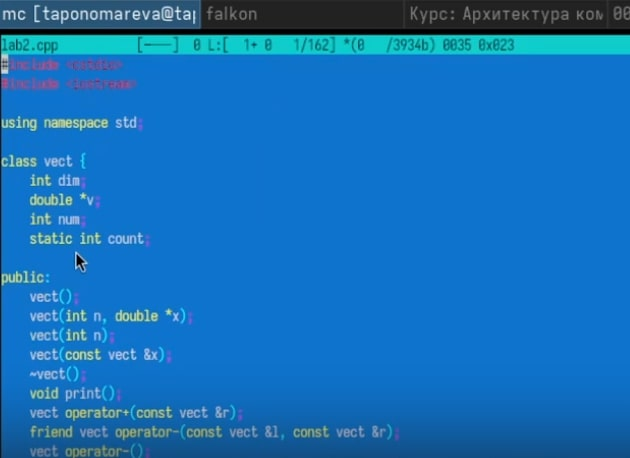

---
## Front matter
lang: ru-RU
title: Презентация по лабораторной работе №9
subtitle: Операционные системы
author:
  - Пономарева Т.А.
institute:
  - Российский университет дружбы народов, Москва, Россия
date: 12 апреля 2025

## i18n babel
babel-lang: russian
babel-otherlangs: english

## Formatting pdf
toc: false
toc-title: Содержание
slide_level: 2
aspectratio: 169
section-titles: true
theme: metropolis
header-includes:
 - \metroset{progressbar=frametitle,sectionpage=progressbar,numbering=fraction}
---

# Информация

## Докладчик

:::::::::::::: {.columns align=center}
::: {.column width="70%"}

  * Пономарева Татьяна Александровна
  * Студент группы НКАбд-04-24
  * Российский университет дружбы народов
  * [1132246742@pfur.ru](mailto:1132246742@pfur.ru)
  * <https://github.com/taponomareva>

:::
::: {.column width="30%"}

:::
::::::::::::::

# Вводная часть
# Цель работы

Освоение основных возможностей командной оболочки Midnight Commander. Приоб-
ретение навыков практической работы по просмотру каталогов и файлов; манипуляций
с ними.

# Теоретическое введение

Командная оболочка — интерфейс взаимодействия пользователя с операционной систе-
мой и программным обеспечением посредством команд.
Midnight Commander (или mc) — псевдографическая командная оболочка для UNIX/Linux
систем. Для запуска mc необходимо в командной строке набрать mc и нажать Enter .
Рабочее пространство mc имеет две панели, отображающие по умолчанию списки
файлов двух каталогов

# Выполнение лабораторной работы

## Открытие man-страницы mc

Открываю справочную страницу Midnight Commander с помощью команды man mc (рис. 1).

Это позволяет ознакомиться с возможностями и параметрами запуска mc.

## Запуск Midnight Commander и интерфейс

Запускаю Midnight Commander с помощью команды mc (рис. 2).

Открывается двухпанельный интерфейс. Переключаюсь между панелями с помощью клавиши Tab. Навигация — стрелками.

## Основные операции с файлами

Тестирую горячие клавиши:

F5 — копирование файла

F6 — перемещение

F8 — удаление

F3 — просмотр

F4 — редактирование

Ctrl + Space — выделение

Ctrl + \ — панель быстрого перехода

На рис. 3 видно пример копирования файла с помощью F5 (рис. 3).

## Работа с меню панели

Навожу курсор на файл и нажимаю F2 для открытия контекстного меню.
Для просмотра подробной информации о файле использую Ctrl + X, затем I

Меню "Файл"
Проверяю следующие действия:

F3 — просмотр содержимого

F4 — редактирование

F7 — создание новой папки

F5 — копирование файла в созданную папку

Меню "Команда"

## Поиск .cpp файлов с функцией main

Выполняю команду для поиска .cpp файлов с функцией main: find . -name "*.cpp" -exec grep -l "main" {} \; (рис. 4).

## Настройки Midnight Commander

Открываю меню F9 → Options.
Тестирую следующие настройки:

Layout — изменяю структуру интерфейса

Panel options — включаю отображение скрытых файлов (Ctrl + H)

## Создание и редактирование файла text.txt

Создаю новый файл text.txt с помощью команды touch text.txt, открываю его в редакторе mc нажатием F4

## Работа с текстом

Вставляю текст при помощи Ctrl + Shift + V.
Применяю команды:

Ctrl + Y — удаление строки

Shift + стрелки — выделение

Ctrl + C/V — копирование/вставка

Shift + F5 — перенос строки

F2 — сохранение

Ctrl + Z — отмена

Ctrl + End и Ctrl + Home — переход в конец и начало файла

## Редактирование кода

Открываю файл с расширением .c или .java нажатием F4 в mc (рис. 5).

# Выводы

Были освоены основные возможности командной оболочки Midnight Commander. Были приоб-
ретены навыки практической работы по просмотру каталогов и файлов; манипуляций
с ними.

# Список литературы{.unnumbered}

1. [Курс на ТУИС](https://esystem.rudn.ru/course/view.php?id=113)
