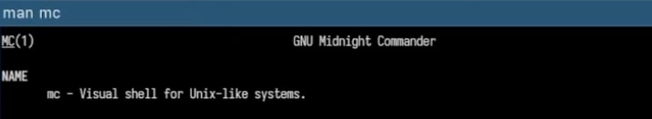
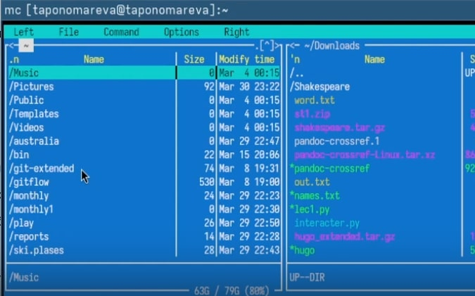
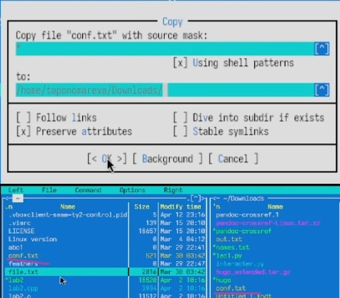
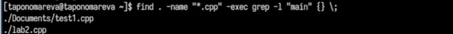
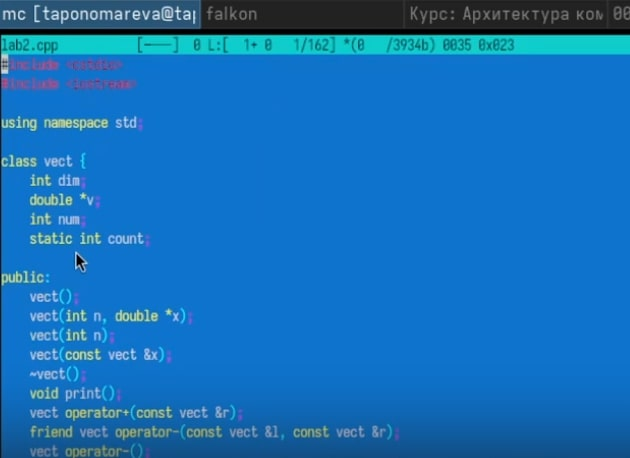

---
## Front matter
title: "Отчёт по лабораторной работе №9"
subtitle: "Операционные системы"
author: "Пономарева Татьяна Александровна"

## Generic otions
lang: ru-RU
toc-title: "Содержание"

## Bibliography
bibliography: bib/cite.bib
csl: pandoc/csl/gost-r-7-0-5-2008-numeric.csl

## Pdf output format
toc: true # Table of contents
toc-depth: 2
lof: true # List of figures
lot: true # List of tables
fontsize: 12pt
linestretch: 1.5
papersize: a4
documentclass: scrreprt
## I18n polyglossia
polyglossia-lang:
  name: russian
  options:
	- spelling=modern
	- babelshorthands=true
polyglossia-otherlangs:
  name: english
## I18n babel
babel-lang: russian
babel-otherlangs: english
## Fonts
mainfont: IBM Plex Serif
romanfont: IBM Plex Serif
sansfont: IBM Plex Sans
monofont: IBM Plex Mono
mathfont: STIX Two Math
mainfontoptions: Ligatures=Common,Ligatures=TeX,Scale=0.94
romanfontoptions: Ligatures=Common,Ligatures=TeX,Scale=0.94
sansfontoptions: Ligatures=Common,Ligatures=TeX,Scale=MatchLowercase,Scale=0.94
monofontoptions: Scale=MatchLowercase,Scale=0.94,FakeStretch=0.9
mathfontoptions:
## Biblatex
biblatex: true
biblio-style: "gost-numeric"
biblatexoptions:
  - parentracker=true
  - backend=biber
  - hyperref=auto
  - language=auto
  - autolang=other*
  - citestyle=gost-numeric
## Pandoc-crossref LaTeX customization
figureTitle: "Рис."
tableTitle: "Таблица"
listingTitle: "Листинг"
lofTitle: "Список иллюстраций"
lotTitle: "Список таблиц"
lolTitle: "Листинги"
## Misc options
indent: true
header-includes:
  - \usepackage{indentfirst}
  - \usepackage{float} # keep figures where there are in the text
  - \floatplacement{figure}{H} # keep figures where there are in the text
---

# Цель работы

Освоение основных возможностей командной оболочки Midnight Commander. Приоб-
ретение навыков практической работы по просмотру каталогов и файлов; манипуляций
с ними.

# Теоретическое введение

Командная оболочка — интерфейс взаимодействия пользователя с операционной систе-
мой и программным обеспечением посредством команд.
Midnight Commander (или mc) — псевдографическая командная оболочка для UNIX/Linux
систем. Для запуска mc необходимо в командной строке набрать mc и нажать Enter .
Рабочее пространство mc имеет две панели, отображающие по умолчанию списки
файлов двух каталогов

# Выполнение лабораторной работы

## Открытие man-страницы mc

Открываю справочную страницу Midnight Commander с помощью команды man mc (рис. [-@fig:001]).

{#fig:001 width=70%}

Это позволяет ознакомиться с возможностями и параметрами запуска mc.

## Запуск Midnight Commander и интерфейс

Запускаю Midnight Commander с помощью команды mc (рис. [-@fig:002]).

{#fig:002 width=70%}

Открывается двухпанельный интерфейс. Переключаюсь между панелями с помощью клавиши Tab. Навигация — стрелками.

## Основные операции с файлами

Тестирую горячие клавиши:

F5 — копирование файла

F6 — перемещение

F8 — удаление

F3 — просмотр

F4 — редактирование

Ctrl + Space — выделение

Ctrl + \ — панель быстрого перехода

На рис. 3 видно пример копирования файла с помощью F5 (рис. [-@fig:003]).

{#fig:003 width=70%}

## Работа с меню панели

Навожу курсор на файл и нажимаю F2 для открытия контекстного меню.
Для просмотра подробной информации о файле использую Ctrl + X, затем I

Меню "Файл"
Проверяю следующие действия:

F3 — просмотр содержимого

F4 — редактирование

F7 — создание новой папки

F5 — копирование файла в созданную папку

Меню "Команда"

## Поиск .cpp файлов с функцией main

Выполняю команду для поиска .cpp файлов с функцией main: find . -name "*.cpp" -exec grep -l "main" {} \; (рис. [-@fig:004]).

{#fig:004 width=70%}

## Настройки Midnight Commander

Открываю меню F9 → Options.
Тестирую следующие настройки:

Layout — изменяю структуру интерфейса

Panel options — включаю отображение скрытых файлов (Ctrl + H)

## Создание и редактирование файла text.txt

Создаю новый файл text.txt с помощью команды touch text.txt, открываю его в редакторе mc нажатием F4

## Работа с текстом

Вставляю текст при помощи Ctrl + Shift + V.
Применяю команды:

Ctrl + Y — удаление строки

Shift + стрелки — выделение

Ctrl + C/V — копирование/вставка

Shift + F5 — перенос строки

F2 — сохранение

Ctrl + Z — отмена

Ctrl + End и Ctrl + Home — переход в конец и начало файла

## Редактирование кода

Открываю файл с расширением .c или .java нажатием F4 в mc (рис. [-@fig:005]).

{#fig:005 width=70%}

# Ответы на контрольные вопросы

1. Какие режимы работы есть в mc. Охарактеризуйте их.
Midnight Commander работает в нескольких режимах:

Двухпанельный файловый менеджер (основной режим): отображаются два окна с содержимым директорий.

Встроенный текстовый редактор (mcedit): позволяет редактировать текстовые файлы прямо в mc.

Встроенный просмотрщик (mcview): используется для просмотра содержимого файлов.

Командная строка: внизу доступна строка ввода команд shell.

Поддержка FTP/SSH: позволяет работать с удалёнными системами, как с локальными папками.

2. Какие операции с файлами можно выполнить как с помощью команд shell, так и с помощью меню (комбинаций клавиш) mc? Примеры:
Примеры операций:

Операция	Команда в shell	Клавиши в mc
Копирование	cp file1 file2	F5
Перемещение	mv file1 dir/	F6
Удаление	rm file.txt	F8
Переименование	mv old.txt new.txt	F6 (указать новое имя)
Создание каталога	mkdir new_folder	F7
Просмотр содержимого	cat file.txt или less file.txt	F3
Редактирование	nano file.txt	F4 (открывает встроенный редактор)

3. Структура меню левой (или правой) панели mc, характеристика команд

В верхней части панели: [Левая] [Файл] [Команда] [Параметры] [Правая] [Выход]

Меню Левая/Правая содержит:

Выбрать каталог — смена директории.

История — просмотр предыдущих путей.

Символическая ссылка — создать symlink.

Фильтр файлов — скрыть/показать по маске.

FTP-соединение — подключиться к удалённой системе.

Shell-соединение — работа с удалённой оболочкой.

Командный вывод — отобразить результат команды.

4–6. Структура меню “Файл”, “Команда”, “Параметры”, характеристика команд
Меню "Файл"
Просмотр (F3)

Редактировать (F4)

Копировать (F5)

Переместить (F6)

Создать каталог (F7)

Удалить (F8)

Выход (F10)

Меню "Команда"
Выполнить команду...

Командная строка

История команд

Избранные команды

Файловая маска

Меню "Параметры"
Настройки интерфейса

Клавиатурные сочетания

Внешний вид панели

Конфигурация mc

Сохранить настройки

7. Встроенные команды mc:
cd — смена директории.

copy — копирование файлов.

rename — переименование.

delete — удаление.

mkdir — создание директории.

view — просмотр файла.

edit — редактирование.

8. Команды встроенного редактора mc (mcedit):
F2 — сохранить.

F3 — копировать в буфер.

F4 — вставить из буфера.

F5 — поиск.

F6 — поиск и замена.

F10 — выход.

Ctrl+Insert, Shift+Insert — копировать/вставить.

9. Средства mc для создания меню, определяемые пользователем:
user menu (~/.config/mc/menu или ~/.mc/menu) — позволяет создавать пользовательское контекстное меню, где можно задавать команды, выполняемые по определённым типам файлов или шаблонам.

Можно задать действия на определённые расширения, условия, и описать команды shell.

10. Средства mc для выполнения действий, определяемых пользователем, над текущим файлом:
Клавиша F2 — открывает пользовательское меню.

Можно выполнить команды, например, "открыть архив", "скомпилировать", "запустить", настроенные пользователем.

Поддерживается интерполяция имени текущего файла (%f), пути (%d), и т.д.

# Выводы

Были освоены основные возможности командной оболочки Midnight Commander. Были приоб-
ретены навыки практической работы по просмотру каталогов и файлов; манипуляций
с ними.

# Список литературы{.unnumbered}

1. [Курс на ТУИС](https://esystem.rudn.ru/course/view.php?id=113)
