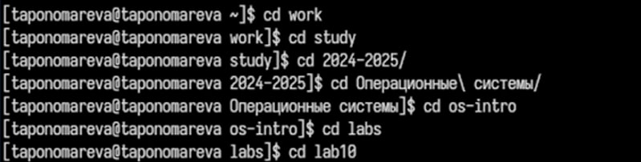
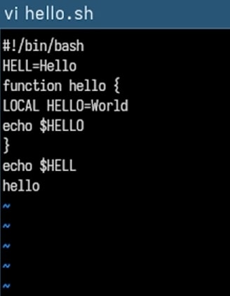
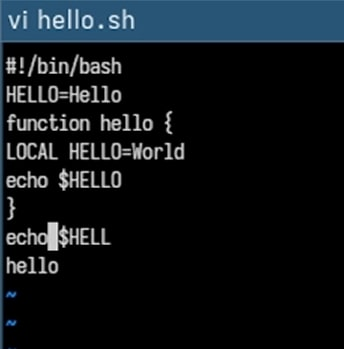
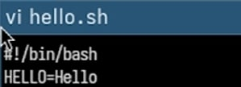
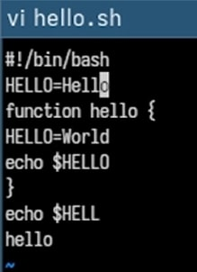
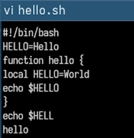
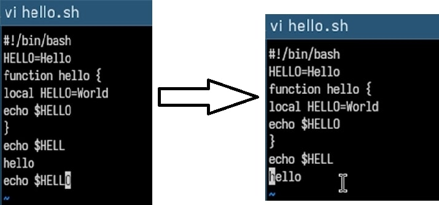
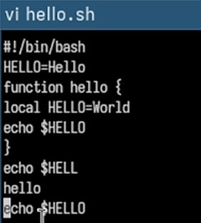

---
## Front matter
lang: ru-RU
title: Презентация по лабораторной работе №10
subtitle: Операционные системы
author:
  - Пономарева Т.А.
institute:
  - Российский университет дружбы народов, Москва, Россия
date: 19 апреля 2025

## i18n babel
babel-lang: russian
babel-otherlangs: english

## Formatting pdf
toc: false
toc-title: Содержание
slide_level: 2
aspectratio: 169
section-titles: true
theme: metropolis
header-includes:
 - \metroset{progressbar=frametitle,sectionpage=progressbar,numbering=fraction}
---

# Информация

## Докладчик

:::::::::::::: {.columns align=center}
::: {.column width="70%"}

  * Пономарева Татьяна Александровна
  * Студент группы НКАбд-04-24
  * Российский университет дружбы народов
  * [1132246742@pfur.ru](mailto:1132246742@pfur.ru)
  * <https://github.com/taponomareva>

:::
::: {.column width="30%"}


:::
::::::::::::::

# Вводная часть

# Цель работы

Познакомиться с операционной системой Linux.Получить практические навыки работы с редактором vi, установленным по умолчанию практически во всех дистрибутивах.

# Теоретическое введение

В большинстве дистрибутивов Linux в качестве текстового редактора по умолчанию устанавливается интерактивный экранный редактор vi (Visual display editor).

Редактор vi имеет три режима работы:
– командный режим — предназначен для ввода команд редактирования и навигации по редактируемому файлу;
– режим вставки — предназначен для ввода содержания редактируемого файла;
– режим последней (или командной) строки — используется для записи изменений в файл и выхода из редактора.

# Выполнение лабораторной работы

# Задание 1. Создание нового файла с использованием vi

## Переход в нужный каталог

Я перешла в каталог ~/work/study/2024-2025/"Операционные системы"/os-intro/labs/lab10 (рис. 1).



## Открытие редактора

Открыла редактор vi с именем нового файла: vi hello.sh (рис. 2).


## Ввод текста

Нажала i для перехода в режим вставки и ввела следующий текст:

```
#!/bin/bash
HELL=Hello
function hello {
LOCAL HELLO=World
echo $HELLO
}
echo $HELLO
hello
```

## Переход в командный режим

Нажала Esc для выхода из режима вставки (рис. 3).



## Переход в режим последней строки

Нажала : (Shift + ;) — появилось двоеточие внизу экрана.

## Сохранение и выход

Ввела wq и нажала Enter для сохранения изменений и выхода из редактора.

## Назначение прав на выполнение

Сделала файл исполняемым с помощью команды: `chmod +x hello.sh` (рис. 4).


# Задание 2. Редактирование существующего файла

## Повторное открытие файла

Ввела команду, находясь в каталоге с файлом ~/work/study/2024-2025/"Операционные системы"/os-intro/labs/lab10, для редактирования уже существующего файла: vi hello.sh (рис. 5).



## Исправление переменной
Переместила курсор в конец слова HELL, нажала i, изменила его на HELLO, затем нажала Esc (рис. 6).



## Удаление ключевого слова
Установила курсор на слово LOCAL, нажала dw для удаления (рис. 7).



## Ввод исправления
Нажала i, ввела local, затем вернулась в командный режим с помощью Esc (рис. 8).



## Добавление строки

Перешла на последнюю строку файла, нажала o и ввела:
echo $HELLO

После этого нажала Esc.

## Удаление строки

Удалила строку с помощью dd (рис. 9).



## Отмена действия

Нажала u, чтобы отменить удаление (рис. 10).



## Завершение редактирования

Нажала :, ввела wq, нажала Enter и вышла из редактора.

# Выводы

Было произведено знакомство с операционной системой Linux. Были получены практические навыки работы с редактором vi, установленным по умолчанию практически во всех дистрибутивах.

# Список литературы{.unnumbered}

1. [Курс на ТУИС](https://esystem.rudn.ru/course/view.php?id=113)
