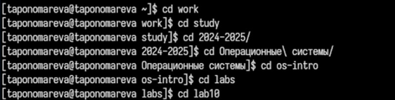
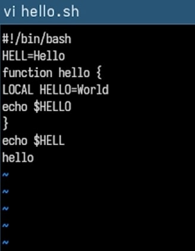
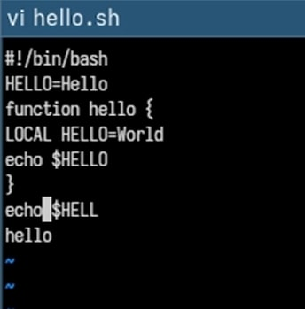
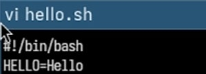
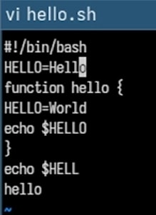
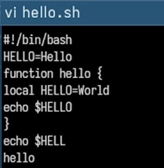
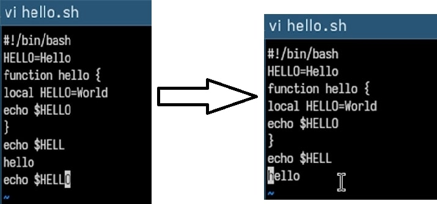
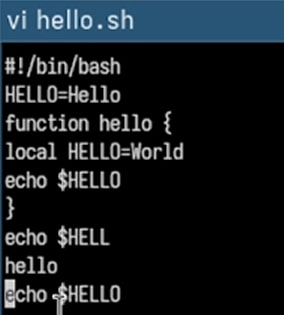

---
## Front matter
title: "Отчёт по лабораторной работе №10"
subtitle: "Операционные системы"
author: "Пономарева Татьяна Александровна"

## Generic otions
lang: ru-RU
toc-title: "Содержание"

## Bibliography
bibliography: bib/cite.bib
csl: pandoc/csl/gost-r-7-0-5-2008-numeric.csl

## Pdf output format
toc: true # Table of contents
toc-depth: 2
lof: true # List of figures
lot: true # List of tables
fontsize: 12pt
linestretch: 1.5
papersize: a4
documentclass: scrreprt
## I18n polyglossia
polyglossia-lang:
  name: russian
  options:
	- spelling=modern
	- babelshorthands=true
polyglossia-otherlangs:
  name: english
## I18n babel
babel-lang: russian
babel-otherlangs: english
## Fonts
mainfont: IBM Plex Serif
romanfont: IBM Plex Serif
sansfont: IBM Plex Sans
monofont: IBM Plex Mono
mathfont: STIX Two Math
mainfontoptions: Ligatures=Common,Ligatures=TeX,Scale=0.94
romanfontoptions: Ligatures=Common,Ligatures=TeX,Scale=0.94
sansfontoptions: Ligatures=Common,Ligatures=TeX,Scale=MatchLowercase,Scale=0.94
monofontoptions: Scale=MatchLowercase,Scale=0.94,FakeStretch=0.9
mathfontoptions:
## Biblatex
biblatex: true
biblio-style: "gost-numeric"
biblatexoptions:
  - parentracker=true
  - backend=biber
  - hyperref=auto
  - language=auto
  - autolang=other*
  - citestyle=gost-numeric
## Pandoc-crossref LaTeX customization
figureTitle: "Рис."
tableTitle: "Таблица"
listingTitle: "Листинг"
lofTitle: "Список иллюстраций"
lotTitle: "Список таблиц"
lolTitle: "Листинги"
## Misc options
indent: true
header-includes:
  - \usepackage{indentfirst}
  - \usepackage{float} # keep figures where there are in the text
  - \floatplacement{figure}{H} # keep figures where there are in the text
---

# Цель работы

Познакомиться с операционной системой Linux.Получить практические навыки работы с редактором vi, установленным по умолчанию практически во всех дистрибутивах.

# Теоретическое введение

В большинстве дистрибутивов Linux в качестве текстового редактора по умолчанию устанавливается интерактивный экранный редактор vi (Visual display editor).

Редактор vi имеет три режима работы:
– командный режим — предназначен для ввода команд редактирования и навигации по редактируемому файлу;
– режим вставки — предназначен для ввода содержания редактируемого файла;
– режим последней (или командной) строки — используется для записи изменений в файл и выхода из редактора.

Для вызова редактора vi необходимо указать команду vi и имя редактируемого файла:
vi <имя_файла>

При этом, в случае отсутствия файла с указанным именем, будет создан такой файл.

Переход в командный режим осуществляется нажатием клавиши Esc.

Для выхода из редактора vi необходимо перейти в режим последней строки: находясь в командном режиме, нажать Shift-; (то есть ввести символ : — двоеточие), затем:
– набрать символы wq, если перед выходом из редактора требуется записать изменения в файл;
– набрать символ q (или q!), если требуется выйти из редактора без сохранения.

# Выполнение лабораторной работы

# Задание 1. Создание нового файла с использованием vi

## Переход в нужный каталог

Я перешла в каталог ~/work/study/2024-2025/"Операционные системы"/os-intro/labs/lab10 (рис. [-@fig:001]).

{#fig:001 width=70%}

## Открытие редактора

Открыла редактор vi с именем нового файла: vi hello.sh (рис. [-@fig:002]).

{#fig:002 width=70%}

## Ввод текста

Нажала i для перехода в режим вставки и ввела следующий текст:

```
#!/bin/bash
HELL=Hello
function hello {
LOCAL HELLO=World
echo $HELLO
}
echo $HELLO
hello
```

## Переход в командный режим

Нажала Esc для выхода из режима вставки (рис. [-@fig:003]).

{#fig:003 width=70%}

## Переход в режим последней строки

Нажала : (Shift + ;) — появилось двоеточие внизу экрана.

## Сохранение и выход

Ввела wq и нажала Enter для сохранения изменений и выхода из редактора.

## Назначение прав на выполнение

Сделала файл исполняемым с помощью команды: `chmod +x hello.sh` (рис. [-@fig:004]).

{#fig:004 width=70%}


# Задание 2. Редактирование существующего файла

## Повторное открытие файла

Ввела команду, находясь в каталоге с файлом ~/work/study/2024-2025/"Операционные системы"/os-intro/labs/lab10, для редактирования уже существующего файла: vi hello.sh (рис. [-@fig:005]).

{#fig:005 width=70%}

## Исправление переменной
Переместила курсор в конец слова HELL, нажала i, изменила его на HELLO, затем нажала Esc (рис. [-@fig:006]).

{#fig:006 width=70%}

## Удаление ключевого слова
Установила курсор на слово LOCAL, нажала dw для удаления (рис. [-@fig:007]).

{#fig:007 width=70%}

## Ввод исправления
Нажала i, ввела local, затем вернулась в командный режим с помощью Esc (рис. [-@fig:008]).

{#fig:008 width=70%}

## Добавление строки

Перешла на последнюю строку файла, нажала o и ввела:
echo $HELLO

После этого нажала Esc.

## Удаление строки

Удалила строку с помощью dd (рис. [-@fig:009]).

{#fig:009 width=70%}

## Отмена действия

Нажала u, чтобы отменить удаление (рис. [-@fig:010]).

{#fig:010 width=70%}

## Завершение редактирования

Нажала :, ввела wq, нажала Enter и вышла из редактора.

# Ответы на контрольные вопросы

1. Краткая характеристика режимов работы редактора vi:
vi работает в трёх основных режимах:

Режим команд (Command mode) — по умолчанию, позволяет выполнять команды редактирования, навигации и т.д.

Режим ввода (Insert mode) — для ввода текста. Переход по команде i, a, o и др.

Режим последней строки (Ex mode) — ввод команд, начинающихся с : (например, :wq, :q! и т.д.)

2. Как выйти из редактора, не сохраняя изменения?
Нажать Esc, затем ввести :q! и нажать Enter.

3. Команды позиционирования (навигации по тексту):
h, l — перемещение влево/вправо

j, k — вниз/вверх

0 — в начало строки

^ — к первому непробельному символу строки

$ — в конец строки

gg — в начало файла

G — в конец файла

w, b — к началу следующего/предыдущего слова

4. Что является словом в vi:
Слово — это последовательность символов, отделённых пробелами или пунктуацией.

Команда w или b перемещает курсор по словам.

5. Как перейти в начало/конец файла?
В начало: gg

В конец: G

6. Основные группы команд редактирования:
Вставка: i, a, o и др.

Удаление: x (символ), dd (строка), d + движение

Замена: r, R

Копирование и вставка: yy, p, P

Отмена: u — отмена последнего действия

7. Как заполнить строку символами $:
Перейти в режим вставки (i)

Нажать и удерживать клавишу $ до заполнения строки

Или использовать команду:

I$$$$$$$$$$$$$$$$$$$$$$$$$$$$$$$$$$$$$$$$
(если в начале строки)

8. Как отменить некорректное действие?
Нажать u в командном режиме — отменяет последнее действие

U — отменяет все изменения в текущей строке

9. Основные команды режима последней строки (:):
:w — сохранить

:q — выйти

:wq — сохранить и выйти

:q! — выйти без сохранения

:set — просмотр/установка опций

:! — выполнить команду оболочки

10. Как определить конец строки без перемещения курсора?
Использовать команду :set list — покажет символ конца строки ($)

Или нажать $, запомнив позицию курсора, и вернуться с помощью `

11. Анализ опций редактора vi:
Список опций: :set all

Назначение опций: :help 'optionname'

Изменить опцию: :set option

Пример: :set number — включить нумерацию строк

12. Как определить режим работы vi:
В командном режиме — текст не вводится, работают команды (dd, yy)

В режиме ввода — на экране видно -- INSERT --

В режиме последней строки — видно : внизу экрана

13. Граф взаимосвязи режимов работы vi:
        +--------------------+
        |                    |
        |  Режим команд (Esc)|
        |                    |
        +-----+--------+-----+
              |        |
        (i,a,o)     (:)
              |        |
     +--------v+      v----------------+
     | Ввод текста |   Режим последней строки |
     | (-- INSERT --)  |     (начинается с :)     |
     +--------+--------+----------------+
              |
            (Esc)
              |
        возвращает в
        режим команд

# Выводы

Было произведено знакомство с операционной системой Linux. Были получены практические навыки работы с редактором vi, установленным по умолчанию практически во всех дистрибутивах.

# Список литературы{.unnumbered}

1. [Курс на ТУИС](https://esystem.rudn.ru/course/view.php?id=113)
