---
## Front matter
lang: ru-RU
title: Презентация по лабораторной работе №11
subtitle: Операционные системы
author:
  - Пономарева Т.А.
institute:
  - Российский университет дружбы народов, Москва, Россия
date: 26 апреля 2025

## i18n babel
babel-lang: russian
babel-otherlangs: english

## Formatting pdf
toc: false
toc-title: Содержание
slide_level: 2
aspectratio: 169
section-titles: true
theme: metropolis
header-includes:
 - \metroset{progressbar=frametitle,sectionpage=progressbar,numbering=fraction}
---

# Информация

## Докладчик

:::::::::::::: {.columns align=center}
::: {.column width="70%"}

  * Пономарева Татьяна Александровна
  * Студент группы НКАбд-04-24
  * Российский университет дружбы народов
  * [1132246742@pfur.ru](mailto:1132246742@pfur.ru)
  * <https://github.com/taponomareva>

:::
::: {.column width="30%"}


:::
::::::::::::::

# Вводная часть

# Цель работы

Познакомиться с операционной системой Linux. Получить практические навыки работы с редактором Emacs.

# Теоретическое введение

Определение 1. Буфер — объект, представляющий какой-либо текст. Буфер может содержать что угодно, например, результаты компиляции программы или встроенные подсказки. Практически всё взаимодействие с пользователем, в том числе интерактивное, происходит посредством буферов.

Определение 2. Фрейм соответствует окну в обычном понимании этого слова. Каждый фрейм содержит область вывода и одно или несколько окон Emacs.

Определение 3. Окно — прямоугольная область фрейма, отображающая один из буферов. Каждое окно имеет свою строку состояния, в которой выводится следующая информация: название буфера, его основной режим, изменялся ли текст буфера и как далеко вниз по буферу расположен курсор. Каждый буфер находится только в одном из возможных основных режимов. Существующие основные режимы включают режим Fundamental (наименее специализированный), режим Text, режим Lisp, режим C, режим Texinfo и другие.

# Выполнение лабораторной работы

# Основные команды Emacs

## Открытие Emacs

Открываю редактор командой: emacs (рис. 1).

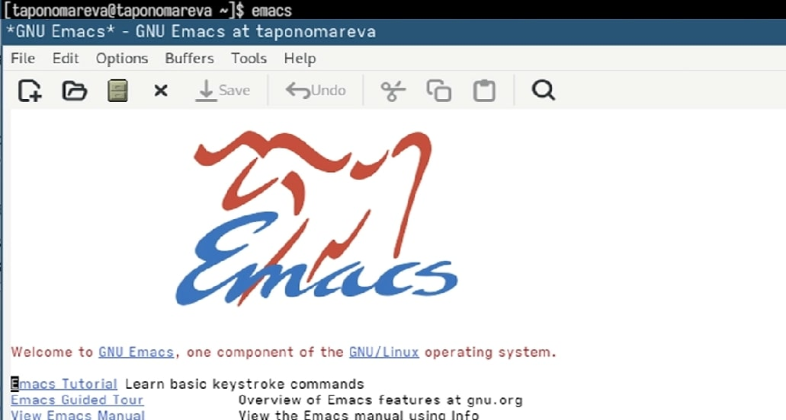

## Создание файла lab11.sh

Создаётся новый файл комбинацией: Ctrl-x Ctrl-f. Ввожу имя lab11.sh и нажимаю Enter (рис. 2).

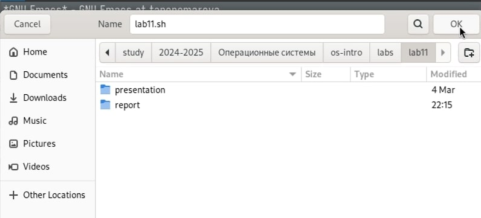

## Ввод текста

Пишу следующий код в буфере:

```
#!/bin/bash
HELL=Hello
function hello {
  local HELLO=World
  echo $HELLO
}
echo $HELL
hello
```

## Сохранение файла

Сохраняю изменения с помощью: Ctrl-x Ctrl-s (рис. 3).

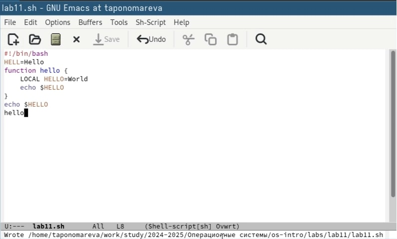

# Редактирование текста

## Вырезание строки

Одним нажатием Ctrl-k удаляется текущая строка (рис. 4).

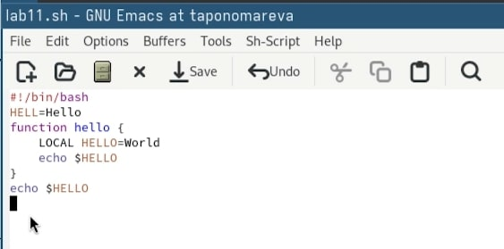

## Вставка строки

Перехожу в конец файла и вставляю строку с помощью Ctrl-y (рис. 5).

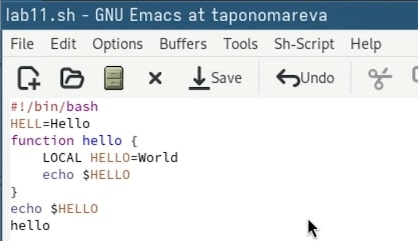

## Выделение области

Устанавливаю курсор в нужную точку, нажимаю Ctrl-Space и двигаюсь дальше для выделение текста (рис. 6).

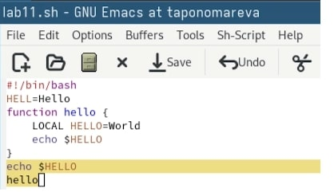

## Копирование области

Копирую выделенное в буфер обмена с помощью M-w.

## Вставка скопированной области

Ctrl-y вставляет текст в конец (рис. 7).

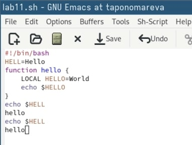

## Вырезание области

Выделяется нужная часть и вырезается через Ctrl-w (рис. 8).

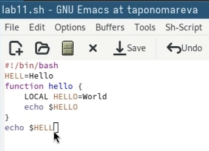

## Отмена действия

Если ошибаюсь — отменяю через Ctrl-/ (рис. 9).

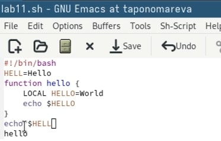

# Перемещение курсора

Перемещаюсь в начало строки: Ctrl-a 

В конец строки — Ctrl-e

В начало буфера — M-<

В конец буфера — M->

# Управление буферами

## Просмотр активных буферов

Открываю список с помощью: Ctrl-x Ctrl-b (рис. 10).

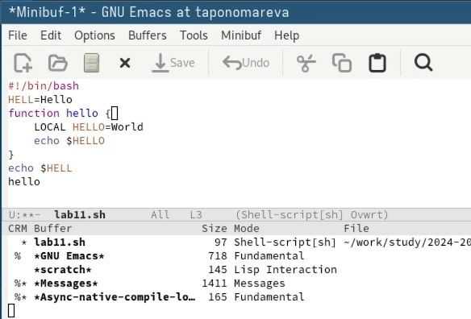

## Переключение между окнами

Переход осуществляется через Ctrl-x o. Вижу буферы и переключаюсь на нужный.

## Закрытие окна

Закрываю ненужное окно комбинацией Ctrl-x 0.

## Быстрое переключение буферов

Без списка перехожу между буферами через Ctrl-x b.

# Управление окнами

## Деление фрейма на 4 части

Делится вертикально (Ctrl-x 3), потом каждое окно — по горизонтали (Ctrl-x 2) (рис. 11).

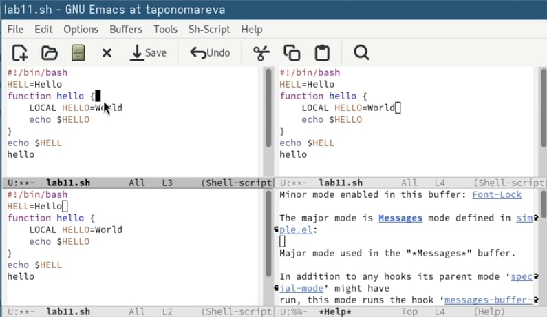

## Работа в окнах

Открываю новый буфер в каждом из четырёх и добавляю по паре строк.

# Поиск и замена

## Включение поиска

Активирую поиск через Ctrl-s, ввожу слово.

## Переключение по результатам

Нажатием Ctrl-s перебираю найденные совпадения (рис. 12).

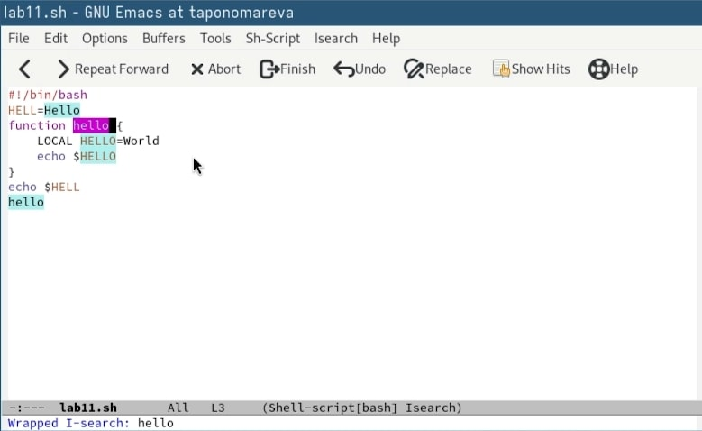

## Завершение поиска

Заканчиваю с помощью Ctrl-g.

## Поиск с заменой

Нажимаю M-%, указываю, что найти, и что поставить взамен. После подтверждаю замену клавишей !.

## Альтернативный поиск

Запускаю M-s o — Emacs сразу подсвечивает все совпадения. Удобнее, чем классический пошаговый поиск (рис. 13).

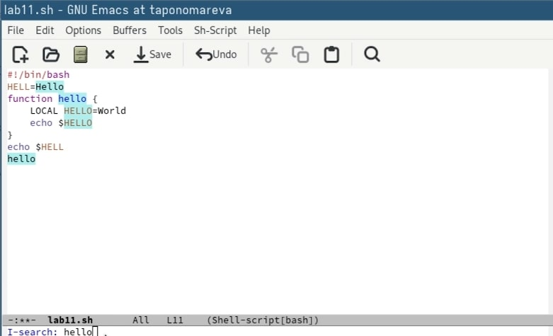

# Выводы

Было произведено знакомство с операционной системой Linux. Были получены практические навыки работы с редактором Emacs.

# Список литературы{.unnumbered}

1. [Курс на ТУИС](https://esystem.rudn.ru/course/view.php?id=113)
