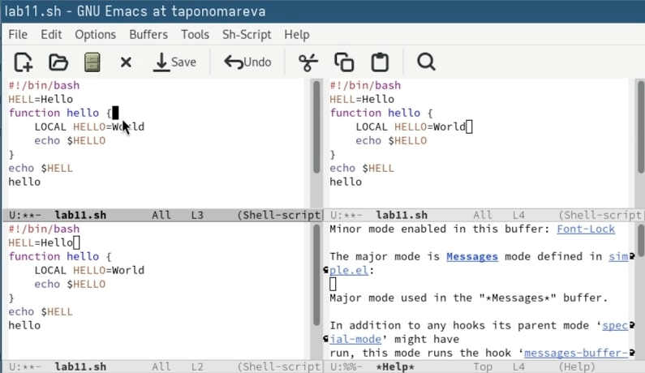

---
## Front matter
title: "Отчёт по лабораторной работе №11"
subtitle: "Операционные системы"
author: "Пономарева Татьяна Александровна"


## Generic otions
lang: ru-RU
toc-title: "Содержание"

## Bibliography
bibliography: bib/cite.bib
csl: pandoc/csl/gost-r-7-0-5-2008-numeric.csl

## Pdf output format
toc: true # Table of contents
toc-depth: 2
lof: true # List of figures
lot: true # List of tables
fontsize: 12pt
linestretch: 1.5
papersize: a4
documentclass: scrreprt
## I18n polyglossia
polyglossia-lang:
  name: russian
  options:
	- spelling=modern
	- babelshorthands=true
polyglossia-otherlangs:
  name: english
## I18n babel
babel-lang: russian
babel-otherlangs: english
## Fonts
mainfont: IBM Plex Serif
romanfont: IBM Plex Serif
sansfont: IBM Plex Sans
monofont: IBM Plex Mono
mathfont: STIX Two Math
mainfontoptions: Ligatures=Common,Ligatures=TeX,Scale=0.94
romanfontoptions: Ligatures=Common,Ligatures=TeX,Scale=0.94
sansfontoptions: Ligatures=Common,Ligatures=TeX,Scale=MatchLowercase,Scale=0.94
monofontoptions: Scale=MatchLowercase,Scale=0.94,FakeStretch=0.9
mathfontoptions:
## Biblatex
biblatex: true
biblio-style: "gost-numeric"
biblatexoptions:
  - parentracker=true
  - backend=biber
  - hyperref=auto
  - language=auto
  - autolang=other*
  - citestyle=gost-numeric
## Pandoc-crossref LaTeX customization
figureTitle: "Рис."
tableTitle: "Таблица"
listingTitle: "Листинг"
lofTitle: "Список иллюстраций"
lotTitle: "Список таблиц"
lolTitle: "Листинги"
## Misc options
indent: true
header-includes:
  - \usepackage{indentfirst}
  - \usepackage{float} # keep figures where there are in the text
  - \floatplacement{figure}{H} # keep figures where there are in the text
---

# Цель работы

Познакомиться с операционной системой Linux. Получить практические навыки работы с редактором Emacs.

# Теоретическое введение

Определение 1. Буфер — объект, представляющий какой-либо текст. Буфер может содержать что угодно, например, результаты компиляции программы или встроенные подсказки. Практически всё взаимодействие с пользователем, в том числе интерактивное, происходит посредством буферов.

Определение 2. Фрейм соответствует окну в обычном понимании этого слова. Каждый фрейм содержит область вывода и одно или несколько окон Emacs.

Определение 3. Окно — прямоугольная область фрейма, отображающая один из буферов. Каждое окно имеет свою строку состояния, в которой выводится следующая информация: название буфера, его основной режим, изменялся ли текст буфера и как далеко вниз по буферу расположен курсор. Каждый буфер находится только в одном из возможных основных режимов. Существующие основные режимы включают режим Fundamental (наименее специализированный), режим Text, режим Lisp, режим C, режим Texinfo и другие. Под второстепенными режимами понимается список режимов, которые включены в данный момент в буфере выбранного окна.

Определение 4. Область вывода — одна или несколько строк внизу фрейма, в которой Emacs выводит различные сообщения, а также запрашивает подтверждения и дополнительную информацию от пользователя.

Определение 5. Минибуфер используется для ввода дополнительной информации и всегда отображается в области вывода.

Определение 6. Точка вставки — место вставки (удаления) данных в буфере.

# Выполнение лабораторной работы

## Основные команды Emacs
### Открытие Emacs

Открываю редактор командой: emacs (рис. [-@fig:001]).

{#fig:001 width=70%}

### Создание файла lab11.sh

Создаётся новый файл комбинацией: Ctrl-x Ctrl-f. Ввожу имя lab11.sh и нажимаю Enter (рис. [-@fig:002]).

{#fig:002 width=70%}

### Ввод текста

Пишу следующий код в буфере:

```
#!/bin/bash
HELL=Hello
function hello {
  local HELLO=World
  echo $HELLO
}
echo $HELL
hello
```

### Сохранение файла

Сохраняю изменения с помощью: Ctrl-x Ctrl-s (рис. [-@fig:003]).

{#fig:003 width=70%}

## Редактирование текста
### Вырезание строки

Одним нажатием Ctrl-k удаляется текущая строка (рис. [-@fig:004]).

{#fig:004 width=70%}

### Вставка строки

Перехожу в конец файла и вставляю строку с помощью Ctrl-y (рис. [-@fig:005]).

{#fig:005 width=70%}

### Выделение области

Устанавливаю курсор в нужную точку, нажимаю Ctrl-Space и двигаюсь дальше для выделение текста (рис. [-@fig:006]).

{#fig:006 width=70%}

### Копирование области

Копирую выделенное в буфер обмена с помощью M-w.

### Вставка скопированной области

Ctrl-y вставляет текст в конец (рис. [-@fig:007]).

{#fig:007 width=70%}

### Вырезание области

Выделяется нужная часть и вырезается через Ctrl-w (рис. [-@fig:008]).

{#fig:008 width=70%}

### Отмена действия

Если ошибаюсь — отменяю через Ctrl-/ (рис. [-@fig:009]).

{#fig:009 width=70%}

## Перемещение курсора

Перемещаюсь в начало строки: Ctrl-a 

В конец строки — Ctrl-e

В начало буфера — M-<

В конец буфера — M->

## Управление буферами
### Просмотр активных буферов

Открываю список с помощью: Ctrl-x Ctrl-b (рис. [-@fig:010]).

{#fig:010 width=70%}

### Переключение между окнами

Переход осуществляется через Ctrl-x o. Вижу буферы и переключаюсь на нужный.

### Закрытие окна

Закрываю ненужное окно комбинацией Ctrl-x 0.

### Быстрое переключение буферов

Без списка перехожу между буферами через Ctrl-x b.

## Управление окнами
### Деление фрейма на 4 части

Делится вертикально (Ctrl-x 3), потом каждое окно — по горизонтали (Ctrl-x 2) (рис. [-@fig:011]).

{#fig:011 width=70%}

### Работа в окнах

Открываю новый буфер в каждом из четырёх и добавляю по паре строк.

## Поиск и замена
### Включение поиска

Активирую поиск через Ctrl-s, ввожу слово.

### Переключение по результатам

Нажатием Ctrl-s перебираю найденные совпадения (рис. [-@fig:012]).

{#fig:012 width=70%}

### Завершение поиска

Заканчиваю с помощью Ctrl-g.

### Поиск с заменой

Нажимаю M-%, указываю, что найти, и что поставить взамен. После подтверждаю замену клавишей !.

### Альтернативный поиск

Запускаю M-s o — Emacs сразу подсвечивает все совпадения. Удобнее, чем классический пошаговый поиск (рис. [-@fig:013]).

{#fig:013 width=70%}

# Ответы на контрольные вопросы

1. Кратко охарактеризуйте редактор Emacs.
Emacs — это мощный и расширяемый текстовый редактор, разработанный для программистов и продвинутых пользователей. Он поддерживает множество языков программирования, режимов редактирования, встроенный терминал, календарь, почтовый клиент и многое другое.

2. Какие особенности данного редактора могут сделать его сложным для освоения новичком?

+ Нестандартные сочетания клавиш

+ Многофункциональность, которая пугает

+ Требует понимания базовых понятий (буферы, окна, фреймы и т.д.)

+ Неинтуитивный интерфейс без графических кнопок

+ Часто требует ручной настройки через конфигурационные файлы

3. Своими словами опишите, что такое буфер и окно в терминологии Emacs.

Буфер — это область памяти, содержащая содержимое файла, текст, результаты команд и т.д.

Окно — это часть экрана, в которой отображается один из буферов. Вы можете видеть один буфер в одном окне, но открывать и переключаться между многими.

4. Можно ли открыть больше 10 буферов в одном окне?
Да, можно. Эмакс не ограничивает количество буферов. В одном окне вы можете отображать по одному буферу, но переключаться между десятками открытых буферов.

5. Какие буферы создаются по умолчанию при запуске Emacs?
Обычно создается:

*scratch* — буфер для заметок и Lisp-экспериментов

*Messages* — буфер для вывода системных сообщений
Также могут быть *Help*, *Completions* и другие, в зависимости от конфигурации.

6. Какие клавиши вы нажмёте, чтобы ввести следующую комбинацию C-c | и C-c C-|?

C-c |: нажмите Ctrl + c, затем клавишу |

C-c C-|: нажмите Ctrl + c, затем удерживая Ctrl, нажмите |

*(На некоторых клавиатурах | может быть с Shift — т.е. Shift + \) *

7. Как поделить текущее окно на две части?
Нажмите:

C-x 2 — вертикальное разделение (одно над другим)

C-x 3 — горизонтальное разделение (рядом)

8. В каком файле хранятся настройки редактора Emacs?
Обычно это файл ~/.emacs или ~/.emacs.d/init.el

9. Какую функцию выполняет клавиша и можно ли её переназначить?
Каждая клавиша в Emacs может выполнять определённую команду, и любую клавишу можно переназначить. Это делается через функцию global-set-key или другие механизмы настройки клавиш в конфиге.

10. Какой редактор вам показался удобнее в работе: vi или emacs? Поясните почему.
Это субъективно. Например:
vi (или vim): быстро запускается, удобен для редактирования с клавиатуры, хорошо работает в терминале.
emacs: мощнее, больше функций, можно превратить в полноценную IDE, но дольше осваивать.
Мне удобнее Emacs, потому что он расширяем, поддерживает пакеты и может адаптироваться под любой стиль работы.

# Выводы

Было произведено знакомство с операционной системой Linux. Были получены практические навыки работы с редактором Emacs.

# Список литературы{.unnumbered}

1. [Курс на ТУИС](https://esystem.rudn.ru/course/view.php?id=113)
