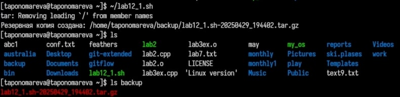
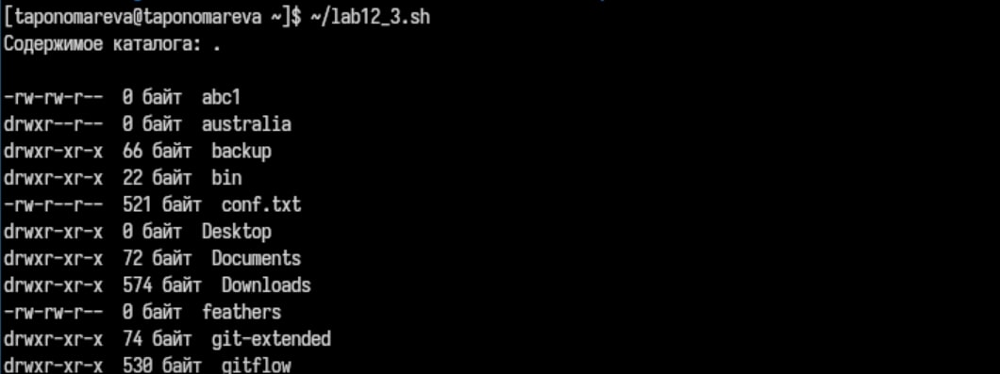
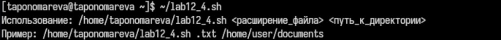

---
## Front matter
lang: ru-RU
title: Презентация по лабораторной работе №12
subtitle: Операционные системы
author:
  - Пономарева Т.А.
institute:
  - Российский университет дружбы народов, Москва, Россия
date: 29 апреля 2025

## i18n babel
babel-lang: russian
babel-otherlangs: english

## Formatting pdf
toc: false
toc-title: Содержание
slide_level: 2
aspectratio: 169
section-titles: true
theme: metropolis
header-includes:
 - \metroset{progressbar=frametitle,sectionpage=progressbar,numbering=fraction}
---

# Информация

## Докладчик

:::::::::::::: {.columns align=center}
::: {.column width="70%"}

  * Пономарева Татьяна Александровна
  * Студент группы НКАбд-04-24
  * Российский университет дружбы народов
  * [1132246742@pfur.ru](mailto:1132246742@pfur.ru)
  * <https://github.com/taponomareva>

:::
::: {.column width="30%"}


:::
::::::::::::::

# Вводная часть

# Цель работы

Изучить основы программирования в оболочке ОС UNIX/Linux. Научиться писать небольшие командные файлы.

# Теоретическое введение

Командный процессор (командная оболочка, интерпретатор команд shell) — это программа, позволяющая пользователю взаимодействовать с операционной системой компьютера.

POSIX (Portable Operating System Interface for Computer Environments) — набор стандартов описания интерфейсов взаимодействия операционной системы и прикладных программ. Стандарты POSIX разработаны комитетом IEEE (Institute of Electrical and Electronics Engineers) для обеспечения совместимости различных UNIX/Linux-подобных операционных систем и переносимости прикладных программ на уровне исходного кода.

# Выполнение лабораторной работы

Даю права на выполнение командой chmod +x lab12_(номер задания).sh

## Задание 1

1. Скрипт, который делает резервную копию самого себя в архиве

```
#!/bin/bash
script_path=$(readlink -f "$0")
script_name=$(basename "$script_path")
backup_dir="$HOME/backup"
mkdir -p "$backup_dir"
timestamp=$(date +"%Y%m%d_%H%M%S")
backup_name="$script_name-$timestamp.tar.gz"
tar -czf "$backup_dir/$backup_name" "$script_path"
echo "Резервная копия создана: $backup_dir/$backup_name"
```
Исполнение (рис. 1).


## Задание 2

2. Скрипт, который обрабатывает любое число аргументов и выводит их
```
#!/bin/bash
echo "Всего передано аргументов: $#"
index=1
for arg in "$@"; do
    echo "Аргумент $index: $arg"
    ((index++))
done
```
Исполнение (рис. 2).


## Задание 3

3. Скрипт — аналог команды ls (без использования ls и dir)

Установка директории — задаёт директорию для работы (по умолчанию текущая).
Проверка существования директории — проверяет, существует ли указанная директория.
Перебор файлов — перебирает все файлы в директории, выводит права доступа, размер и имя каждого файла.

Исполнение (рис. 3).


## Задание 4

4. Скрипт, который считает файлы с заданным расширением в указанной директории

Проверка аргументов — проверяет количество переданных аргументов и выводит ошибку, если их не два.
Задание переменных — сохраняет расширение файла и путь к директории.
Проверка существования директории — проверяет, существует ли указанная директория.
Подсчёт файлов — с помощью find ищет файлы с нужным расширением и считает их количество.
Вывод результата — информирует пользователя о количестве найденных файлов.

Исполнение (рис. 4).


# Выводы

Были изучены основы программирования в оболочке ОС UNIX/Linux. Были получены знания о написании небольших командных файлов.


# Список литературы{.unnumbered}

1. [Курс на ТУИС](https://esystem.rudn.ru/course/view.php?id=113)
