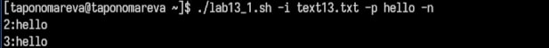
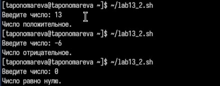
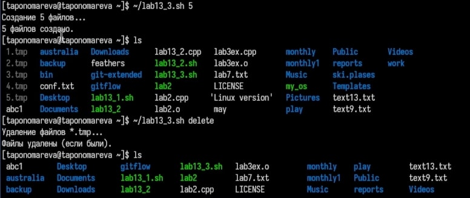
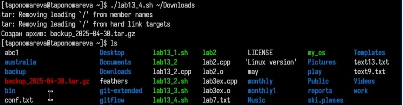

---
## Front matter
lang: ru-RU
title: Презентация по лабораторной работе №13
subtitle: Операционные системы
author:
  - Пономарева Т.А.
institute:
  - Российский университет дружбы народов, Москва, Россия
date: 30 апреля 2025

## i18n babel
babel-lang: russian
babel-otherlangs: english

## Formatting pdf
toc: false
toc-title: Содержание
slide_level: 2
aspectratio: 169
section-titles: true
theme: metropolis
header-includes:
 - \metroset{progressbar=frametitle,sectionpage=progressbar,numbering=fraction}
---

# Информация

## Докладчик

:::::::::::::: {.columns align=center}
::: {.column width="70%"}

  * Пономарева Татьяна Александровна
  * Студент группы НКАбд-04-24
  * Российский университет дружбы народов
  * [1132246742@pfur.ru](mailto:1132246742@pfur.ru)
  * <https://github.com/taponomareva>

:::
::: {.column width="30%"}

:::
::::::::::::::

# Цель работы

Изучить основы программирования в оболочке ОС UNIX. Научиться писать более сложные командные файлы с использованием логических управляющих конструкций и циклов.

# Теоретическое введение

Командный процессор (или оболочка) в операционных системах UNIX и Linux предоставляет возможности для написания скриптов, которые автоматизируют выполнение различных задач. Эти скрипты могут включать конструкции для принятия решений и выполнения повторяющихся действий.

Программирование в командной оболочке UNIX позволяет создавать более сложные сценарии с использованием ветвлений и циклов. Основные конструкции, такие как if, case, while, for, break и continue, обеспечивают гибкость и функциональность скриптов, что делает их важной частью работы в UNIX.

# Выполнение лабораторной работы

## Задание 1

1. Командный файл для анализа командной строки с ключами и поиска строк в файле:
Анализ аргументов командной строки — принимает параметры для указания входного файла, шаблона, вывода, учёта регистра и отображения номеров строк.
Формирование команды поиска — формирует команду grep с нужными флагами на основе переданных параметров.
Выполнение поиска — выполняет поиск строк по шаблону в указанном файле.
Обработка вывода — либо отображает результат на экране, либо сохраняет его в указанный файл. Делаю файл исполняемым при помощи команды: chmod +x ~/lab13_1.sh
Исполнение (рис. 1).

## Задание 2

2. Программа на языке C для ввода числа и определения его знака:
Ввод числа пользователем — программа на языке C запрашивает число у пользователя.
Определение знака числа — программа определяет, больше ли число нуля, меньше или равно ему.
Завершение с кодом — программа завершает выполнение с соответствующим кодом (0, 1 или 2).
Обработка кода завершения — командный файл анализирует код завершения и выводит текстовое сообщение о результате. Делаю файл исполняемым при помощи команды: chmod +x ~/lab13_2.sh
Исполнение (рис. 2).

{width=40%}

## Задание 3

3. Командный файл для создания и удаления файлов:
Приём аргумента — скрипт принимает одно число, указывающее количество файлов.
Создание файлов — создаёт указанное количество временных файлов с расширением .tmp.
Удаление файлов — удаляет все созданные файлы, если они существуют.
Вывод сообщений — информирует пользователя о количестве созданных и удалённых файлов. Делаю файл исполняемым при помощи команды: chmod +x ~/lab13_3.sh
Исполнение (рис. 3).

{width=40%}

## Задание 4

4. Командный файл для упаковки файлов с изменениями за последнюю неделю:
Проверка директории — проверяет, существует ли указанная пользователем директория.
Поиск изменённых файлов — с помощью команды find находит файлы, изменённые за последние 7 дней.
Создание архива — архивирует найденные файлы в формате .tar.gz с указанием текущей даты в имени.
Вывод сообщения — сообщает пользователю о создании архива и его расположении. Делаю файл исполняемым при помощи команды: chmod +x ~/lab13_4.sh
Исполнение (рис. 4).

{width=40%}

# Выводы

Были изучены основы программирования в оболочке ОС UNIX. Были получены знания написания  более сложных командных файлов с использованием логических управляющих конструкций и циклов.

# Список литературы{.unnumbered}

1. [Курс на ТУИС](https://esystem.rudn.ru/course/view.php?id=113)
