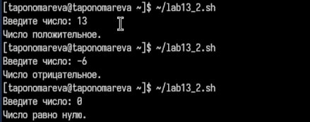
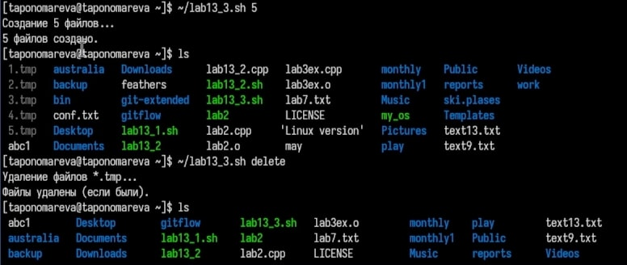
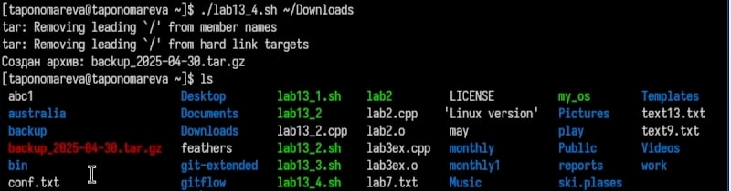

---
## Front matter
title: "Отчёт по лабораторной работе №13"
subtitle: "Операционные системы"
author: "Пономарева Татьяна Александровна"

## Generic otions
lang: ru-RU
toc-title: "Содержание"

## Bibliography
bibliography: bib/cite.bib
csl: pandoc/csl/gost-r-7-0-5-2008-numeric.csl

## Pdf output format
toc: true # Table of contents
toc-depth: 2
lof: true # List of figures
lot: true # List of tables
fontsize: 12pt
linestretch: 1.5
papersize: a4
documentclass: scrreprt
## I18n polyglossia
polyglossia-lang:
  name: russian
  options:
	- spelling=modern
	- babelshorthands=true
polyglossia-otherlangs:
  name: english
## I18n babel
babel-lang: russian
babel-otherlangs: english
## Fonts
mainfont: IBM Plex Serif
romanfont: IBM Plex Serif
sansfont: IBM Plex Sans
monofont: IBM Plex Mono
mathfont: STIX Two Math
mainfontoptions: Ligatures=Common,Ligatures=TeX,Scale=0.94
romanfontoptions: Ligatures=Common,Ligatures=TeX,Scale=0.94
sansfontoptions: Ligatures=Common,Ligatures=TeX,Scale=MatchLowercase,Scale=0.94
monofontoptions: Scale=MatchLowercase,Scale=0.94,FakeStretch=0.9
mathfontoptions:
## Biblatex
biblatex: true
biblio-style: "gost-numeric"
biblatexoptions:
  - parentracker=true
  - backend=biber
  - hyperref=auto
  - language=auto
  - autolang=other*
  - citestyle=gost-numeric
## Pandoc-crossref LaTeX customization
figureTitle: "Рис."
tableTitle: "Таблица"
listingTitle: "Листинг"
lofTitle: "Список иллюстраций"
lotTitle: "Список таблиц"
lolTitle: "Листинги"
## Misc options
indent: true
header-includes:
  - \usepackage{indentfirst}
  - \usepackage{float} # keep figures where there are in the text
  - \floatplacement{figure}{H} # keep figures where there are in the text
---

# Цель работы

Изучить основы программирования в оболочке ОС UNIX. Научиться писать более сложные командные файлы с использованием логических управляющих конструкций и циклов.

# Теоретическое введение

Командный процессор (или оболочка) в операционных системах UNIX и Linux предоставляет возможности для написания скриптов, которые автоматизируют выполнение различных задач. Эти скрипты могут включать конструкции для принятия решений и выполнения повторяющихся действий.

Программирование в командной оболочке UNIX позволяет создавать более сложные сценарии с использованием ветвлений и циклов. Это дает возможность выполнять действия в зависимости от условий и повторять их при необходимости. Основные конструкции, такие как if, case, while, for, break и continue, обеспечивают гибкость и функциональность скриптов, что делает их важной частью работы в UNIX.

# Выполнение лабораторной работы

## Задание 1

1. Командный файл для анализа командной строки с ключами и поиска строк в файле:

```
#!/bin/bash

# Инициализация переменных
inputfile=""
outputfile=""
pattern=""
case_sensitive=true
line_numbers=false

# Обработка параметров с помощью getopts
while getopts "i:o:p:Cn" opt; do
  case $opt in
    i) inputfile="$OPTARG" ;;
    o) outputfile="$OPTARG" ;;
    p) pattern="$OPTARG" ;;
    C) case_sensitive=false ;;
    n) line_numbers=true ;;
    *) echo "Неверный параметр"; exit 1 ;;
  esac
done

# Проверка наличия обязательных параметров
if [[ -z "$inputfile" || -z "$pattern" ]]; then
  echo "Необходимо указать файл и шаблон"
  exit 1
fi

# Формируем команду для поиска
grep_command="grep"

# Учитываем регистры
if ! $case_sensitive; then
  grep_command="$grep_command -i"
fi

# Добавляем опцию для вывода номеров строк
if $line_numbers; then
  grep_command="$grep_command -n"
fi

# Выполнение поиска
if [[ -z "$outputfile" ]]; then
  # Если не указан файл для вывода, выводим в консоль
  $grep_command "$pattern" "$inputfile"
else
  # Если указан файл для вывода, перенаправляем вывод в файл
  $grep_command "$pattern" "$inputfile" > "$outputfile"
  echo "Результат сохранён в $outputfile"
fi
```

Делаю файл исполняемым при помощи команды: chmod +x ~/lab13_1.sh

Создаю файл text13.txt с содежанием:

```
HELLO
hello
hello
hi
HI
Hello
```

Исполнение (рис. [-@fig:001]).

{#fig:001 width=70%}


## Задание 2

2. Программа на языке C для ввода числа и определения его знака:

```
#include <stdio.h>
#include <stdlib.h>

int main() {
    int num;
    
    printf("Введите число: ");
    scanf("%d", &num);
    
    if (num > 0) {
        printf("Число больше нуля\n");
        exit(0);
    } else if (num < 0) {
        printf("Число меньше нуля\n");
        exit(1);
    } else {
        printf("Число равно нулю\n");
        exit(2);
    }
}
```

Командный файл для вызова программы и анализа результата

```
#!/bin/bash

# Запуск программы на C и анализ её кода завершения
./lab13_2
result=$?

# Вывод результата в зависимости от кода завершения
if [ $result -eq 0 ]; then
  echo "Число больше нуля"
elif [ $result -eq 1 ]; then
  echo "Число меньше нуля"
elif [ $result -eq 2 ]; then
  echo "Число равно нулю"
else
  echo "Неизвестный код завершения"
fi
```

Делаю файл исполняемым при помощи команды: chmod +x ~/lab13_2.sh

Исполнение (рис. [-@fig:002]).

{#fig:002 width=70%}

## Задание 3

3. Командный файл для создания и удаления файлов:
```
#!/bin/bash

# Проверка аргумента (число файлов)
if [ $# -ne 1 ]; then
  echo "Использование: $0 <число файлов>"
  exit 1
fi

num_files=$1

# Создание файлов
for i in $(seq 1 $num_files); do
  touch "$i.tmp"
done
echo "$num_files файлов создано."

# Удаление файлов
for i in $(seq 1 $num_files); do
  rm -f "$i.tmp"
done
echo "$num_files файлов удалено."
```

Делаю файл исполняемым при помощи команды: chmod +x ~/lab13_3.sh

Исполнение (рис. [-@fig:003]).

{#fig:003 width=70%}

## Задание 4

4. Командный файл для упаковки файлов с изменениями за последнюю неделю:
```
#!/bin/bash

# Проверка аргумента (директория)
if [ $# -ne 1 ]; then
  echo "Использование: $0 <директория>"
  exit 1
fi

directory=$1

# Проверка существования директории
if [ ! -d "$directory" ]; then
  echo "Каталог не найден: $directory"
  exit 1
fi

# Запаковка файлов, изменённых за последнюю неделю
find "$directory" -type f -mtime -7 | tar -czf "$directory/backup_$(date +%Y%m%d).tar.gz" -T -
echo "Файлы, изменённые за последнюю неделю, запакованы в архив."
```

Делаю файл исполняемым при помощи команды: chmod +x ~/lab13_4.sh

Исполнение (рис. [-@fig:004]).

{#fig:004 width=70%}

# Ответы на контрольные вопросы

1. Каково предназначение команды getopts?

Команда getopts используется для обработки аргументов командной строки в скриптах оболочки. Она позволяет считывать опции (например, -f или -d) и их значения, переданные при запуске скрипта, и упрощает обработку этих опций.

Пример использования:
```
while getopts "f:d:" opt; do
  case $opt in
    f) echo "Опция -f со значением $OPTARG";;
    d) echo "Опция -d со значением $OPTARG";;
    *) echo "Неверная опция";;
  esac
done
```
2. Какое отношение метасимволы имеют к генерации имён файлов?

Метасимволы, такие как *, ?, и [], используются в оболочке UNIX для расширения имен файлов (так называемое globbing). Они позволяют указать шаблоны, которые могут соответствовать множеству файлов в каталоге.

Пример:

+ *.txt — все файлы с расширением .txt.

+ file?.txt — все файлы, начинающиеся с file, за которыми идет один символ, и заканчивающиеся на .txt.

+ file[1-3].txt — файлы, такие как file1.txt, file2.txt, file3.txt.

3. Какие операторы управления действиями вы знаете?

В оболочке UNIX есть несколько операторов для управления выполнением команд:

+ && — выполняет команду только если предыдущая команда завершилась успешно (с кодом выхода 0).

+ || — выполняет команду только если предыдущая команда завершилась с ошибкой (с ненулевым кодом выхода).

+ ! — инвертирует результат команды (например, ! ls вернёт 0, если команда ls завершилась с ошибкой).

+ if, else, elif — условные операторы для выполнения команд в зависимости от условий.

+ case — многократный выбор (аналогичен конструкции switch в других языках программирования).

4. Какие операторы используются для прерывания цикла?

Для прерывания цикла в bash используются следующие операторы:

+ break — завершает выполнение текущего цикла.

+ continue — пропускает текущую итерацию и переходит к следующей итерации цикла.

Пример с break:
```
while true; do
  read -p "Введите число (или 'exit' для выхода): " num
  if [[ $num == "exit" ]]; then
    break
  fi
  echo "Вы ввели число $num"
done
```
5. Для чего нужны команды false и true?

+ Команды false и true — это утилиты, которые всегда возвращают ошибку (ненулевой код выхода) и успех (код выхода 0), соответственно.

+ true: всегда возвращает код 0 (успех). Часто используется в циклах или условных конструкциях для обозначения "успешного" состояния.

+ false: всегда возвращает ненулевой код выхода, что используется для указания на ошибку или для условных проверок.

Пример:
```
if true; then
  echo "Это всегда будет выполнено"
fi
```
6. Что означает строка if test -f man$s/$i.$s, встреченная в командном файле?

+ Эта строка выполняет проверку, существует ли файл с именем, сформированным из переменных man, $s, $i и $s, и является ли этот файл обычным файлом.

+ test -f проверяет, является ли файл обычным файлом (не директорией и не символической ссылкой).

+ $s, $i — это переменные, значения которых подставляются в строку.

Пример:
```
if test -f "man$s/$i.$s"; then
  echo "Файл существует"
else
  echo "Файл не существует"
fi
```
7. Объясните различия между конструкциями while и until.

+ while выполняет блок команд пока условие истинно (код выхода 0).

+ until выполняет блок команд пока условие ложно (код выхода не равен 0).

Пример с while:
```
counter=1
while (( counter <= 5 )); do
  echo "Счётчик: $counter"
  ((counter++))
done
```

Пример с until:
```
counter=1
until (( counter > 5 )); do
  echo "Счётчик: $counter"
  ((counter++))
done
```
Основное различие:

+ В while цикл выполняется, пока условие истинно.
+ В until цикл выполняется, пока условие ложно.

# Выводы

Были изучены основы программирования в оболочке ОС UNIX. Были получены знания написания  более сложных командных файлов с использованием логических управляющих конструкций и циклов.

# Список литературы{.unnumbered}

1. [Курс на ТУИС](https://esystem.rudn.ru/course/view.php?id=113)
