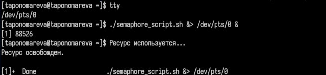
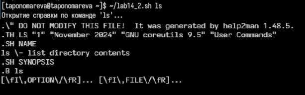

---
## Front matter
lang: ru-RU
title: Презентация по лабораторной работе №14
subtitle: Операционные системы
author:
  - Пономарева Т.А.
institute:
  - Российский университет дружбы народов, Москва, Россия
date: 30 апреля 2025

## i18n babel
babel-lang: russian
babel-otherlangs: english

## Formatting pdf
toc: false
toc-title: Содержание
slide_level: 2
aspectratio: 169
section-titles: true
theme: metropolis
header-includes:
 - \metroset{progressbar=frametitle,sectionpage=progressbar,numbering=fraction}
---

# Информация

## Докладчик

:::::::::::::: {.columns align=center}
::: {.column width="70%"}

  * Пономарева Татьяна Александровна
  * Студент группы НКАбд-04-24
  * Российский университет дружбы народов
  * [1132246742@pfur.ru](mailto:1132246742@pfur.ru)
  * <https://github.com/taponomareva>

:::
::: {.column width="30%"}

:::
::::::::::::::

# Цель работы

Изучить основы программирования в оболочке ОС UNIX. Научиться писать более сложные командные файлы с использованием логических управляющих конструкций и циклов.

# Теоретическое введение

Командный процессор, или оболочка (shell), является важной частью операционных систем UNIX и Linux, позволяя пользователю взаимодействовать с системой через командную строку. Оболочка позволяет не только выполнять простые команды, но и писать сложные сценарии (скрипты), которые могут включать в себя различные управляющие конструкции и функциональные элементы, такие как условия, циклы и функции. 

# Выполнение лабораторной работы

## Задание 1

Для реализации упрощённого механизма семафоров можно использовать файловые блокировки.
Анализ состояния ресурса — проверяет наличие файла-семафора, сигнализирующего о занятости ресурса.
Ожидание доступа — если ресурс занят, скрипт делает паузу и повторно проверяет доступность.
Захват и использование ресурса — создаёт файл-семафор, имитируя "занятый" ресурс, выполняет задачу.
Освобождение ресурса — удаляет файл-семафор, разрешая другим процессам доступ к ресурсу.
Этот скрипт проверяет, занят ли ресурс, и если да, то ждёт, пока он не будет освобожден. После этого скрипт использует ресурс, а затем освобождает его.
Исполнение (рис. 1).

{width=70%}

## Задание 2

Данный скрипт (~/lab14_2.sh) будет принимать команду, искать справку в каталоге /usr/share/man/man1 и показывать содержимое с помощью less (если справка найдена).
Делаю файл исполняемым при помощи команды: chmod +x ~/lab14_2.sh
Пример использования: ./lab14_2.sh ls
Скрипт проверяет наличие справочного файла для указанной команды в каталоге /usr/share/man/man1 и, если файл существует, открывает его с помощью команды zless.
Исполнение (рис. 2).

{width=50%}

## Задание 3

Установка длины строки — задаёт количество символов в итоговой строке (по умолчанию 10).
Генерация символов — с помощью $RANDOM получает случайные числа, соответствующие буквам A–Z.
Преобразование чисел в символы — конвертирует числа в ASCII-буквы с помощью printf.
Формирование и вывод строки — объединяет все буквы в одну строку и выводит результат в терминал.
Пример использования: ./lab14_3.sh
Этот скрипт генерирует случайную строку длиной 10 символов, используя $RANDOM для генерации случайных чисел в диапазоне от 0 до 25 (для латинских букв A-Z).
Исполнение (рис. 3).

{width=70%}

# Выводы

Были изучены основы программирования в оболочке ОС UNIX. Были получены знания о написании более сложных командных файлов с использованием логических управляющих конструкций и циклов.

# Список литературы{.unnumbered}

1. [Курс на ТУИС](https://esystem.rudn.ru/course/view.php?id=113)
