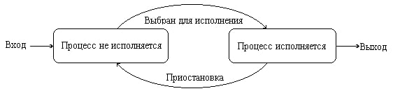
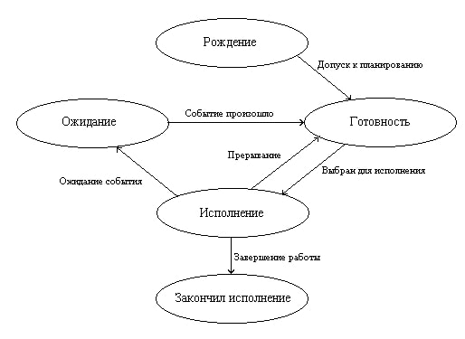

---
## Front matter
lang: ru-RU
title: Презентация. Понятие процесса, виды процессов и его состояния в операционных системах
subtitle: Операционные системы
author:
  - Пономарева Татьяна Александровна
professor:
  - Кулябов Дмитрий Сергеевич
  - д.ф.-м.н., профессор
  - профессор кафедры прикладной информатики и теории вероятностей
institute:
  - Российский университет дружбы народов, Москва, Россия
date: 07 марта 2025

## i18n babel
babel-lang: russian
babel-otherlangs: english

## Formatting pdf
toc: false
toc-title: Содержание
slide_level: 2
aspectratio: 169
section-titles: true
theme: metropolis
header-includes:
 - \metroset{progressbar=frametitle,sectionpage=progressbar,numbering=fraction}
---

# Информация

## Докладчик

:::::::::::::: {.columns align=center}
::: {.column width="70%"}

  * Пономарева Татьяна Александровна
  * Студент группы НКАбд-04-24
  * Российский университет дружбы народов
  * [1132246742@pfur.ru](mailto:1132246742@pfur.ru)
  * <https://github.com/taponomareva>

:::
::: {.column width="30%"}

:::
::::::::::::::

# Вводная часть

## Цель работы

Изучение процессов в операционных системах, видов и их состояний

## Задание

- Дать определение процессу и его характеристики
- Рассмотреть виды процессов в ОС
- Изучить возможные состояния процессов

## Теоретическое введение

Фундаментальным понятием для изучения работы операционных систем является понятие процессов, как основных динамических объектов.

## Понятие процесса

Процесс - это команда, которая выполняется в текущий момент. Также процесс - совокупность взаимосвязанных и взаимодействующих действий, преобразующих входящие данные в исходящие. 

Часто процессом называют выполняющуюся программу и все ее элементы: адресное пространство, глобальные переменные, регистры, стек, открытые файлы.

# Характеристика процесса

1. Уникальный идентификатор (PID, Process ID)

2. Состояние процесса - (New, Ready, Running, Waiting, Terminated) 

3. Приоритет выполнения

4. Пространство памяти

5. Контекст процесса

6. Родительский процесс (PPID, Parent Process ID)

## Виды процессов

* Фоновые (системные)
* Пользовательские
* Интерактивные
* Пакетные
* Реального времени

## Состояния процессов

* New - процесс создается
* Ready - процесс ожидает выполнения
* Running - процесс выполняется процессором
* Waiting - процесс ждет события (например, ввода-вывода)
* Terminated - процесс завершил выполнение

## Модель представления процессов

Каждый процесс может находиться как минимум в двух состояниях: процесс исполняется и процесс не исполняется (рис. 1).

Процесс, находящийся в состоянии процесс исполняется, может через некоторое время завершиться или быть приостановлен операционной системой и снова переведен в состояние не исполняется.

## Улучшенная модель представления процессов

Для полноты картины нам необходимо ввести еще два состояния процессов: рождение и закончил исполнение (рис. 2).

Теперь для появления в вычислительной системе процесс должен пройти через состояние рождение. При рождении процесс получает в свое распоряжение адресное пространство, в которое загружается программный код процесса; ему выделяются стек и системные ресурсы; устанавливается начальное значение программного счетчика этого процесса и т. д.

# Выводы

Были изучены процессы в операционных системах, виды и их состояния

# Список литературы{.unnumbered}

1. [Понятие процесса ОС](https://studfile.net/preview/3638405)
