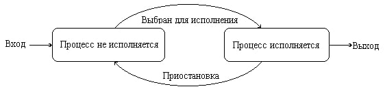
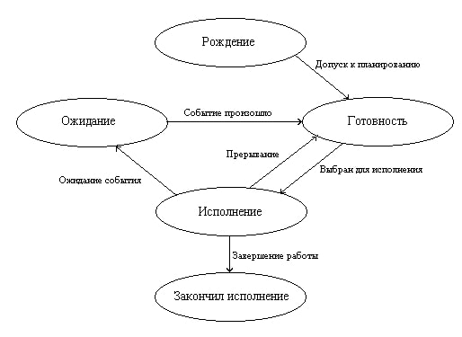

---
## Front matter
title: "Реферат на тему: Понятие процесса, виды процессов и его состояния в операционных системах"
subtitle: "Операционные системы"
author: "Пономарева Татьяна Александровна"

## Generic otions
lang: ru-RU
toc-title: "Содержание"

## Bibliography
bibliography: bib/cite.bib
csl: pandoc/csl/gost-r-7-0-5-2008-numeric.csl

## Pdf output format
toc: true # Table of contents
toc-depth: 2
lof: true # List of figures
lot: true # List of tables
fontsize: 12pt
linestretch: 1.5
papersize: a4
documentclass: scrreprt
## I18n polyglossia
polyglossia-lang:
  name: russian
  options:
	- spelling=modern
	- babelshorthands=true
polyglossia-otherlangs:
  name: english
## I18n babel
babel-lang: russian
babel-otherlangs: english
## Fonts
mainfont: IBM Plex Serif
romanfont: IBM Plex Serif
sansfont: IBM Plex Sans
monofont: IBM Plex Mono
mathfont: STIX Two Math
mainfontoptions: Ligatures=Common,Ligatures=TeX,Scale=0.94
romanfontoptions: Ligatures=Common,Ligatures=TeX,Scale=0.94
sansfontoptions: Ligatures=Common,Ligatures=TeX,Scale=MatchLowercase,Scale=0.94
monofontoptions: Scale=MatchLowercase,Scale=0.94,FakeStretch=0.9
mathfontoptions:
## Biblatex
biblatex: true
biblio-style: "gost-numeric"
biblatexoptions:
  - parentracker=true
  - backend=biber
  - hyperref=auto
  - language=auto
  - autolang=other*
  - citestyle=gost-numeric
## Pandoc-crossref LaTeX customization
figureTitle: "Рис."
tableTitle: "Таблица"
listingTitle: "Листинг"
lofTitle: "Список иллюстраций"
lotTitle: "Список таблиц"
lolTitle: "Листинги"
## Misc options
indent: true
header-includes:
  - \usepackage{indentfirst}
  - \usepackage{float} # keep figures where there are in the text
  - \floatplacement{figure}{H} # keep figures where there are in the text
---

# Цель работы

Изучение процессов в операционных системах, видов и их состояний

# Задание

- Дать определение процессу и его характеристики
- Рассмотреть виды процессов в ОС
- Изучить возможные состояния процессов

# Теоретическое введение

Фундаментальным понятием для изучения работы операционных систем является понятие процессов, как основных динамических объектов, над которыми системы выполняют определенные действия.

# Понятие процесса

Процесс - это команда, которая выполняется в текущий момент. Также процесс - совокупность взаимосвязанных и взаимодействующих действий, преобразующих входящие данные в исходящие. 

Компьютерная программа сама по себе это только пассивная совокупность инструкций, в то время как процесс - это непосредственное выполнение этих инструкций.

Часто процессом называют выполняющуюся программу и все ее элементы: адресное пространство, глобальные переменные, регистры, стек, открытые файлы.

# Характеристика процесса

1. Уникальный идентификатор (PID, Process ID) - число, используемое для идентификации процесса в системе

2. Состояние процесса - процесс может находиться в одном из состояний (New, Ready, Running, Waiting, Terminated) 

3. Приоритет выполнения - определяет порядок выполнения процесса относительно других

4. Пространство памяти - включает код программы, стек, сегмент данных

5. Контекст процесса - совокупность информации о процессоре и памяти, которая позволяет приостанавливать и возобновлять процесс.

6. Родительский процесс (PPID, Parent Process ID) - указывает на процесс, создавший текущий процесс

7. Потоки - процессы могут быть однопотоковыми или многопотоковыми

8. Дескрипторы ресурсов - включает в себя файлы, порты, устройства ввода-вывода, которые использует процесс

# Виды процессов

* Фоновые (системные) - выполняются в фоновом режиме и поддерживают работу ОС
* Пользовательские - запущенные пользователем программы
* Интерактивные - требуют взаимодействия с пользователетем
* Пакетные - выполняются без вмешательства пользователя
* Реального времени - требуют жестких временных ограничений

# Состояния процессов

* New - процесс создается
* Ready - процесс ожидает выполнения
* Running - процесс выполняется процессором
* Waiting - процесс ждет события (например, ввода-вывода)
* Terminated - процесс завершил выполнение

Каждый процесс может находиться как минимум в двух состояниях: процесс исполняется и процесс не исполняется (рис. [-@fig:001]).

{#fig:001 width=70%}

Процесс, находящийся в состоянии процесс исполняется, может через некоторое время завершиться или быть приостановлен операционной системой и снова переведен в состояние процесс не исполняется. Приостановка процесса происходит по одной из двух причин: для его дальнейшей работы потребовалось возникновение какого-либо события (например, завершения операции ввода-вывода) или истек временной интервал, отведенный операционной системой для работы этого процесса. После этого операционная система по определенному алгоритму выбирает для исполнения один из процессов, находящихся в состоянии процесс не исполняется, и переводит его в состояние процесс исполняется. Новый процесс, появляющийся в системе, первоначально помещается в состояние процесс не исполняется.

Для полноты картины нам необходимо ввести еще два состояния процессов: рождение и закончил исполнение (рис. [-@fig:002]).

{#fig:002 width=70%}

Теперь для появления в вычислительной системе процесс должен пройти через состояние рождение. При рождении процесс получает в свое распоряжение адресное пространство, в которое загружается программный код процесса; ему выделяются стек и системные ресурсы; устанавливается начальное значение программного счетчика этого процесса и т. д. Родившийся процесс переводится в состояние готовность. При завершении своей деятельности процесс из состояния исполнение попадает в состояние закончил исполнение.

# Выводы

Были изучены процессы в операционных системах, виды и их состояния

# Список литературы{.unnumbered}

1. [Понятие процесса ОС](https://studfile.net/preview/3638405)
