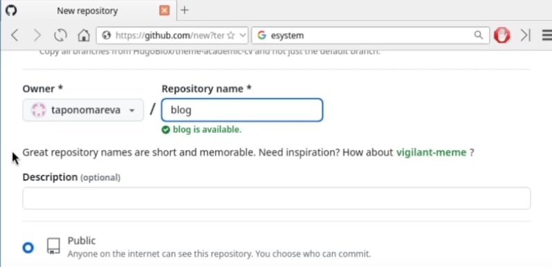
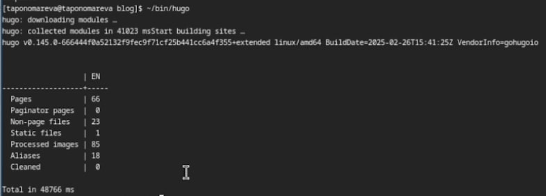
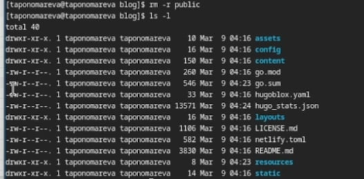
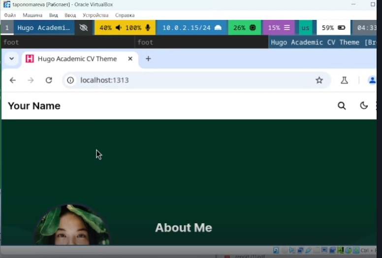
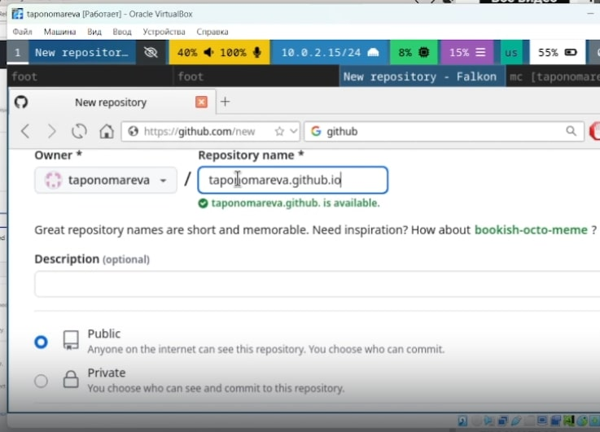
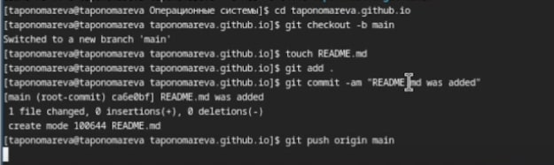

---
## Front matter
lang: ru-RU
title: Презентация. Этап 1 индивидуального проекта
subtitle: Операционные системы
author:
  - Пономарева Т.А.
institute:
  - Российский университет дружбы народов, Москва, Россия
date: 08 марта 2025

## i18n babel
babel-lang: russian
babel-otherlangs: english

## Formatting pdf
toc: false
toc-title: Содержание
slide_level: 2
aspectratio: 169
section-titles: true
theme: metropolis
header-includes:
 - \metroset{progressbar=frametitle,sectionpage=progressbar,numbering=fraction}
---

# Информация

## Докладчик

:::::::::::::: {.columns align=center}
::: {.column width="70%"}

  * Пономарева Татьяна Александровна
  * Студент группы НКАбд-04-24
  * Российский университет дружбы народов
  * [1132246742@pfur.ru](mailto:1132246742@pfur.ru)
  * <https://github.com/taponomareva>

:::
::: {.column width="30%"}

:::
::::::::::::::

# Вводная часть

## Цель работы

Разместить на Github pages заготовки для персонального сайта

# Задание

- Установить необходимое программное обеспечение
- Скачать шаблон темы сайта
- Разместить его на хостинге git
- Установить параметр URLs сайта
- Разместить заготовку сайта на Github pages

# Теоретическое введение

GitHub pages - удобный сервис для размещения статических веб-сайтов непосредственно из репозитория GitHub. Он позволяет разработчикам и пользователям позволяет публиковать веб-страницы, используя Git как систему управления версиями.

# Выполнение лабораторной работы

Устанавливаю необходимое программное обеспечение через сайт https://github.com/gohugoio/hugo/releases и распаковываю архивированный файл программы (рис. 1).

## Создание папки bin

Затем я создаю папку bin (рис. 2).

## Копирование файла hugo в папку ~/bin

Копирую разархивированный файл hugo в папку ~/bin при помощи команды cp hugo ~/bin (рис. 3).

# Создание нового репозитория blog

На гитхабе создаю новый репозиторий blog (рис. 4).

Репозиторий был создан успешно (рис. 5).

# Работа с репозиторием blog

Копирую репозиторий с гитхаба в папку "Операционные системы" (рис. 6).

Репозиторий blog был успешно скопирован в данную папку, перехожу в папку blog (рис. 7).

Затем выполняю команду ~/bin/hugo (рис. 8).

## Удаление каталога public

Удаляю каталог public при помощи команды rm -r public (рис. 9).

Далее выполняю команду ~/bin/hugo server (рис. 10).

# Пример сайта

Перехожу по ссылке http://localhost:1313/ (рис. 11).

Нажимаю на Ctrl+C

# Создание нового репозитория

Создаю новый репозиторий под именем taponomareva.github.io (рис. 12).

## Копирование в каталог "Операционные системы"

Копирую новый репозиторий в каталог "Операционные системы" (рис. 13).

# Работа с новым репозиторием

Перехожу в новый репозиторий, меняю свое расположение на ветку main, создаю файл README.md, отправляю данные на гитхаб с коммитом "README.md was added" (рис. 14).

## Добавдение нового репозитория как подмодуль репозитория blog

Добавляю новый репозиторий как подмодуль репозитория blog в папку public (рис. 15).

Выполняю команду git remote -v для привязки репозитория с удаленным доступом (рис. 16).

# Отправка данных на гитхаб

Потом делаю git push для отправки данных на гитхаб (рис. 17).

# Выводы

В ходе проведения лабораторной работы заготовки для персонального сайта были размещены на Github pages.

# Список литературы{.unnumbered}

1. [Курс на ТУИС](https://esystem.rudn.ru/course/view.php?id=113)
2. [Сайт Дмитрия Сергеевича Кулябова. Создание сайта на основе Hugo](https://yamadharma.github.io/ru/post/2022/04/12/creating-hugo-site)
