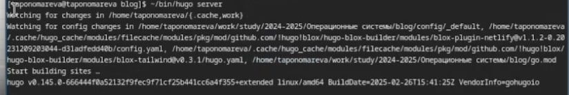
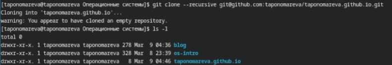
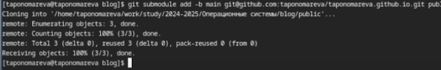
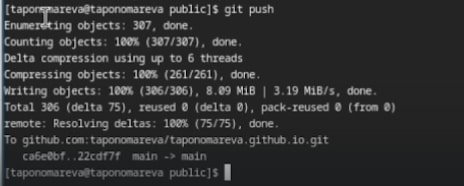

---
## Front matter
title: "Отчёт по этапу 1 индивидуального проекта"
subtitle: "Операционные системы"
author: "Пономарева Татьяна Александровна"

## Generic otions
lang: ru-RU
toc-title: "Содержание"

## Bibliography
bibliography: bib/cite.bib
csl: pandoc/csl/gost-r-7-0-5-2008-numeric.csl

## Pdf output format
toc: true # Table of contents
toc-depth: 2
lof: true # List of figures
lot: true # List of tables
fontsize: 12pt
linestretch: 1.5
papersize: a4
documentclass: scrreprt
## I18n polyglossia
polyglossia-lang:
  name: russian
  options:
	- spelling=modern
	- babelshorthands=true
polyglossia-otherlangs:
  name: english
## I18n babel
babel-lang: russian
babel-otherlangs: english
## Fonts
mainfont: IBM Plex Serif
romanfont: IBM Plex Serif
sansfont: IBM Plex Sans
monofont: IBM Plex Mono
mathfont: STIX Two Math
mainfontoptions: Ligatures=Common,Ligatures=TeX,Scale=0.94
romanfontoptions: Ligatures=Common,Ligatures=TeX,Scale=0.94
sansfontoptions: Ligatures=Common,Ligatures=TeX,Scale=MatchLowercase,Scale=0.94
monofontoptions: Scale=MatchLowercase,Scale=0.94,FakeStretch=0.9
mathfontoptions:
## Biblatex
biblatex: true
biblio-style: "gost-numeric"
biblatexoptions:
  - parentracker=true
  - backend=biber
  - hyperref=auto
  - language=auto
  - autolang=other*
  - citestyle=gost-numeric
## Pandoc-crossref LaTeX customization
figureTitle: "Рис."
tableTitle: "Таблица"
listingTitle: "Листинг"
lofTitle: "Список иллюстраций"
lotTitle: "Список таблиц"
lolTitle: "Листинги"
## Misc options
indent: true
header-includes:
  - \usepackage{indentfirst}
  - \usepackage{float} # keep figures where there are in the text
  - \floatplacement{figure}{H} # keep figures where there are in the text
---

# Цель работы

Разместить на Github pages заготовки для персонального сайта

# Задание

- Установить необходимое программное обеспечение
- Скачать шаблон темы сайта
- Разместить его на хостинге git
- Установить параметр URLs сайта
- Разместить заготовку сайта на Github pages

# Теоретическое введение

GitHub pages - удобный сервис для размещения статических веб-сайтов непосредственно из репозитория GitHub. Он позволяет разработчикам и пользователям позволяет публиковать веб-страницы, используя Git как систему управления версиями.

# Выполнение лабораторной работы

Устанавливаю необходимое программное обеспечение через сайт https://github.com/gohugoio/hugo/releases и распаковываю архивированный файл программы (рис. [-@fig:001]).

{#fig:001 width=70%}

Затем я создаю папку bin (рис. [-@fig:002]).

{#fig:002 width=70%}

Копирую разархивированный файл hugo в папку ~/bin при помощи команды cp hugo ~/bin (рис. [-@fig:003]).

{#fig:003 width=70%}

На гитхабе создаю новый репозиторий blog (рис. [-@fig:004]).

{#fig:004 width=70%}

Репозиторий был создан успешно (рис. [-@fig:005]).

{#fig:005 width=70%}

Копирую репозиторий с гитхаба в папку "Операционные системы" (рис. [-@fig:006]).

{#fig:006 width=70%}

Репозиторий blog был успешно скопирован в данную папку, перехожу в папку blog (рис. [-@fig:007]).

{#fig:007 width=70%}

Затем выполняю команду ~/bin/hugo (рис. [-@fig:008]).

{#fig:008 width=70%}

Удаляю каталог public при помощи команды rm -r public (рис. [-@fig:009]).

{#fig:009 width=70%}

Далее выполняю команду ~/bin/hugo server (рис. [-@fig:010]).

{#fig:010 width=70%}

Перехожу по ссылке http://localhost:1313/ (рис. [-@fig:011]).

{#fig:011 width=70%}

Нажимаю на Ctrl+C

Создаю новый репозиторий под именем taponomareva.github.io (рис. [-@fig:012]).

{#fig:012 width=70%}

Копирую новый репозиторий в каталог "Операционные системы" (рис. [-@fig:013]).

{#fig:013 width=70%}

Перехожу в новый репозиторий, меняю свое расположение на ветку main, создаю файл README.md, отправляю данные на гитхаб с коммитом "README.md was added" (рис. [-@fig:014]).

{#fig:014 width=70%}

Добавляю новый репозиторий как подмодуль репозитория blog в папку public (рис. [-@fig:015]).

{#fig:015 width=70%}

Выполняю команду git remote -v для привязки репозитория с удаленным доступом (рис. [-@fig:016]).

{#fig:016 width=70%}

Потом делаю git push для отправки данных на гитхаб (рис. [-@fig:017]).

{#fig:017 width=70%}

# Выводы

В ходе проведения лабораторной работы заготовки для персонального сайта были размещены на Github pages.

# Список литературы{.unnumbered}

1. [Курс на ТУИС](https://esystem.rudn.ru/course/view.php?id=113)
2. [Сайт Дмитрия Сергеевича Кулябова. Создание сайта на основе Hugo](https://yamadharma.github.io/ru/post/2022/04/12/creating-hugo-site)
